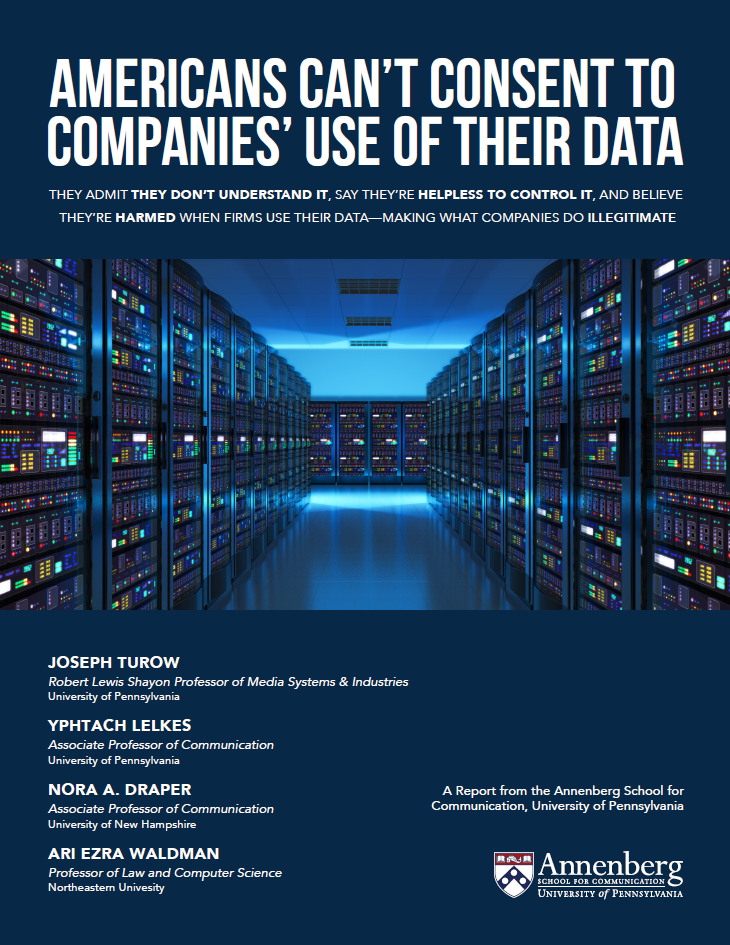
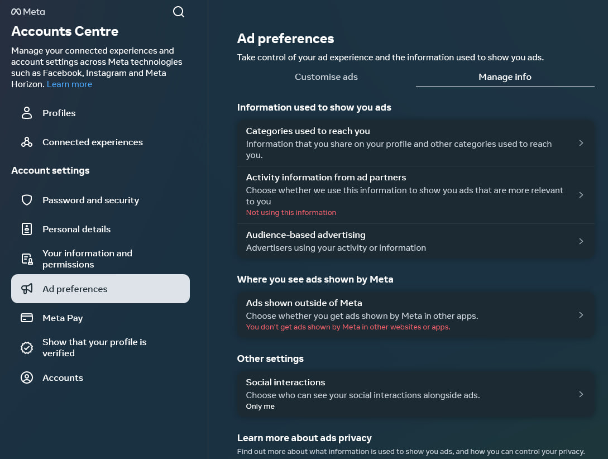
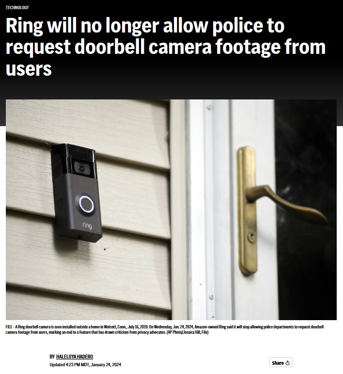
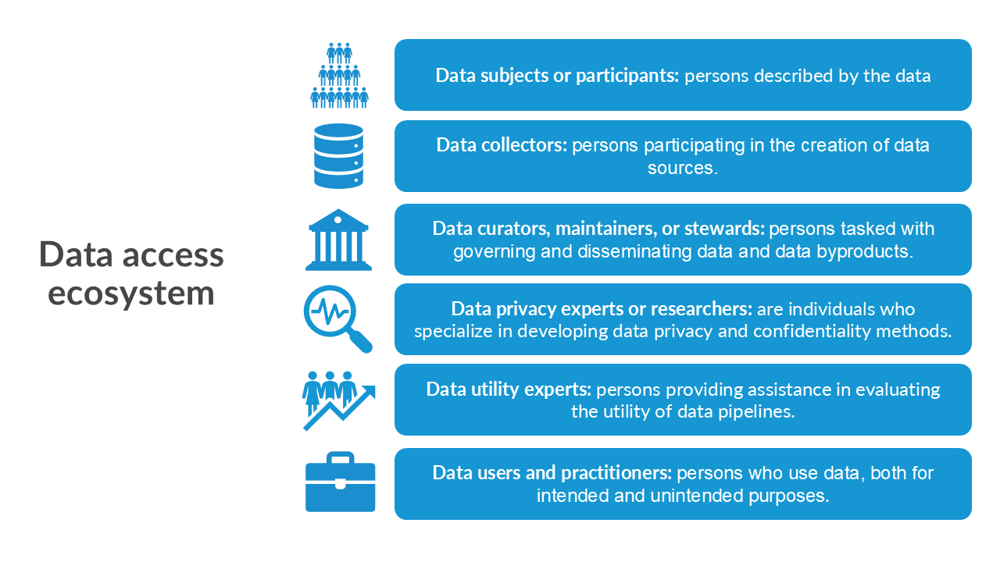
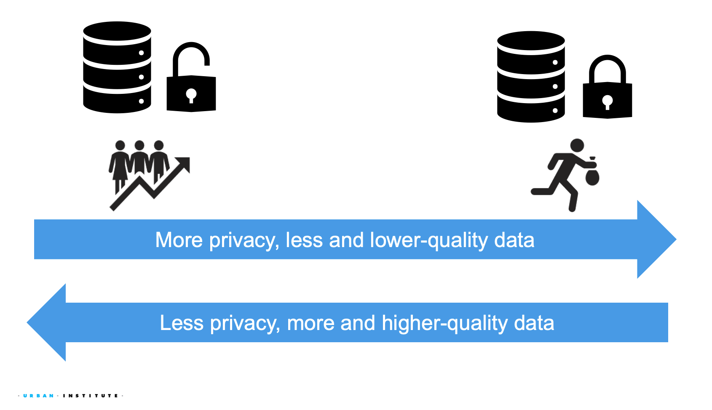
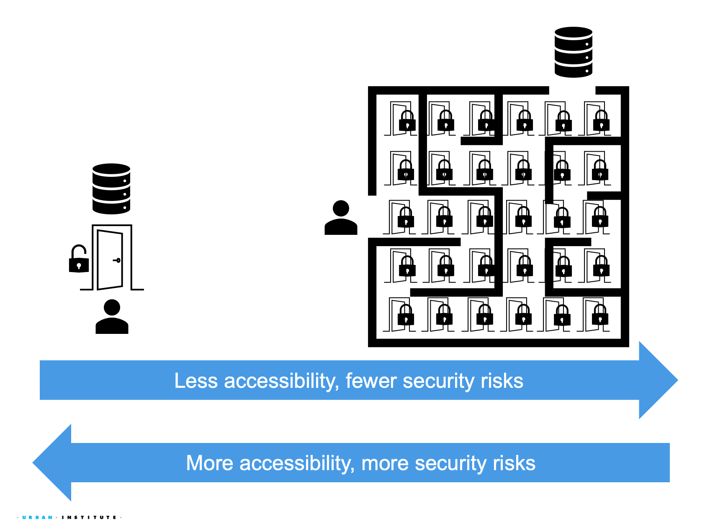
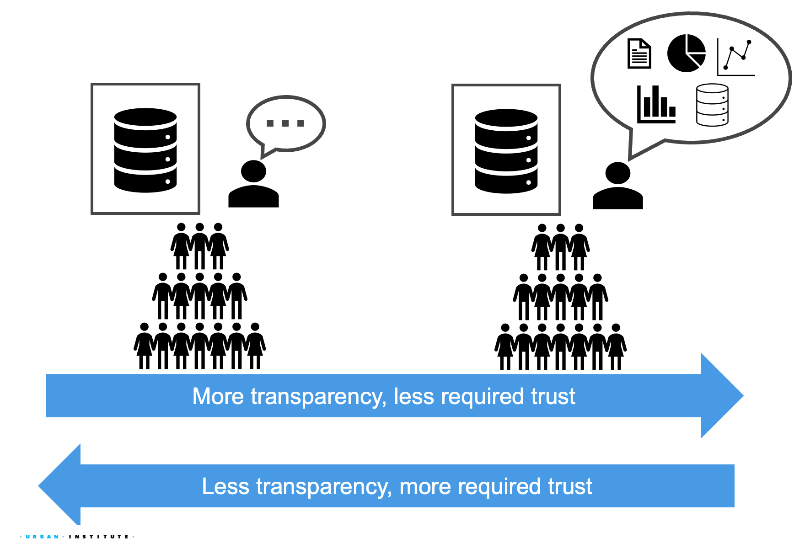

```{r}
#| echo: false

exercise_number <- 1

```

{#fig-data-lifecycle fig-align="center" width=100%}

:::{.callout-note}

### Overview

This week introduces the core concepts that will guide the rest of the course. You will learn how to:

- Define (at least for this class) data governance terms, such as security, privacy, ethics, and equity.
- Explain how privacy, security, ethical, and equity considerations arise throughout the data lifecycle.
- Evaluate common assumptions about data collection, tracking, and information sharing in an increasingly data-driven and AI-enabled world.

:::

We will explore what data security, privacy, and ethics mean to individuals, organizations, and society throughout the data lifecycle. These considerations are often discussed within the broader framework of data governance, which focuses on how decisions are made about the collection, use, sharing, retention, and disposal of data.

## How are our data being governed in the private and public sector?

How well do you know about basic corporate and governmental internet practices and policies?

### Test your knowledge

::: callout
#### [`r paste("Class Activity", exercise_number)`]{style="color:#1696d2;"}

```{r}
#| echo: false 

exercise_number <- exercise_number + 1
```

Complete this [17 true-or-false question quiz](https://forms.gle/GMfexETbiQejU9E99) created by researchers from the Annenberg School for Communication at the University of Pennsylvania [@turow2023americans].

You will have 6 minutes to complete the quiz (most students finish in 3–4 minutes).

The quiz was created in February 2023. Since then, privacy laws, technologies, artificial intelligence systems, data collection practices, and online services have continued to evolve. As a result, some answers may be different today than they were when the quiz was originally developed.

After completing the quiz, we will review each question together and discuss whether the answer has changed between 2023 and 2026. This exercise highlights an important challenge in data privacy and governance: privacy risks, legal protections, and societal expectations are constantly changing, requiring policymakers, organizations, and individuals to continually reassess what responsible data stewardship looks like.
:::

{#fig-americans-consent fig-align="center" width=60%}

::: {.callout-important}

### ANSWERS BEYOND THIS POINT!

Answers to each question are beyond this point along with additional information. Please do not proceed until you have completed the quiz!
::: 

### Answers to the quiz and discussion

::: callout
#### [`r paste("Class Activity", exercise_number)`]{style="color:#1696d2;"}

```{r}
#| echo: false 

exercise_number <- exercise_number + 1
```
We will review the answers to the quiz and discuss additional information that provides context for each question. As we do so, consider the following:

- Did the answer surprise you? Why or why not?
- What assumptions or prior knowledge influenced your response?
- Has the answer changed since the quiz was developed in 2023? If so, what technological, legal, social, or policy developments contributed to that change?
- What answer would you prefer, and why? If the current answer does not align with your expectations, what changes in technology, law, business practices, or public attitudes would be necessary for the answer to be different?
- What trade-offs might result from changing the answer? Who would benefit, and who might be harmed?

:::

::: {.callout-caution collapse="true"}
## When I go to a web site, it can collect information about my online behaviors even if I don’t register using my name or email address. 

**2023: TRUE**

From @turow2023americans,

> Companies have an ability to see what we do on our websites and apps (through first-party cookies and other such trackers); to follow us across the media content we visit (via third-party cookies and emerging versions); to view our activities as we move from one media technology to another— for example, from the web to our smartphone to our tablet to our “connected” TV to the in-store trackers we pass in the aisles, to outdoor message boards we stop to view. Whether with first- party data, third-party data, or more, the goal is to give us tags or personas and have computers decide whether and how we ought to be the companies’ targets.

**2026: TRUE** Answer is still the same, but technology has evolved a lot!

:::

::: {.callout-caution collapse="true"}
## A Smart TV can help advertisers send an ad to a viewer’s smartphone based on the show they are watching.

**2023: TRUE**

See answer to question 1.

**2026: TRUE**

Smart TVs and streaming services are part of a broader digital ecosystem that allows advertisers to connect information collected across multiple devices, creating profiles of linked devices. As a result, content viewed on one device may influence advertisements delivered on another device.
:::

::: {.callout-caution collapse="true"}
## A company can tell that I have opened its email even if I don’t click on any links. 

**2023: TRUE**

Email tracking is a method that sends a signal to the sender's server that the email has been opened. Many services use this method (the Urban Institute does this for their newsletters!). However, some email providers, such as Outlook and Gmail, have features that can block this type of tracking. You should check your email settings.

**2026: TRUE**

A company can often detect that an email has been opened without the recipient clicking any links by using a common technique called an email tracking pixel, where a tiny, invisible image embedded in the email. When the email client loads images, it requests that pixel from the sender’s server, which logs the request as an “open.”

:::

::: {.callout-caution collapse="true"}
## A website cannot track my activity across devices unless I log into the same account on those devices.

**2023: FALSE**

See the answers to the previous questions. Cookies, IP address tracking, email tracking, and more can be linked together to track an individual across devices (although the accuracy might be reduced, such as being coarsened to the household level).

**2026: FALSE**

Tracking is increasingly done via statistical matching, identity graphs, and ecosystem-level inference rather than simple identifiers in addition to cookies, IP address tracking, and more.

:::

::: {.callout-caution collapse="true"}
## When a website has a privacy policy, it means the site will not share my information with other websites or companies without my permission.

**2023: FALSE**

A privacy policy does not mean a site won’t share a person’s information with other sites without the person’s permission.

**2026: FALSE**

A privacy policy tells you what a company *may do with your data* -- not what it will *never do with your data.* 

Chrome's New Privacy Policy
{#fig-bathroom fig-align="center"}

:::

::: {.callout-caution collapse="true"}
## Facebook’s user privacy settings allow me to limit the information about me that Facebook shares with advertisers. 

**2023: TRUE**

Check all the apps you use to adjust your privacy settings!

**2026: TRUE**

Privacy settings allow users to influence how their data are used for advertising, but they do not fully stop data collection or eliminate ad targeting.

{#fig-facebook fig-align="center"}
:::

::: {.callout-caution collapse="true"}
## All fifty states have laws requiring companies to notify individuals of security breaches involving personally identifiable information.

**2023 and 2026: TRUE**

But, there is no federal law, so each state has their own regulations. See National Conference of State Legislatures on "[Security Breach Notification Laws](https://www.ncsl.org/technology-and-communication/security-breach-notification-laws)" across the 50 states and territories.

:::

::: {.callout-caution collapse="true"}
## It is illegal for internet marketers to record my computer’s IP address.

**2023 and 2026: FALSE**

In the United States, companies can legally collect IP addresses, but their use and sharing may be regulated depending on context, sector, and local to federal law.

:::

::: {.callout-caution collapse="true"}
## It is legal for an online store to charge people different prices depending on where they are located.

**2023 and 2026: TRUE**

Think about your local area and whether grocery stores change the prices of their goods based on their proximity to certain neighborhoods.

:::

::: {.callout-caution collapse="true"}
## The doorbell company Ring has a policy of not sharing recordings with law enforcement without the homeowner’s permission. 

**2023 and 2026: FALSE**

Ring updated their policies in 2024, where Ring has reduced or eliminated some informal law enforcement request tools. However, the video can still be accessed by police through legal processes or user-controlled sharing.

Check out this [Associate Press](https://apnews.com/article/ring-amazon-camera-police-request-56a128dcd77a4cb0b27d71be9384fe1a) article about the new policy!

{#fig-ring fig-align="center"}
:::

::: {.callout-caution collapse="true"}
## By law, a travel site such as Expedia or Orbitz that compares prices on different airlines must include the lowest airline prices. 

**2023 and 2026: FALSE**

Online travel sites may display a range of airline prices but are not legally required to include the lowest available fares; pricing display is shaped by commercial agreements, algorithms, and consumer protection laws rather than a lowest-price mandate.

:::

::: {.callout-caution collapse="true"}
## In the United States, the federal government regulates the types of digital information companies collect about individuals. 

**2023 and 2026: FALSE**

The U.S. federal government regulates certain types of digital data collection through sector and there are specific laws and agency enforcement, but it does not have a comprehensive federal consumer data privacy law.

:::

::: {.callout-caution collapse="true"}
## Some large American cities have banned the use of facial recognition technology by law enforcement. 

**2023 and 2026: TRUE**

San Francisco became the first United States city to ban facial recognition.

[BBC article](https://www.bbc.com/news/technology-48276660)

[NYTimes article](https://www.nytimes.com/2019/05/14/us/facial-recognition-ban-san-francisco.html)
:::

::: {.callout-caution collapse="true"}
## The US Federal government requires that companies ask internet users to opt-in to being tracked. 

**2023 and 2026: FALSE**

The U.S. federal government does not require companies to obtain opt-in consent for all internet tracking.

In the United States, what you encounter on sites that prompt you to choose are usually 'opt-out' settings. If there's an 'opt-in' alternative, it's often because website designers have streamlined the site, not wanting to differentiate visitors from the United States or European Union countries, which have 'opt-out' data privacy laws

:::

::: {.callout-caution collapse="true"}
## Section 230 of the Communication Decency Act ensures that digital platforms like Facebook, Twitter, and YouTube can be held responsible for illegal content posted on their platforms.

**2023 and 2026: FALSE**

From Section 230 of the Communication Decency Act:

> No provider or user of an interactive computer service shall be treated as the publisher or speaker of any information provided by another information content provider.

:::

::: {.callout-caution collapse="true"}
## The Health Insurance Portability and Accountability Act (HIPAA) prevents apps that provide information about health from selling data collected about app users to marketers.

**2023 and 2026: FALSE**

From @turow2023americans,

> The Federal Health Insurance and Portability Act (HIPAA) does not stop apps that provide information about health – such as exercise and fertility apps – from selling data collected about the app users to marketers. HIPAA came into law in 1996 to "improve portability and continuity of health insurance coverage in the group and individual markets, to combat waste, fraud, and abuse in health insurance and health care delivery, to promote the use of medical savings accounts, to improve access to long-term care services and coverage, to simplify the administration of health insurance, and for other purposes." Therefore, HIPAA does not prevent apps that provide information about health from selling data collected about app users to marketers.
:::

::: {.callout-caution collapse="true"}
## Some social media platforms activate users’ smartphone speakers to listen to conversations and identify their interests in order to sell them ads. 

**2023 and 2026: FALSE**

There has never been a documented case of a social media platform activating users’ smartphone speakers to eavesdrop on conversations and identify their interests for targeted advertising. Your browsing history, app usage patterns, location data, purchasing behavior, and more already provides enough information for that!

:::

## Why is Data Governance Important?

Data governance ultimately concerns decision-making around how data flows or does not flow between parties. While different actors may be more concerned with expanding or restricting data flows, real-world harms can occur if data sharing is too permissive or too restrictive. 

Different stakeholders may have competing interests when it comes to expanding or restricting data flows. However, real-world harms can arise when data sharing is either too permissive or too restrictive. For example, excessive sharing of location data may enable stalking or other forms of surveillance, while overly restrictive data access may limit research and evidence needed to address important social challenges. Understanding how to balance these competing interests is a central challenge of responsible data governance.

::: callout-note
### Example: SNAP data governance

Recent changes to SNAP administration reveal the limits of *both* too much data sharing and too little data sharing: 

* In October 2025, NPR reported that [states turned over personal information on snap recipients to USDA](https://www.npr.org/2025/10/16/nx-s1-5533045/snap-privacy-usda-lawsuit). This new centralization of SNAP data at USDA poses many data governance questions, including but not limited to...
  * Legal risk: is this data collection allowed under federal and state law? 
  * Institutional risk: is this data collection in line with expectations for how federal and state agencies collaborate? 
  * Data subject protection: is there transparency around how this data will be used, and will there be sufficient protections for data subjects?

* In September 2025, NPR reported that the [USDA is canceling the Household Food Security Report](https://www.npr.org/2025/09/22/nx-s1-5549115/usda-food-insecurity-survey-hunger). This new redaction on nutritional accessibility data poses many data governance questions, including but not limited to...
  * Data alternatives: what alternative data sources might users turn to in place of this report, and are they sufficient replacements? 
  * Evidence-based decision-making: what kinds of policy decisions at the federal, state, or local level are now lacking evidence due to this report being unavailable?
  * Public accountability: how is the USDA justifying its decision to cancel the report, and how are the savings from canceling the report being used? 

::: 

The following are additional real-world examples of the tensions between data access, usability, privacy, security, and ethics.

Click on the tab to learn more.

::: {.panel-tabset}

### <font color="#ec008b">**Student Success and Safety**</font>

{width=80%}

The same data that can enable responsible, evidence-based decision-making can also raise legitimate privacy concerns. For example, some universities use smartphone apps to monitor student attendance—tracking when students arrive late, leave early, or miss class entirely, especially in large lecture halls with over a hundred students. These apps also record which campus facilities students use, such as libraries or gyms. 

- Making this data more widely available can help universities better understand student behavior, guide resource investments, or even support emergency alerts (e.g., during an active shooter event).

- At the same time, such tracking could inadvertently reveal students’ identities, sensitive FERPA-protected information like grades, or fine-grained real-time student location, all of which raise privacy and safety concerns.

### <font color="#ec008b">**People with Disabilities Accessing Public Service**</font>

Different subpopulations experience different relationships to data privacy. For example, the right to privacy for disabled individuals is often compromised the moment they seek services or support.

- Blind individuals may rely on medical devices with widely varying privacy standards. For example, [virtual assistants or devices like Meta AI glasses](https://afb.org/aw/fall2025/meta-glasses-review) help individuals navigate the world independently while raising concerns that [companies like Meta may share or sell user data](https://nelowvision.com/how-ray-ban-meta-smart-glasses-support-the-deaf-blind-community/).

- Disabled individuals may also face structural privacy barriers when accessing medical care. For example, health data for disabled individuals is [routinely reported to the Centers for Medicare & Medicaid Services (CMS), often without explicit consent](https://www.urban.org/urban-wire/stronger-data-privacy-protections-are-needed-protect-people-disabilities).

- Simultaneously, disabled individuals often need their disability status disclosed to properly receive legible, timely, and actionable information. For example, during the Kerr County Flood, emergency evacuation warnings were not effectively issued to allow those with mobility challenges to successfully evacuate.

### <font color="#ec008b">**LGBTQ+ Representation in Data**</font>

Those who collect and disseminate data may have different data privacy expectations and obligations than data subjects. For example, during a roundtable discussion hosted by the Council of the Section of Legal Education and Admissions to the American Bar Association (ABA), the ABA focused on reviewing, refining, and expanding demographic data collection practices for students, faculty, and staff.

- Some universities may choose to withhold the number of transgender students enrolled in their law schools to protect individual privacy. Since transgender students are frequently a small minority of law student cohorts, choosing not to disclose this information can help protect the identities and "out" statuses of potentially affected transgender students. 

- While some students preferred this university approach, others preferred accurate representation in the data, believing it helps foster connection among transgender students and signals that their law school was inclusive and welcoming. Different universities reached different outcomes depending on how group representativeness was valued and who was involved in shaping these decisions. 

:::

## What is data security, privacy, and ethics?

::: callout

#### [`r paste("Class Activity", exercise_number)`]{style="color:#1696d2;"}

```{r}
#| echo: false

exercise_number <- exercise_number + 1
```

Many AI systems, voice assistants, chatbots, and digital avatars are designed to appear friendly, helpful, and approachable. These design choices often include decisions about voice, name, personality, appearance, and communication style.

How might these design choices reinforce or challenge existing social stereotypes and power dynamics?

Who should be responsible for making these decisions, and what factors should they consider?

:::

[Scarlett Johansson says she is 'shocked, angered' over new ChatGPT voice](https://www.npr.org/2024/05/20/1252495087/openai-pulls-ai-voice-that-was-compared-to-scarlett-johansson-in-the-movie-her) - NPR Article

{#fig-ai-voice fig-align="center"}

### Defining key stakeholders in the data ecosystem

For this course, this is how we define the various stakeholders in the data ecosystem.

{#fig-stakeholders fig-align="center"}

::: callout-tip

### Definition: Data adversaries

**Data privacy adversaries** ("adversaries" for short) are individuals who try to collect, extract, or otherwise procure data from a computing system in an inappropriate manner. 

Data privacy adversaries are known by many names, including  *intruders, attackers, hackers, snoopers,* and others. 

1. **Hackers:** adversaries who steal confidential information through unauthorized access.
2. **Snoopers:** adversaries who reconstruct confidential information from data releases.
3. **Hoarders:** stewards who collect data but don't release the data even if respondents want the information releasesd.

:::

* Adversaries aim to receive information that's typically unintended for them as data users. For example, data privacy adversaries may try to reconstruct personal information from published statistics, even though the published statistics may be intended for a general public audience.
* The inappropriateness of adversaries can stem from many places; adversaries may be acting illegally, unethically, or in violation of organizational policies. 

There are two major categories of data privacy threats:

* **Input privacy** threats occur when adversaries gain unauthorized data access *as it is being communicated through data processing to its final audiences.* Example threats include:
  * An email service provider accessing a file attachment containing raw personal information.
  * A large language model reading a file in its context containing sensitive data.

* **Output privacy** threats occur when adversaries interpret or modify data *as it is being published to its final audiences* in order to extract sensitive information. Example threats include: 
  * A table of workplace survey results allows a manager to infer which of their direct reports is the least happy with their manager's performance.
  * A dataset of financial statements allows an auditor to deduce that a business has not paid their taxes properly.

-   There are differing notions of what should and shouldn't be private, which may include being able to opt out of or opt into disclosure protections.

-   Data privacy is a broad topic, which includes data security, encryption, access to data, etc. We will not be covering privacy breaches from unauthorized access to a database (e.g., hackers).

### Security, Privacy, Confidentiality, and Ethics

::: callout-tip
### Data Security

**Data Security** is a condition that results from the establishment and maintenance of protective measures that enable an organization to perform its mission or critical functions despite risks posed by threats to its use of systems. Protective measures may involve a combination of deterrence, avoidance, prevention, detection, recovery, and correction that should form part of the organization’s risk management approach.. [^1] 

[^1]: National Institute of Standards and Technology (NIST). *Security*. NIST Computer Security Resource Center Glossary. https://csrc.nist.gov/glossary/term/security
:::

Data security often refers to the hardware, software, storage devices, and user devices; access and administrative controls; and organizations’ policies and procedures. For example, many organizations have switched to two factor authentication and VPN to access their systems.

::: callout-tip
### Data Privacy

**Data Privacy** is assurance that the confidentiality of, and access to, certain information about an entity is protected.[^1] 

[^1]: National Institute of Standards and Technology (NIST). *Privacy*. NIST Computer Security Resource Center Glossary. https://csrc.nist.gov/glossary/term/privacy

:::

::: callout-tip
### Confidentiality

**Confidentiality** is preserving authorized restrictions on information access and disclosure, including means for protecting personal privacy and proprietary information. [^1] 

[^1]: National Institute of Standards and Technology (NIST). *Confidentiality*. NIST Computer Security Resource Center Glossary. https://csrc.nist.gov/glossary/term/confidentiality
:::

When reviewing these definitions, it’s important to note that the terms data privacy and confidentiality are often used interchangeably, but they refer to distinct concepts.

- Privacy centers on the various flows of personal information in the different processes. In contrast, confidentiality pertains to the responsibility of data curators to protect that information.

- Both privacy and confidentiality aim to protect sensitive information and foster trust among the various entities involved in data sharing and access.

::: callout-tip
## Ethics

**Data ethics** is the "...systemizing, defending, and recommending concepts of right and wrong conduct in relation to data, in particular personal data" [@kitchin2014data].

:::

Most research institutions and government entities have an Institutional Review Board (IRB), an institution that applies research ethics by reviewing the methods proposed for research involving human subjects, to ensure that the projects are ethical. IRBs **do not** evaluate the quality of the research. They evaluate the the ethical protection of human subjects.

::: callout
#### [`r paste("Class Activity", exercise_number)`]{style="color:#1696d2;"}

```{r}
#| echo: false

exercise_number <- exercise_number + 1
```

- Prior to starting this course, how would you have defined data security, privacy, and ethics?
- How has your definition of these different terms changed since the assignments and these discussions? Why or why not?

:::

## What are the Dimensions of Data Governance?

Data governance concerns ensuring appropriate flow of information in data processing systems. However, there are countless approaches to both 1) determining what is appropriate flow, and 2) deciding how to ensure appropriate flow. To break it down, we consider...

* **Values**: how might we want the flow of information to function? 
* **Perspectives**: what disciplinary tools, methods, and frameworks give us guidance on how to govern data? 
* **Trade-offs**: what aspects of data governance are in tension with one another? 

### Data Governance Values 

#### Accuracy

Accuracy often refers to the *quality of available data, ensuring that data meaningfully represents the data subjects.*

**Why it matters:** Inaccurate data can lead to flawed analyses, poor decision-making, and misrepresentation of data subjects.

**Key ideas:**

- Quantitative and qualitative data quality assessments.
- End-to-end monitoring of data production processes. 


#### Accessibility

Accessibility focuses on *what kinds of data are accessible, by whom, and under what conditions.*  

**Why it matters:** Data should be available to those who need it for legitimate purposes.  

**Key ideas:**  

- Different data access models for different user groups.
- Technologies and policies that enforce different access models. 

#### Usability

Usability ensures that data is *understandable, actionable, and fit for purpose*.  

**Why it matters:** Highly accurate data is ineffective if users cannot interpret, use it, or otherwise act upon it. 

**Key ideas:**  

- Clear and accessible documentation, metadata, and guidance on appropriate or inappropriate use. 
- Training and communication strategies for diverse user audiences.

#### Privacy

Privacy *safeguards data subjects' sensitive information from illegitimate access and use.*

**Why it matters:**  
Data curators are ultimately responsible for protecting the privacy rights of data subjects and maintaining their trust.

**Key ideas:**  

- Privacy and security risk assessments. 
- Technologies and policies to safely share data products.

### Perspectives

#### Technical perspectives

Technical perspectives on data governance concern *technological interventions for controlling data access and use.* 

Example interventions include, but are not limited to...

* Privacy enhancing technologies (PETS): computational technologies that measure and/or restrict privacy risk in data processing.
* Algorithmic fairness technologies: computational technologies that measure and/or restrict group disparities in data processing.

#### Legal perspectives

Legal perspectives on data governance concern *laws and policies that ensure legally compliant data processing.* 

Example interventions include, but are not limited to...

* Information privacy laws and their implementation.
* Writing and executing data use agreements and policies.

#### Social perspectives

Social perspectives on data governance concern *social and normative practices that ensure data governance aligns with data subjects' social expectations.*

Example interventions include, but are not limited to...

* Qualitative user studies.
* Community engagement and data subject participation.

#### Ethical perspectives

Ethical perspectives on data governance concern *ethical practices for data governance decision-making and justification*.  

Example interventions include, but are not limited to...

* Data governance codes of conduct. 
* Data-subject powered accountability mechanisms. 

### Trade-offs

::: callout-note
### Trade-off #1: Privacy-Utility

Increasing the quantity and quality of available data necessarily increases data subject privacy risks. 

::: 

{#fig-privacy-utility-trade-off fig-align="center" fig-alt="Privacy-utility Trade-off image"}

::: callout-tip
### Definition: Data Utility, Quality, Accuracy, or Usefulness

**Data utility, quality, accuracy, and usefulness** is how practically useful and/or accurate the data are for research and analysis purposes.

::: 

- Making more higher-quality data easily available necessarily increases the risk of data subject privacy risks. 
  - Example 1: providing record-level data instead of aggregated data makes it easier to single out individuals in datasets.
  - Example 2: providing more detailed demographic data makes it easier to associate records with specific individuals.
- Making data more private necessarily means providing less data or lower-quality data. 
  - Example 1: Data that has been altered for privacy protection purposes are necessarily harder to analyze than their unprotected counterparts.
  - Example 2: Many public datasets have specific data fields entirely removed for privacy purposes, making them unusable.
  
In other words...

Greater Data Utility

- Data quantity + quality
- Ease of access
- Permitted use and dissemination

Greater Data Privacy
 
- Technical protections 
- Secure architectures
- Rules and regulations 

::: callout-note
### Trade-off #2: Security-Accessibility

Increasing the ease at which users access data necessarily increases data subject security risks.

::: 

{#fig-privacy-utility-trade-off fig-align="center" fig-alt="Privacy-utility Trade-off image"}

- Making it easier to access data necessarily makes it easier for unintended parties to access data. 
  - Example 1: hosting data publicly on websites allows automated processes like web crawlers, AI training data processes, etc. to use this data in insecure manners.
  - Example 2: insecure file sharing practices (like sharing unencyrpted email attachments with collaborators) increases both convenience and security risks in case of an email breach.
  
- Making it harder for adversarial actors to access data necessarily increases administrative burdens for intended parties.
  - Example 1: multi-factor authentication for data access increases the time needed to gain approval to access a dataset.
  - Example 2: analyzing data on secure computing systems can be slower and more burdensome than analyzing data on insecure systems. 

::: callout-note
### Trade-off #3: Transparency-Trust

Increasing transparency about data processing necessarily reduces the trust in expertise needed to justify data governance decisions, for better and worse. 

::: 

{#fig-privacy-utility-trade-off fig-align="center" fig-alt="Privacy-utility Trade-off image"}

- Failing to share sufficiently transparent information about data processing demands that users put more trust in data curators.
  - Example 1: Restricting publicly available information about data collection methods requires users to trust that data was collected in a justifiable manner.
  - Example 2: Restricting publicly available information about data processing risks requires users to trust that any risks were properly assessed by the data curators.
  
- Sharing too much transparent information about data processing can unintentionally undermine trust in expertise needed to make nuanced or ambiguous data governance decisions. 
  - Example 1: sharing too much transparent information about appropriate or inappropriate use of data may inadvertently discourage otherwise appropriate data use. 
  - Example 2: sharing too much information about privacy risks associated with a dataset may unintentionally discourage data subjects from participating in data processing.

::: callout-note

### Note: Context matters

Data privacy best practices resist simple technical or legal standardization, as effective solutions often depend on nuanced and evolving contexts. All data privacy approaches perform best when evaluated holistically, with attention to the specific social, legal, and technical environments in which they operate. These practices also require navigating disagreements and competing priorities among stakeholders.

::: 

## What is Data Governance in the Data Lifecycle?

::: {.panel-tabset}

### <font color="#1696d2">**Data Lifecycle Definitions**</font>

{#fig-data-lifecycle fig-align="center" width=80% fig-alt="A colorful circular diagram of the data lifecycle, showing six stages: data collection and acquisition, data storage, data sharing and transfer, data analysis, data dissemination, and data destruction and archival."}

### <font color="#fdbf11">**Data Lifecycle with Guiding Questions**</font>

{#fig-data-lifecycle fig-align="center" width=80% fig-alt="A data lifecycle diagram again, but with guiding questions for each part."}

:::

We've just started exploring the world of security, privacy, ethics, and equity. Throughout this course, we'll integrate these definitions, concepts, and ideas into our discussions, applying them to the data lifecycle, which we define as:

- data collection or acquisition (week 2)

- data storage (week 3)

- data sharing and transfer (week 3)

- data analysis (week 4)

- data dissemination (week 5)

- data destruction or termination (week 6)

::: {.callout-important}
## No set taxonomony in the field!
All definitions used (including the data life cycle) are my opinionated definitions. Since many different fields work in data security, privacy, ethics, and equity, there is no standard taxonomy, which causes a lot of confusion. I set a standard definition in all my work, including this course, to ensure we are using the same common language. However, note that when reading other materials or literature, you might encounter conflicting terminology.

::: 

## Week 2 Assignment

::: {.callout-important}
## DEADLINE
Due July 6, at 11:59 PM EDT on Canvas
::: 

### Read

- Chapter 2: How Did Data Privacy Change Over Time?

### Optional read

- Part 1 Blog: [Where Do Official Statistics Come From?](https://apdu.org/2025/12/where-do-official-statistics-come-from/)
- Part 2 Blog: [New Data Sources to Improve Federal Statistics](https://apdu.org/2026/01/new-data-sources-to-improve-federal-statistics/)

### Write (600 to 1200 words)

Find and summarize a real-world example of data being used unethically, a violation of privacy, a security breach, or a failure of responsible AI. The example must have occurred since January 2025.

In your summary, address the following questions:

1.	Background and Context
    - What happened? 
    - Who were the parties involved?
2.	Privacy, Security, Ethics, and AI Considerations
    - Which principles of privacy, security, and/or ethics were violated?
    - If AI played a role, how did it contribute to the issue?
    - Were any particular populations (e.g., children) disproportionately affected? Why?
3.	Lessons Learned
    - What organizational, technical, legal, or societal factors contributed to the problem?
    - Could the issue have been prevented? If so, how?
    - How was the situation addressed, if at all?
    - What policies, safeguards, governance practices, or technical controls would you recommend preventing similar issues?
  
Cite all references using APA format, including the real-world example you picked.

**AI Reflection (Prepare to discuss in class):** Use any generative AI tool to summarize the real-world example you picked. Compare the AI-generated summary to your own review.  What did the AI miss, oversimplify, or misunderstand about the privacy, security, or ethical issues involved?

# References