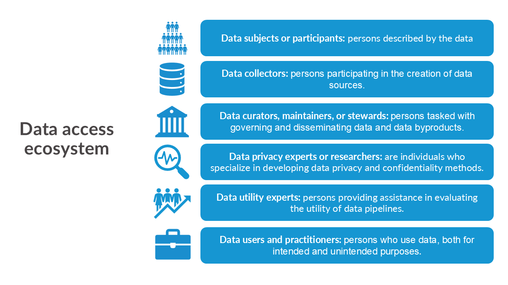
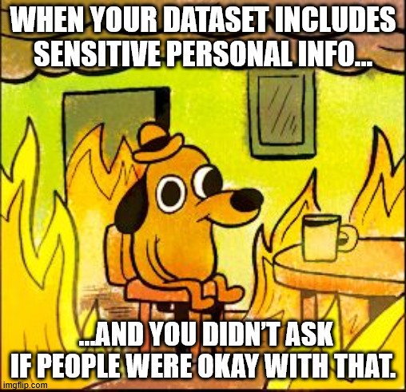
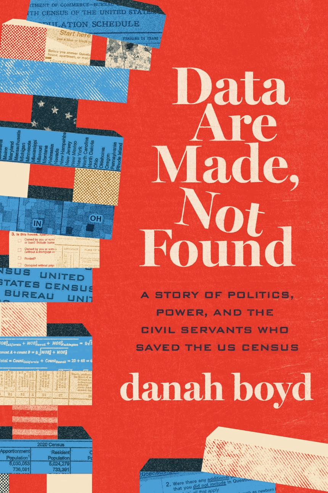
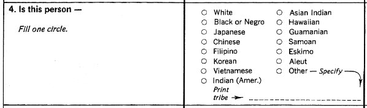
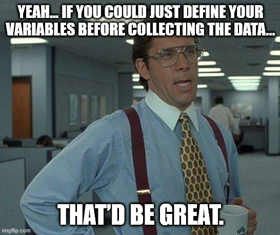
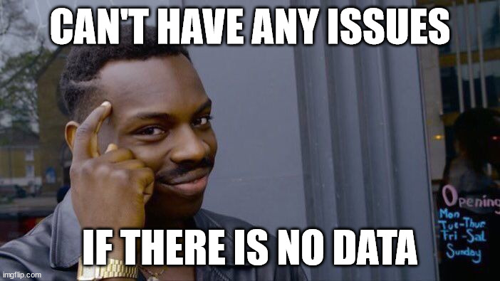

```{r}
#| echo: false

exercise_number <- 1

```

{#fig-data-collection fig-align="center" width=100%}

:::{.callout-note}

### Overview

This week focuses on the first stage of the data lifecycle: data collection and acquisition. You will learn how to:

- Describe how different types of data (primary, secondary, and administrative) are collected and how they differ in purpose and design.
- Explain how data collection decisions--such as sampling, incentives, and definitions of populations--affect representation, bias, and data quality.
- Evaluate what is included and excluded in data collection, and how missing or poorly designed data can shape research, policy, and AI systems.

:::

We start with data collection and learn about the different types of data, the importance of how we collect that data, and the issues for society caused by the absence of or poorly designed data collection.

But first...

## Quick recap on week 1

We should consider the interactions within this ecosystem and the data life cycle in the context of security, privacy, ethics, and equity.

### Definitions

{#fig-stakeholders fig-align="center"}

::: callout-tip

### Definition: Data adversaries

**Data privacy adversaries** ("adversaries" for short) are individuals who try to collect, extract, or otherwise procure data from a computing system in an inappropriate manner. 

Data privacy adversaries are known by many names, including  *intruders, attackers, hackers, snoopers,* and others. 

1. **Hackers:** adversaries who steal confidential information through unauthorized access.
2. **Snoopers:** adversaries who reconstruct confidential information from data releases.
3. **Hoarders:** stewards who collect data but don't release the data even if respondents want the information releasesd.

:::

::: callout-tip
### Data Security

**Data Security** is a condition that results from the establishment and maintenance of protective measures that enable an organization to perform its mission or critical functions despite risks posed by threats to its use of systems. Protective measures may involve a combination of deterrence, avoidance, prevention, detection, recovery, and correction that should form part of the organization’s risk management approach.. [^1] 

[^1]: National Institute of Standards and Technology (NIST). *Security*. NIST Computer Security Resource Center Glossary. https://csrc.nist.gov/glossary/term/security
:::

Data security often refers to the hardware, software, storage devices, and user devices; access and administrative controls; and organizations’ policies and procedures. For example, many organizations have switched to two factor authentication and VPN to access their systems.

::: callout-tip
### Data Privacy

**Data Privacy** is assurance that the confidentiality of, and access to, certain information about an entity is protected.[^1] 

[^1]: National Institute of Standards and Technology (NIST). *Privacy*. NIST Computer Security Resource Center Glossary. https://csrc.nist.gov/glossary/term/privacy

:::

::: callout-tip
### Confidentiality

**Confidentiality** is preserving authorized restrictions on information access and disclosure, including means for protecting personal privacy and proprietary information. [^1] 

[^1]: National Institute of Standards and Technology (NIST). *Confidentiality*. NIST Computer Security Resource Center Glossary. https://csrc.nist.gov/glossary/term/confidentiality
:::

When reviewing these definitions, it’s important to note that the terms data privacy and confidentiality are often used interchangeably, but they refer to distinct concepts.

- Privacy centers on the various flows of personal information in the different processes. In contrast, confidentiality pertains to the responsibility of data curators to protect that information.

- Both privacy and confidentiality aim to protect sensitive information and foster trust among the various entities involved in data sharing and access.

::: callout-tip
## Ethics

**Data ethics** is the "...systemizing, defending, and recommending concepts of right and wrong conduct in relation to data, in particular personal data" [@kitchin2014data].

:::

Two major categories of data privacy threats:

- **Input privacy** threats occur when adversaries gain unauthorized data access *as it is being communicated through data processing to its final audiences.*

- **Output privacy** threats occur when adversaries interpret or modify data *as it is being published to its final audiences* in order to extract sensitive information.


{#fig-data-lifecycle fig-align="center" width=80%}

We've just started exploring the world of security, privacy, ethics, and equity. Throughout this course, we'll integrate these definitions, concepts, and ideas into our discussions, applying them to the data life cycle, which we define as:

- data collection or acquisition (week 2)

- data storage (week 3)

- data sharing and transfer (week 3)

- data analysis (week 4)

- data dissemination (week 5)

- data destruction or termination (week 6)

### Week 2 Assignment

#### Read

- Chapter 2: How Did Data Privacy Change Over Time?

#### Optional read

- Part 1 Blog: [Where Do Official Statistics Come From?](https://apdu.org/2025/12/where-do-official-statistics-come-from/)
- Part 2 Blog: [New Data Sources to Improve Federal Statistics](https://apdu.org/2026/01/new-data-sources-to-improve-federal-statistics/)

#### Write (600 to 1200 words)

Find and summarize a real-world example of data being used unethically, a violation of privacy, a security breach, or a failure of responsible AI. The example must have occurred since January 2025.

In your summary, address the following questions:

1.	Background and Context
    - What happened? 
    - Who were the parties involved?
2.	Privacy, Security, Ethics, and AI Considerations
    - Which principles of privacy, security, and/or ethics were violated?
    - If AI played a role, how did it contribute to the issue?
    - Were any particular populations (e.g., children) disproportionately affected? Why?
3.	Lessons Learned
    - What organizational, technical, legal, or societal factors contributed to the problem?
    - Could the issue have been prevented? If so, how?
    - How was the situation addressed, if at all?
    - What policies, safeguards, governance practices, or technical controls would you recommend preventing similar issues?
  
Cite all references using APA format, including the real-world example you picked.

**AI Reflection (Prepare to discuss in class):** Use any generative AI tool to summarize the real-world example you picked. Compare the AI-generated summary to your own review.  What did the AI miss, oversimplify, or misunderstand about the privacy, security, or ethical issues involved?

::: callout
#### [`r paste("Class Activity", exercise_number)`]{style="color:#1696d2;"}

```{r}
#| echo: false

exercise_number <- exercise_number + 1
```

1. What real-world example did you choose, and what made it significant? Who was most affected, and why?

2. What do you think was the root cause of the issue? Was it primarily a technical failure, a governance failure, poor organizational decisions, inadequate laws or regulations, misuse of AI, or some combination of these?

3. How did the AI generated summary compare to your own analysis? What important details, context, privacy, security, or ethical considerations did the AI miss, oversimplify, or misrepresent? How might those omissions affect someone's understanding of the event?
 
:::

{#fig-this-is-fine fig-align="center" width=80%}

## Data types
There are generally three principal types of qualitative and quantitative data.

### Primary data

::: callout-tip

### Primary data
**Primary** is any data directly collected by an entity. 

:::

Direct data collection includes both quantitative data (e.g., from a survey) and qualitative data (e.g., from focus groups, site visits, qualitative interviews, or trained observations) collected from individuals or organizations. Also, with primary you will usually have access to paradata.[^paradata]

[^paradata]: Paradata are a by-product of data collection. Types of paradata vary from contact attempt history records for interviewer-assisted operations, to form tracing using tracking numbers in mail surveys, to keystroke or mouse-click history for internet self-response surveys. Because paradata are a by-product of a given data collection operation, their format, layout, and content are a function of the system that generated the data.

### Secondary data

::: callout-tip

### Secondary data
**Secondary** is any data collected by another organization that a stakeholder uses for analysis.

:::

Secondary data also include both quantitative and qualitative data; depending on the source, they may also include some paradata. Often, secondary data are in public-use files that have been sanitized for general release and use (e.g., public file of the American Community Survey[^ACS]).

[^ACS]: "The American Community Survey (ACS) helps local officials, community leaders, and businesses understand the changes taking place in their communities. It is the premier source for detailed population and housing information about our nation." Quoted from the U.S. Census Bureau website found [here](https://www.census.gov/programs-surveys/acs).

### Administrative data

::: callout-tip

### Administrative data
**Administrative** is any data collected by governments or other organizations, as part of their management and operation of a program or service, that provide information on registrations, transactions, and other regular tasks.

:::

Administrative data are collected for the administration of an organization or program by entities, such as government agencies as they provide services, companies to track orders, and universities to record registered students. These data records are usually not public-use data files and tend to only be accessed through strict confidentiality agreements, such as non-disclosure agreements or memorandum of understanding (e.g., IRS tax payer data).

::: callout
#### [`r paste("Class Activity", exercise_number)`]{style="color:#1696d2;"}

```{r}
#| echo: false

exercise_number <- exercise_number + 1
```
Working in small groups (4 to 5), choose one of the three data types.

 - Identify one real-world example of your assigned data type. Who collects the data, and for what purpose?
 - What are the main strengths and limitiations of using this type of data?
 - What privacy, security, and/or ethical concerns should be considered when collecting these data?
 - If an AI system were trained using these data, what challenges or risks might arise? Consider issues such as data quality, representation, bias, or misuse.
 
:::

### Institutional Review Boards' role in data collection

Institutional Review Boards (IRBs) review an institution's (e.g., university, government agency) research, evaluation, and technical assistance projects involving information collected from or about human subjects. The IRB reviews projects’ data collection procedures and data security plans with the objective of protecting the rights and welfare of human subjects and minimizing risks to them, as mandated by federal regulations and consistent with longstanding institutional policies.

::: {.callout-important}
## The importance of IRB
Any university or research institution-led survey or data collection involving human subjects must undergo an Institutional Review Board (IRB) process. If you see someone conducting a survey without information about the security, privacy, and confidentiality of the data, including its use, storage, and termination, you must report it to the university's or research institution's IRB.
::: 

## Data Are Made, Not Found

{#fig-data-are-created fig-align="center" width=60%}

### How do we define ourselves and society

> There are two sides to survey data collection: the experience of the participant and the experience of the researcher. Thus, building trust between the participant and the researcher is key to generating high-quality data. Communicating to people why their personal information is necessary and gaining their formal consent can lead to greater collaboration and, ultimately, allow for more inclusive survey methods.

Quote from "Do No Harm Guide: Collecting, Analyzing, and Reporting Gender and Sexual Orientation Data" [@schwabish2023no], which discusses best practices for collecting sensitive information. Although the guide focuses on gender identity and sexual orientation, its recommendations apply broadly to many forms of data collection.

One of the most important (and often overlooked) aspects of data collection is how we define people, places, and events (and more!). Categories such as race, ethnicity, disability, household, veteran status, employment, and rural/urban are not naturally occurring facts. Researchers, policymakers, and organizations made decisions about what to measure and how to measure it.

These decisions have real-world consequences. They determine who is counted (or not!), how resources are allocated (or not!), what disparities can be identified, and how AI systems and statistical models learn about the topic. As our society changes, these definitions must also evolve to remain accurate, inclusive, and fit-for-purpose.

{#fig-1980-census-race fig-align="center" width=100%}

{#fig-2020-census-race fig-align="center" width=75%}

The nuances of different races is important in some contexts and not in others. For example, the state of Wyoming probably only needs to know the number of Asian Americans (i.e., coarsen all subgroups into the larger group), whereas New York City needs the count of various subgroups, because each subgroup has different poverty rates [@sonoda2023, boddupalli2026].

::: callout
#### [`r paste("Class Activity", exercise_number)`]{style="color:#1696d2;"}

```{r}
#| echo: false

exercise_number <- exercise_number + 1

```

Article I, Section 2 of the U.S. Constitution requires that a census be conducted every 10 years. Census data are used to apportion seats in the U.S. House of Representatives and help distribute hundreds of billions of dollars in federal funding each year.

Review the race question from the 1980 and 2020 Census questionnaires.

Consider the following:

- How would you describe your own race or ethnicity? Would either questionnaire allow you to accurately identify yourself?

- Why do you think the race question changed over time?

- What are the advantages and disadvantages of collecting more detailed demographic categories?

- How might changing these definitions affect research, policymaking, funding decisions, or AI systems that rely on Census Bureau data?

:::

{#fig-boss fig-align="center" width=80%}

### Representation in data comes at a price

Large-scale surveys and data collections, such as the decennial census, are expensive. The 2020 Census is estimated to have cost over \$6 billion, including the development and testing of data collection methods, hiring and deploying field workers for nonresponse follow-up, and post-collection data processing and quality assurance. Because resources are always limited, cost is often a major driver of how data are collected. 

@sears1986college highlights that psychology research has historically relied heavily on convenience samples, particularly undergraduate college students. These participants are relatively inexpensive to recruit and are often compensated with course credit. Many of us have likely completed similar surveys in undergraduate psychology courses (I remember participating in undergrad!). As a result, several foundational research in behavioral science has been conducted on Western, educated, industrialized, and relatively young populations in controlled laboratory settings rather than on the broader populations those studies aim to represent. Although researchers have long recognized this limitation and data collection methods have evolved (e.g., online survey platforms), convenience sampling remains common because it is easy and cost-effective. 

However, we should keep in mind that the easiest populations to reach are not always the populations we most need to study.

::: callout-tip

### Convenience sampling

**Convenience sampling** (also known as grab sampling, accidental sampling, or opportunity sampling) is a type of non-probability sampling that involves the sample being drawn from that part of the population that is close at hand.[^con-samp]

[^con-samp]: "Convenience sampling (also known as grab sampling, accidental sampling, or opportunity sampling) is a type of non-probability sampling that involves the sample being drawn from that part of the population that is close at hand. Convenience sampling is not often recommended by official statistical agencies for research due to the possibility of sampling error and lack of representation of the population. It can be useful in some situations, for example, where convenience sampling is the only possible option. A trade-off exists between this method's speed and accuracy. Collected samples may not accurately represent the population of interest and can be a source of bias; however, larger sample sizes reduce the likelihood of sampling error occurring." [Convenience sampling](https://en.wikipedia.org/wiki/Convenience_sampling)

:::

There are other trade-offs to consider when balancing accuracy of data collection against other practical challenges:

- **Incentives and participation costs.** Researchers often use incentives such as gift cards or cash payments to improve response rates. However, administering incentives can be expensive and logistically complex. For example, providing \$10 gift card to 1,000 participants requires \$10,000 in direct costs, not including administrative overhead. Researchers must weigh whether increased participation and representativeness justify these costs. Also, such costs may not improve the response rates!

- **Accessibility and participation formats.** Remote tools such as Zoom or Teams have made it easier to conduct interviews and focus groups, especially across geographic regions where travel can be difficult (e.g., rural region) or costly (e.g., rising gas prices, childcare). However, remote participation introduces new constraints, including lack of private space, household distractions, and unequal access to stable internet or devices.

  > We ask that you participate in a private setting away from earshot or viewing by unauthorized persons to include family members and given technical limitations with zoom and similar internet platforms, we cannot guarantee the confidentiality of what might be said.

- **Informed consent and participation burden.** Researchers must balance providing sufficient information about risks and rights without overwhelming or discouraging participation. Consent processes must be understandable (e.g., high school reading level), but also accurate about how data will be used and protected.

  > You are being invited to participate in a research study. Your participation is voluntary, and you should only participate if you fully understand what the study requires and what the risks of participation are. You should ask the study team any questions you have related to participating before agreeing to join the study. 
  >  
  > The research study is being conducted to create a “Do No Harm Guide” on the best practices to equitably apply common data privacy approaches to help data privacy practitioners do no harm to people and communities when protecting data. 
  >  
  > As part of this study, we are interviewing data privacy and confidentiality researchers and practitioners from various work sectors and technical backgrounds. Given your expertise in the field, we would like to interview you for 45 minutes about your experience implementing data privacy and confidentiality methods and your thoughts about applying them equitably.
  >  
  > If you agree to join the study, you will be asked to participate in a video interview. You may refuse to answer any questions that you do not want to answer and still remain in the study. Before we begin the interview, we will request that the interview be recorded. We will not record if you do not wish us to do so. If you request that we do not record, we will take notes.
  >  
  > We ask that you participate in a private setting away from earshot or viewing by unauthorized persons to include family members and given technical limitations with zoom and similar internet platforms, we cannot guarantee the confidentiality of what might be said.
  >  
  > Your participation will last for 45 minutes.
  >  
  > The potential benefits of this study are minimal, but you may receive reputational benefits from being quoted or referenced in our report. 
  We do not anticipate any risks from participation. You are free to decline or stop participation at any time during or after the initial consenting process. If during or at the end of the interview you would like to terminate the interview, we will do so. If during or at the end of the interview you decide you would like us to not cite or reference your comments, we will oblige.

- **Integrity and authenticity in remote data collection.** As data collection increasingly moves online, new risks have emerged. For example, participants may use AI tools or automated systems to complete surveys or interviews in exchange for incentives, raising concerns about data validity and the authenticity of responses.

Across all of these examples, researchers make deliberate decisions about who is included in a study, how the target population is defined, and how participants are recruited. These choices shape the representativeness and validity of findings, and they have downstream consequences for public policy, health care, business decision-making, and increasingly, for artificial intelligence systems trained on these data.

### No data, no problem, no action

In this next subsection, we examine real-world cases where the absence of data directly limits analysis, accountability, and policy action.

#### Library of Missing Datasets

Do you agree or disagree that we should answer the following questions with data?

- Sales and prices in the art world (and relationships between artists and gallerists)
- People excluded from public housing because of criminal records
- Trans people killed or injured in instances of hate crime (note: existing records are notably unreliable or incomplete)
- Poverty and employment statistics that include people who are behind bars
- Muslim mosques/communities surveilled by the FBI/CIA
- Mobility for older adults with physical disabilities or cognitive impairments
- LGBT older adults discriminated against in housing
- Undocumented immigrants currently incarcerated and/or underpaid
- Undocumented immigrants for whom prosecutorial discretion has been used to justify release or general punishment
- Measurements for global web users that take into account shared devices and VPNs
- Firm statistics on how often police arrest women for making false rape reports
- Master database that details if/which Americans are registered to vote in multiple states
- Total number of local and state police departments using stingray phone trackers (IMSI-catchers)
- How much Spotify pays each of its artists per play of song

Now consider: what if there are no reliable, publicly available datasets that fully answer these questions?

{#fig-1990-census-race fig-align="center" width=50%}

These questions are part of a mixed-media installation by [Mimi Ọnụọha](https://mimionuoha.com/) called, The Library of Missing Datasets, which is on [version 3.0](https://mimionuoha.com/the-library-of-missing-datasets-v3). Although the project has not been updated since 2021–2022, it continues to raise important questions about why certain data do not exist, and what those absences reveal about data collection priorities and power.

From Mimi Onuoha's website,

> "Missing datasets" are the blank spots that exist in spaces that are otherwise data-saturated. Wherever large amounts of data are collected, there are often empty spaces where no data live. The word "missing" is inherently normative. It implies both a lack and an ought: something does not exist, but it should. That which should be somewhere is not in its expected place; an established system is disrupted by distinct absence. That which we ignore reveals more than what we give our attention to. It’s in these things that we find cultural and colloquial hints of what is deemed important. Spots that we've left blank reveal our hidden social biases and indifferences.

::: callout
#### [`r paste("Class Activity", exercise_number)`]{style="color:#1696d2;"}

```{r}
#| echo: false

exercise_number <- exercise_number + 1
```
Mimi Ọnụọha created the list of questions for "The Library of Missing Datasets 3.0" in 2022. In earlier versions of the installation, she also tracked how some datasets transitioned from “missing” to “available” over time. For example:

> Civilians killed in encounters with police or law enforcement agencies [update: this is no longer a missing dataset]

In the next 10–15 minutes, choose one example from the Library of Missing Datasets and attempt to locate a *publicly available dataset* that could reasonably address it.

- Were you able to find a dataset that directly answers the question? If not, did you find something close?
- What does the absence (or partial presence) of data tell you about priorities in data collection and governance?

:::

#### Asian Americans are highly educated, born in the U.S., and speak English

Not collecting data is one issue. Another, which could be just as or even more detrimental to society, is collecting the wrong kind of data. If we are not careful with how we design data collection, we could create harmful narratives about certain areas of society, especially underrepresented groups.

An example of this is work done by my colleague, [Dr. Sunghee Lee](https://surveydatascience.isr.umich.edu/slee) of the University of Michigan. She presented her in the same conference session as me, where she discussed how incomplete data on Asian-American populations risks fueling a vicious circle of inaction and growing inequality. One of her projects compared the socio-demographics of Asian-American respondents reported in four large-scale sample surveys against the same characteristics collected by the US Census Bureau’s American Community Survey,[^ACS] which is often referred to as the gold standard survey on the United States populations and housing information [@tarran2023].

[^ACS]: "The American Community Survey helps local officials, community leaders, and businesses understand the changes taking place in their communities. It is the premier source for detailed population and housing information about our nation." [U.S. Census Bureau's page on the American Community Survey](https://www.census.gov/programs-surveys/acs).

When comparing these surveys, Dr. Lee found that the four surveys often differed in important respects. For example, Asian Americans accounted for seven percent of adults aged 18 and over in the American Community Survey. In contrast, the General Social Survey[^GSS] and Behavioral Risk Factor Surveillance Survey[^BRFSS] accounted for only four percent and two percent, respectively. The American Community Survey shows 27 percent of Asian-American respondents are educated to high-school level or below, the equivalent grouping in the Behavioral Risk Factor Surveillance Survey accounted for 18 percent.

[^GSS]: "[C]onducted every two years, NORC interviews a representative sample of Americans about a range of topics. The questions address belief in God, confidence in government institutions, race relations, abortion, spending patterns, gun rights, social isolation—even pet ownership." [NORC at the University of Chicago's page on the General Social Survey](https://www.norc.org/research/projects/gss.html).

[^BRFSS]: "The Behavioral Risk Factor Surveillance System (BRFSS) is the nation’s premier system of health-related telephone surveys that collect state data about U.S. residents regarding their health-related risk behaviors, chronic health conditions, and use of preventive services." [U.S. Centers for Disease Control and Prevention's page on the Behavioral Risk Factor Surveillance System](https://www.cdc.gov/brfss/index.html). 

However, none of these surveys, except the American Community Survey, collected data on Asian Americans’ proficiency with spoken English.

According to the American Community Survey, 31 percent of Asian-American adults have "limited English proficiency." Dr. Lee's research found that none of the four selected surveys (General Social Survey and Behavioral Risk Factor Surveillance Survey, plus the Current Population Survey[^CPS] and National Health Interview Survey[^NHIS]) offered questionnaires in Asian languages; only English and Spanish.

[^CPS]: "The Current Population Survey, sponsored jointly by the U.S. Census Bureau and the U.S. Bureau of Labor Statistics, is the primary source of labor force statistics for the population of the United States." [U.S. Census Bureau's page on the Current Population Survey](https://www.census.gov/programs-surveys/cps.html).

[^NHIS]: "The National Health Interview Survey on a broad range of health topics are collected through personal household interviews. Survey results have been instrumental in providing data to track health status, health care access, and progress toward achieving national health objectives." [U.S. Centers for Disease Control and Prevention's page on the National Health Interview Survey](https://www.cdc.gov/nchs/nhis/index.htm). 

Due to the poorly designed surveys, anyone using these data will find that most Asian Americans are born in the US and/or who have high levels of English proficiency, missing the true geographic and ethnic heterogeneity of the Asian American population. This underrepresentation of certain Asian-American subgroups encourages a potential vicious cycle of having no "data-driven" proof to collect such information. This means that issues affecting certain population groups are not identified, meaning no action needs to be taken.

Hence, at the end of the presentation, Dr. Lee's slide stated, "No data, no problem, no action".

{#fig-no-data fig-align="center" width=80%}

::: callout
#### [`r paste("Class Activity", exercise_number)`]{style="color:#1696d2;"}

```{r}
#| echo: false

exercise_number <- exercise_number + 1
```
Choose one publicly available dataset that interests you. Examples include data from the U.S. Census Bureau, Bureau of Labor Statistics, Centers for Disease Control and Prevention, local governments, sports statistics, weather records, Spotify, Zillow, or another source.

For this activity, you are not analyzing the data. Instead, you are investigating how the data were created.

Answer the following questions:

- What dataset did you choose, and what does it measure? Who collects the data, and for what purpose?

- How are the data collected? How are people, places, or events defined and categorized (what is not collected)? Which of the three data types (primary, secondary, or administrative) best describes the dataset?

- How might these definitions or categories influence downstream decisions? Consider how they could affect research findings, resource allocation, policy decisions, AI systems, or who is included or excluded from services.

After 10 minutes, be prepared to briefly describe your dataset, identify one important design decision you discovered, and explain why it matters.

:::

## Week 3 Assignment

::: {.callout-important}
## DEADLINE
Due July 13th, Sunday, at 11:59 pm EDT on Canvas
::: 

### Read

- Chapter 3: How Do Data Privacy Methods Expand Access to Data?

### Optional additional read

- [The Future of Public Data Lies in the States, But It’s Complicated](https://issues.org/public-data-states-bowen/).

### Write (600 to 1200 words)

Choose a community you belong to (e.g., your hometown, workplace, religious organization, college community, or another community that is meaningful to you). Identify a public dataset or data collection effort that is used to inform decisions affecting that community. Examples may include data collected by the U.S. Census Bureau, Bureau of Labor Statistics, Centers for Disease Control and Prevention, Department of Transportation, local governments, or other public agencies.

Describe the dataset and explain how it is collected, who collects it, and how it is used to inform decisions, policies, or resource allocation.
In your discussion paper, address the following questions:

1.	Data Collection and Acquisition
    - How are the data acquired (e.g., surveys, administrative records, sensors, web scraping, third-party data, or other methods)?
    - Who is responsible for collecting and maintaining the data?
2.	Representation and Data Quality
    - Who is represented in the data?
    - Are there populations that may be underrepresented, excluded, or difficult to measure? (e.g., children, veterans, persons with disabilities)
    - How might missing or inaccurate data affect decisions made using the dataset?
3.	Privacy, Security, and Ethics
    - What privacy, security, and/or ethical concerns arise from collecting this information?
    - How would limiting or expanding access to this dataset affect your community in making decisions?
    - What might be the privacy, security, and/or ethical risks could result from collecting or linking additional information?

Example (that you can’t use): [School district lines](https://apps.urban.org/features/dividing-lines-school-segregation/).

Cite all references using APA format, including the real-world example you picked.

**AI Reflection (Prepare to discuss in class):** What risks might arise if AI systems are trained on incomplete, biased, or unrepresentative data? How might that impact your community?

# References