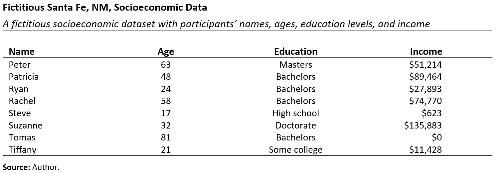
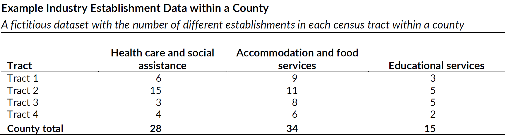
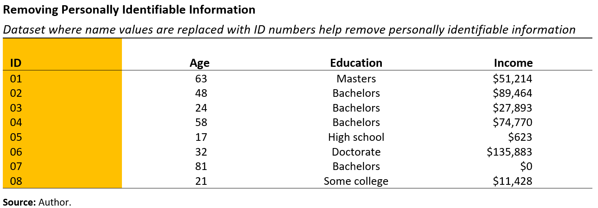
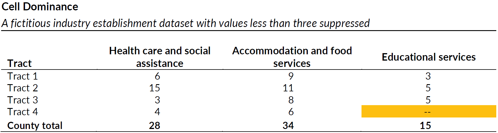
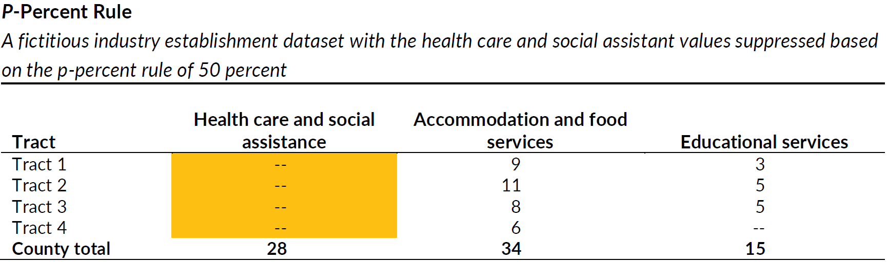
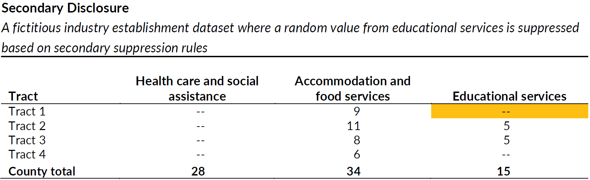
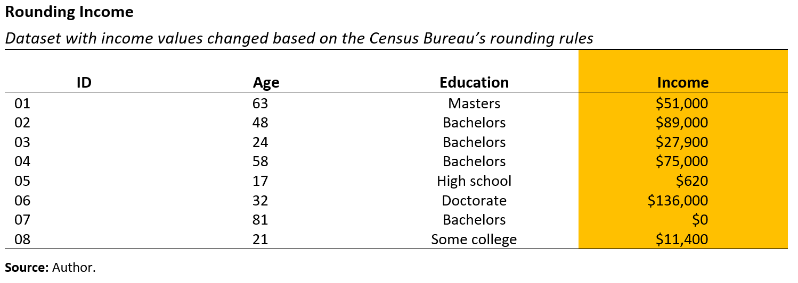
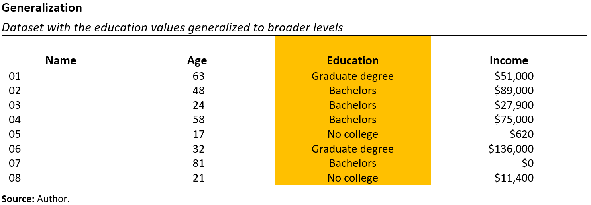
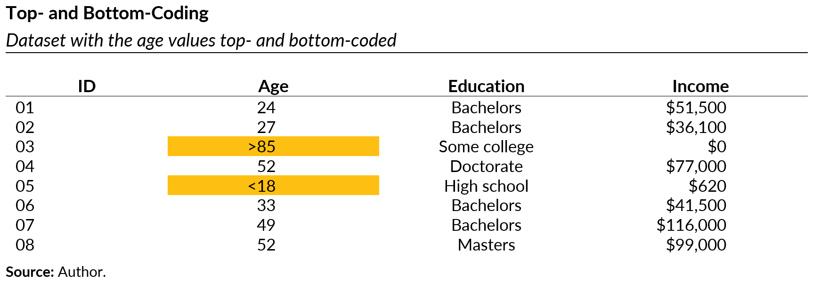

```{r}
#| label: setup
#| echo: false
#| warning: false
#| message: false

library(tidyverse)
library(palmerpenguins)
library(kableExtra)
library(gt)
library(urbnthemes)
library(here)
library(haven)

set_urbn_defaults(style = "print")
options(scipen = 999)

source(here::here("R", "create_table.R"))

exercise_number <- 1

```

{#fig-americans-consent fig-align="center" width=100%}

```{r}
#| echo: false

exercise_number <- 1

```

## Importance of sharing data



::: callout
#### [`r paste("Class Activity", exercise_number)`]{style="color:#1696d2;"}

```{r}
#| echo: false

exercise_number <- exercise_number + 1
```

From this short video, what data sharing issues can you identify?

:::

@fienberg1994sharing outlines the ethical, institutional, legal, and professional dimensions for sharing statistical data in biomedical and health sciences, but these ideas apply to all data. I also continue to draw from the guide by @icpsr.

### Required by law or funding support

One of the foremost reasons for sharing data is that it is often mandated by law or funding sources, such as the National Science Foundation and the National Institutes of Health, two of the largest funders of scientific research in the US. Unfortunately, some researchers are not diligent about following through or find loopholes, such as claiming the information is too sensitive to share or has proprietary aspects.

### Scientific rigor

Making data publicly available has several key benefits for the scientific community. It reinforces open scientific inquiry, as the self-correcting features of science work most effectively when data are widely available. It encourages diversity of analysis and opinions, enabling researchers to challenge each other's analyses and conclusions. It promotes new research and allows for testing new or alternative methods, with numerous examples of data being used in ways the original investigators had not envisioned. Additionally, it improves methods of data collection and measurement through the scrutiny of others. Overall, making data publicly available helps the scientific community reach consensus on various methods.

### Cost reduction

Reduces costs by avoiding duplicate data collection efforts. From @icpsr:

> Some standard datasets, such as the General Social Survey and the National Election Studies, have produced literally thousands of papers that could not have been possible if the authors had to collect their own data. Archiving makes known to the field what data have been collected so that additional resources are not spent to gather essentially the same information.

### Training

Data are also an important resource for training the next generation of researchers and for working professionals seeking to improve their technical skills. For instance, think back to your past courses when you were learning a new technical skill. Did it help to have a realistic dataset to test your skills on?

An example the Urban Institute collaborated with the Allegheny County Department of Human Services and the Western Pennsylvania Regional Data Center (WPRDC) to create a [synthetic version of the County’s confidential social and human service utilization data](https://data.wprdc.org/dataset/synthetic-integrated-services-data). Synthetic data replace actual records in a dataset with pseudo-records, with the goal of closely mimicking key distributional and statistical properties of the original records. This allows agencies to release data disaggregated by race and ethnicity while reducing the risk of privacy violations. [Graduate students at the University of Pittsburgh](https://news.engineering.pitt.edu/using-data-for-social-good/) examined the data and confirmed that it could be used effectively, for instance, to allocate resources for overdose prevention. 

### Data of the people, by the people, and for the people

Finally, I like to say that these data are often "of the people, by the people, and for the people."

The data are *of the people*, in the sense that people do care about their privacy and their confidential data. Although they may be willing to trade off information a bit at a time to private sector actors for useful purposes, many people would be deeply unhappy if their personal data was widely available.

The data are also *by the people*, in the sense that government collection of people’s information is supported by taxpayer dollars. Therefore, one could argue that anonymized individual-level data should be accessible to data users—such as data practitioners, external researchers, or public policymakers.

Literally volumes of research could be cited here about how increased access to government data results in social good *for the people*.

::: {.callout-note}
## Open-source code is also important!

The reasons for sharing data applies to sharing code.

::: 

## Secure data access

Over the years, government agencies have been moving slowly toward allowing more data users direct access to the underlying cleaned data, under strict controls. 

### Secure enclaves

An example of direct data access is through a secure enclave, such as the Federal Statistical Research Data Centers.[^FSRDC] This secure enclave became available in 1982 (then called the Center for Economic Studies), after data users demanded access to better quality data when the US Census Bureau became more aggressive with its applications of statistical data privacy methods on its data products.

Although more secure facilities are becoming available (for example, the National Science Foundation Secure Data Access Facility[^SDAF]), researchers face several challenges to obtain this direct access. Full access to these data is only available to select government agencies, a limited number of data users working in collaboration with analysts from those agencies, or through highly selective research programs administered by these agencies. Further, data users are often required to be US citizens, undergo lengthy clearance processes to gain direct access (which can take months or years), and submit extensive research proposals.

[^FSRDC]: “Federal Statistical Research Data Centers (FSRDCs) are partnerships between federal statistical agencies and leading research institutions. FSRDCs provide secure environments supporting qualified researchers using restricted-access data while protecting respondent confidentiality.” From the U.S. Census Bureau's webpage on [Federal Statistical Research Data Centers](https://www.census.gov/about/adrm/fsrdc.html).

{#fig-fsrdcs fig-align="center" width=80%}

[^SDAF]: The [National Science Foundation Secure Access Facility](https://www.norc.org/research/projects/nsf-secure-data-access-facility.html) provides authorized researchers secure remote access to National Center for Science and Engineering Statistics data and metadata, such as the Survey of Earned Doctorates and the national Survey of Recent College Graduates.

::: {.callout-warning}
## Federal Statistical Research Data Centers

At the time of publication, the textbook mentions there are 30 Federal Statistical Research Data Centers [@bowen2021protecting]. At the time of this course, there are 35. See the U.S. Census Bureau's webpage on [Federal Statistical Research Data Centers](https://www.census.gov/about/adrm/fsrdc.html) for the number and [locations](https://www.census.gov/about/adrm/fsrdc/locations.html).

The 35 Federal Statistical Research Data Centers across the United States (including Puerto Rico!) may seem like enough to be geographically accessible to most data users. But that is not the case. These data centers are primarily located in places with large academic institutions. For me, living in Santa Fe, New Mexico (the state capital), the closest is a 7.5-hour drive to Boulder, Colorado. Moreover, remote access to these data centers grants access to only a limited selection of confidential data and requires a setup that simulates a secure enclave working station, which may prove challenging for many individuals.

::: 

### Restricted access

Sometimes confidential data will need to be transferred to an external systems for further analysis. The following are two safe options that are standard ensure a secure file transfer: 

- File transfer using secure electronic connections. Most workplaces have Secure File Transfer Protocol (SFTP) servers to allow external parties to exchange data with them through encrypted connections. This also includes encrypted emails, file transfers to file hosting services (e.g., Dropbox), survey tools (e.g., Qualtrics), and other services using browser-based transfers with Transfer Layer Security (TLS).
- File transfers using compressed (e.g., zipped), encrypted, password protected files to emails where the password is shared by another means by phone or text message and the encryption is FIPS 140-2 complaint, usually AES 128 or AES 256.

::: {.callout-important}
## DO NOT EMAIL DATA WITHOUT ENCRYPTION!

Do not share data through unencrypted file transfers over the Internet or in the body of, or as an unencrypted attachment to, an unencrypted email. Always consider some form of SFTP!

::: 

You can also restrict access by limiting the use of confidential variables. For example, if a file is considered confidential because it contains identifying names and addresses, those variables may be removed from the file and replaced with pseudo identifiers. The sanitized file can then be used and shared without risk of violating confidentiality. You can also regulate access restrictions by limiting people within your workplace from accessing specific computer accounts or files.

::: callout
#### [`r paste("Class Activity", exercise_number)`]{style="color:#1696d2;"}

```{r}
#| echo: false

exercise_number <- exercise_number + 1
```

As we’ve explored secure data access methods, such as secure enclaves and restricted file transfers. It’s clear that strong protections are essential for safeguarding sensitive information.

Given the current infrastructure for secure data access (e.g., FSRDCs, remote secure setups, restricted file transfers), what are the privacy, security, ethical, and equity implications of these systems?

Things to consider in answering this question:

- Who gets access to high-quality, confidential data—and who doesn’t?
- How do geographic, institutional, or citizenship requirements influence equity in research?
- Are current security measures proportionate to the risks they’re trying to mitigate?
- How might these systems reinforce or challenge power imbalances in data use?

:::

## Public data files and statistics

The following is discussed in @bowen2021protecting and @bowen2024government.

For decades, government agencies produced public use data and statistics. During the pre-computer era in the early to mid-1900s, public use data were available to those who braved the “government documents” section of research libraries or those who physically went to government offices to inspect available files. But government agencies typically reported summary statistics, such as total spending on unemployment insurance and total number of people receiving it. Knowing such information on a county-by-county or metro-area basis did not pose much threat to privacy.

As the computer era arrived, government agencies started to provide more detailed public use data that could be directly accessible to both researchers and the general public. For example, the Statistics of Income Division of the Internal Revenue Service releases a public use file for data users based on administrative taxpayer data. Several organizations, such as the American Enterprise Institute [@debacker2019integrating], the Urban-Brookings Tax Policy Center [@mcclelland2019tcja], and the National Bureau of Economic Research [@bierbrauer2021politically], develop microsimulation models based on this public use file that inform the public on potential impacts of tax policy proposals.

To ensure that these public use data protect individual privacy, extensive statistical data privacy methods (or statistical disclosure control) are implemented. Here, I will use a fictitious socioeconomic dataset to illustrate a range of such methods. For a more comprehensive overview of these methods, @matthews2011data offer a detailed review, while @mckenna2019legacy summarize the specific statistical data privacy methods employed by the US Census Bureau.

## Privacy-Enhancing Technologies (PETs)

Privacy-Enhancing Technologies (PETs) are critical tools for ensuring responsible data stewardship. 

::: callout-tip

### Privacy-enhancing technologies 

**Privacy-enhancing technologies** (PETs) are computing technologies that enable safer data sharing while mitigating potential privacy risks.

:::

PETs may refer to algorithmic data processing techniques, hardware configurations, communication protocols, or other computing technologies that address potential privacy risks. In general, PETs can be distinguished into two types: 

- **Input Privacy PETs** aim to protect data *communication* to prevent *unauthorized access* during data processing and storage. Examples include: 
  - **Secure multi-party computation (MPC):** algorithms that allow multiple parties to compute a function on their joint data without revealing the inputs to one another. For example, the [Boston Women's Workforce Council](https://thebwwc.org/mpc) used MPC to securely aggregate salary data across Boston employers to analyze wage disparities without revealing which employers contributed which pieces of salary data. 
  - **Privacy-preserving record linkage (PPRL):** algorithms that allow multiple parties to analyze data on individuals present in multiple datasets without sharing identifying information needed to link records. For example, the [National Covid Cohort Collaborative](https://covid.cd2h.org/PPRL/) used PPRL to link COVID data across multiple electronic health records systems without directly sharing PHI. 
  - **Federated learning (FL):** algorithms that enable iterative training for machine learning, generative AI, or other optimization-based models on local devices to avoid directly transferring sensitive information to a central server. For example, [NVIDIA's Autonomous Vehicles team](https://developer.nvidia.com/blog/federated-learning-in-autonomous-vehicles-using-cross-border-training/) uses FL to minimize data transfers between autonomous vehicles located in different countries. 
  
- **Output Privacy PETs** aim to protect data *publishing* to prevent *unauthorized disclosure* using published outputs. Examples include: 
  - **Statistical disclosure control (SDC):** traditional algorithms that modify statistical data products (usually following deterministic rules) prior to publication to avoid leaking confidential information. For example, the [DC Office of the State Superindendent of Education](https://osse.dc.gov/page/student-privacy-and-data-suppression-policy-glance) uses different cell suppression policies to determine whether tabular count statistics are safe to publish or require modification or deletion.
  - **Synthetic data generation:** algorithms that use generative modeling to generate datasets that imitate the statistical properties of confidential datasets while limiting the ability to infer information about individual records within the confidential datasets. For example, the [U.S. Census Bureau's Synthetic Longitudinal Business Database](https://www.census.gov/programs-surveys/ces/data/public-use-data/synthetic-longitudinal-business-database.html) generates synthetic longitudinal data about business establishments and their payrolls and employee counts.
  - **Differential privacy** algorithms that use randomized noise to estimate statistical outputs while providing a priori or formal disclosure risk limitation properties. For example [Apple](https://www.apple.com/privacy/docs/Differential_Privacy_Overview.pdf) uses differential privacy to model emoji usage for automatic emoji suggestions within Apple product keyboard interfaces. 

### Common Threats

#### Threats to Privacy and Data Access

Privacy threats arise from **data intruders**,who seek to misuse data for harmful or exploitative purposes.

Common threats include:

- **Reconstruction for proprietary gain**: Using released data to reconstruct individual-level information for resale to third-party data brokers.

- **Reidentification for targeted harm**: Reidentifying members of marginalized subpopulations for social, economic, or political exploitation.

#### Threats to Data Access and Utility

Efforts to protect data privacy can also introduce **barriers to data usability**.

- **Overly conservative sharing policies**: Excessive suppression of data that limits the usefulness of public datasets.

- **Cumbersome approval processes**: Requiring lengthy or exclusive security clearances for access to restricted-use datasets.
  
### What Are PETs?

PETs are methods and tools that help reduce privacy risks in different stages of the data lifecycle. They are used in:

- Designing data communication protocols and system architectures.
- Designing data processing algorithms.
- Measuring privacy risks associated with both the above.

::: callout-warning
### WARNING: No silver bullet

PETs are *not plug-and-play*. 

Because applying PETs requires engaging with multiple tools, each with many design choices, the effectiveness of PETs is a function of...

1. How a particular PET is implemented, and...
2. Whether or not the PET is capable of addressing substantive privacy concerns.

:::

## Statistical Disclosure Control Methods

::: callout-tip
## Statistical Disclosure Control 

**Statistical Disclosure Control (SDC)**, sometimes referred to as Statistical Disclosure Limitation (SDL), is a field of study. It aims to develop and apply statistical methods that enable the release of high-quality data products while reducing the risk of disclosure, or release of sensitive information contained in the data.

:::

These methods have existed within statistics and the social sciences since the mid-20th century; researchers have likely encountered some of them before, even outside of the privacy context. SDC can be as simple as:

- suppressing (not releasing or withholding) certain records or results,
- aggregating variables into larger groups (like reporting state-level data rather than county-level data), or
- rounding numeric values to make them less distinct.

Chapter 3 of @bowen2021protecting walks through these methods using a famous piece of art. Below are some of the PETs across three different formats:

1.  **Conceptually**, using an iconic painting by Georges Seurat.
2.  **Illustratively**, through a fictitious micro-level socioeconomic dataset containing hundreds of individual records from Santa Fe, NM.
3.  **Computationally**, with coding examples.

:::: panel-tabset
### <font color="#1696d2">**Conceptual**</font>

Each person in the painting in @fig-sunday-data is currently re-identifiable. The goal of PETs is to preserve certain statistical qualities of the data (in this metaphor, the general image of the painting) while also maintaining privacy. We will demonstrate how each PETs change both the re-identifiability of the individuals and the larger image of the painting.

These illustrative images were originally published in @bowen2021protecting and are used with the author's permission.

{#fig-sunday-data fig-align="center" width="100%" fig-alt="Georges Seurat's *A Sunday Afternoon on the Island of La Grande Jatte (1884)*; no disclosure control techniques applied."}

### <font color="#fdbf11">**Illustrative**</font>

We will use two different fictitious micro-level datasets. The first is a socioeconomic dataset contains hundreds of records for individuals residing in Santa Fe, NM. @fig-socio-data displays a sample of eight records from the dataset, which includes the person’s name, age, education, and income.

{#fig-socio-data fig-align="center" fig-alt="Fictitious Santa Fe, NM, Socioeconomic Data"}

The second dataset is a confidential dataset containing the number of Health Care and Social Assistance, Accommodation and Food Service, and Educational Services establishments at the census-tract level within a county .

{#fig-establishment-data fig-align="center" fig-alt="A fictitious dataset with the number of different establishments in each census tract within a county."}

### <font color="#ec008b">**Computational**</font>

The data (`pud_data`) are from a Department of Labor study @lachowska2015 on *The Effects of Eliminating the Work Search Requirement on Job Match Quality and Other Long-Term Employment Outcomes.* The project is a follow up on the work done by @klepinger1991, which studied ways to reduce unemployment insurance (UI) receipt and duration of a recipient being out of work, by assigning them to one of three treatment groups or a control group. Each of the four groups have different work search requirements (WSR) to be eligible for receiving UI benefits. The claimants were randomly assigned based on the last digit of their SSN between the period of July 1986 and August 1987. The 2015 study used this data and then added on nine years of administrative wage records to estimate the effect of removing WSR on employment outcomes for the recipients.

The study combines data from three sources to create a panel at the individual claimant level:

a)  UI claims records that provide data on amount of benefits and when its provided in a benefit year,
b)  quarterly administrative wage records used to track wages and hours, and
c)  employment service records that has data on individual characteristics such as occupation, typically used for job placements.

```{r, echo = TRUE, fig.height = 3.5}

pud_tb <- read_dta(here::here("data", "pud.dta")) |>
  select(agele24, ageyrs, collgrad, earnyr1, married, nevmarr, divorced, marstoth, whltrd, rtltrd)

pud_tb |>
  head() |>
  create_table()

```

::: {.callout-warning title="WARNING: Not confidential data"}

The data used here already underwent through a statistical data privacy process to remove identifiable information, but for illustrative purposes, we assume the data to be 'sensitive.'

:::

::::

### Suppression

::: panel-tabset
### <font color="#1696d2">**Conceptual**</font>

**Suppression** refers to omitting data or information about certain subgroups or data point(s). For example, excluding counts or proportions that are based on very small sample sizes.

In @fig-sunday-suppressed, we can see that many individuals from the painting have been removed entirely.

{#fig-sunday-suppressed fig-align="center" width="100%" fig-alt="Many individuals have been suppressed from the painting and are no longer present."}

### <font color="#fdbf11">**Illustrative**</font>

**Suppression** refers to omitting data or information about certain subgroups or data point(s). For example, excluding counts or proportions that are based on very small sample sizes.

#### a. Primary Suppression

Most personally identifiable information, such as names, should be removed from the data (see @fig-socio-data-pii). We can replace names with numbers (or remove them entirely). Data curators, who are responsible for safeguarding the data, may generate individual level identification numbers if they plan to link the data with other information. If there is no intention to link the data with another source, the variable may be entirely removed.

{#fig-socio-data-pii fig-align="center" fig-alt="Removing personally identifiable information"}

##### i.) Suppressing statistics

The most common use case for suppression is the removal of statistics, such as counts or proportions, from public release. In Figure @fig-establishment-data, the statistics shown are cell counts of various establishments within a county. Suppressing this type of statistic is often referred to as cell dominance, which requires that any cells with fewer than three contributors (e.g., individuals or households) be automatically suppressed. Figure @fig-cell-dominance illustrates this rule by showing the suppression of all cells with fewer than three industry establishment contributors.

{#fig-cell-dominance fig-align="center" fig-alt="A fictitious industry establishment dataset with values less than three suppressed."}

##### ii.) Suppressing observations

In some cases, we might need to suppress the observations corresponding to a specific subset of variable values. For example, we could remove any minors (individuals under the age of 18), such as observation no. 5 (see @fig-socio-data-pii).

##### iii.) Suppressing variables

Suppose in the industry establishment dataset we want to determine whether we should report the values of Health Care and Social Assistance, where we might suppress the variable. One method that some federal agencies use is called p-percent rule, which determines whether a cell should be suppressed based on the contributions to that cell. If after excluding the top two contributors the remaining sum is less than a certain percentage of the top contributor’s value, the cell is not suppressed. The idea is that the rule protects the top contributor from the second contributor and vice versa.

For example, let $p$ be 50 percent. The Health Care and Social Assistance values have the two largest contributors as 15 and 6. The sum of the remaining values is 7, which is less than 7.5 (i.e., 15 × 0.5 = 7.5). This means that Health Care and Social Assistance must be suppressed. If we repeat this for the remaining columns in @fig-p-percent, we do not suppress any more values.

In this case, we suppressed all the values, except the total count, for Health Care and Social Assistance variable.

{#fig-p-percent fig-align="center" fig-alt="A fictitious industry establishment dataset with values less than three suppressed."}

#### b. Secondary Suppression

Secondary disclosure requires that any grouping of records cannot have only one contribution suppressed using primary suppression. In @fig-cell-dominance, for instance, we removed the Education Service value for tract 4 because of primary suppression of statistics. If we report the Educational Services values as is, a malicious actor could calculate the suppressed tract 4 value by calculating 15 – 3 – 5 – 5 = 2. Following secondary disclosure rules, we randomly suppress one of the values remaining in the Educational Services column in @fig-secondary.

{#fig-secondary fig-align="center" fig-alt="A fictitious industry establishment dataset where a random value from educatoinal services is suppresed based on secondary suppression rules."}

### <font color="#ec008b">**Computational**</font>

**Suppression** refers to omitting data or information about certain subgroups or data point(s). For example, excluding counts or proportions that are based on very small sample sizes.

In the example below, we identify a subset of the observations and demonstrate how to:

  a) suppress earnings information of the selected sample and, 
  b) drop the subset of observations.

```{r}
#| echo: false
#| message: false

pud_tb <- pud_tb |>
  mutate(age_25 = c(rep(1,5), rep(0, n() - 5)))

```

The variables referenced here are as follows:

-   `agele24`: Indicator variable (values 0 and 1) for age less than or equal to 24.
-   `collgrad`: Indicator variable (values 0 and 1) for college graduate.
-   `earnyr1`: Earnings in year 1.
-   `age_25` : Indicator variable (values 0 and 1) for individuals aged 25. Note that this is variable is created for demonstrative purposes and not part of the actual data.

```{r}
#| echo: false
#| message: false

pud_tb |>
  filter(age_25 == 1) |>
  select(agele24, married, collgrad)

```

#### a. Primary Suppression

For this example, we noticed that there are only 7 observations that are under 24, married, and a college graduate. Suppose that our threshold for the number of observations to be suppressed is 10. This means we must either suppress (i.e., remove) these observations or the corresponding values for specific sensitive variables (e.g., `earnyr1`). The `earnyr1` variable on its own or other variables (e.g., age, marital status, etc.) can reveal personally identifiable information.

To find those 7 observations, we use functions from the `tidyverse` package to first `filter` the observations on conditions in reference to the age, marriage, and education variables, and then `select` the specific variables to be displayed.

```{r}
pud_tb |>
  filter(agele24 == 1 & married == 1 & collgrad == 1) |> 
  select(agele24, married, collgrad, earnyr1)

```

##### i.) Suppressing statistics

The most common use case for suppression is suppressing statistics (e.g., counts or proportions). We demonstrate an example of suppressing mean earnings (`earnyr1`) if there are less than 10 observations that have `agele24`, `married`, and `collgrad` equal to 1.

As discussed earlier, there are only 7 observations that are under 24, married, and a college graduate. For demonstration purposes, we set 10 as the threshold number. Suppose there is a risk of identification if sensitive information, such as average earnings information, is released with these observations. We first group together the three variables of interest (i.e., all indicator variables with values 0 and 1) using `group_by` from the `tidyverse` package. This function groups the three variables into the possible combinations based on their values. For example, `agele24 = married = collgrad = 1` is one possible combination, whereas `agele24 = married = 1, collgrad = 0` is another combination. Each combination has its own $n$ or number of rows or observations that meet those conditions. We then use the `summarize` function, which computes summary statistics. For this example, we calculate `mean` for the variable `earnyr1`. We then define `n` as `n()` or the number of rows, and we use the `mutate` function along with the `if_else` function to modify `mean_earnyr1`. Specifically, the `if` condition specifies that if the number of rows (within the `group_by` condition) is less than 10, change the mean value to missing. In all other conditions (`else`), we calculate and display the mean value.

As we can see below, the `mean_earnyr1` value is suppressed for the condition `agele24 = married = collgrad = 1`, where the number of observations is 7. We can see the value for `mean_earnyr1` for all other combinations of the three indicator variables.

```{r}
#| echo: false

pud_tb <- read_dta(here::here("data", "pud.dta")) |>
  select(agele24, ageyrs, collgrad, earnyr1, married, nevmarr, divorced, marstoth, whltrd, rtltrd)

```

```{r}
#| message: false

pud_tb |>
  group_by(agele24, married, collgrad)|>
  summarize(
    n = n(),
    mean_earnyr1 = mean(earnyr1)
  ) |>
  ungroup() |>
  mutate(
    mean_earnyr1 = if_else(
      condition = n < 10, 
      true = NA_real_,
      false = mean_earnyr1
    )
  )

```

##### ii.) Suppressing observations

In some cases, we might need to suppress the observations corresponding to a specific subset of variable values. In this example, we use the `mutate` function to create a new variable `sum_var`, which sums across rows of the three variables (`agele24`, `married`, `collgrad`). We then `filter` the observations on the condition that the value for `sum_var` is not equal to `3`. In other words, we set the condition to retain observations if at least one of the three variables among `agele24`, `married`, and `collgrad` is not equal to `1`.

```{r}
pud_tb_s <- pud_tb |>
  mutate(sum_var = agele24 + married + collgrad) |>
  filter(sum_var != 3)

```

As we can see below, in this suppressed dataset, there are no observations corresponding to the condition where an individual is under 24, married, and a college graduate.

```{r}
pud_tb_s |>
  filter(agele24 == 1 & married == 1 & collgrad == 1) |>
  select(agele24, married, collgrad)

```

##### iii.) Suppressing variable values

Suppose there is a variable `age_25`, which uniquely identifies only 5 individuals as aged 25. In this case, we may want to suppress the values of specific sensitive variables, such as `earnyr1`.

```{r}
#| echo: false
#| message: false

pud_tb <- read_dta(here::here("data", "pud.dta")) |>
  select(agele24, ageyrs, collgrad, earnyr1, married, nevmarr, divorced, marstoth, whltrd, rtltrd)

pud_tb <- pud_tb |>
  mutate(age_25 = c( rep(1,5), rep(0, n() - 5)))


```

```{r}

pud_tb |>
  filter(age_25 == 1) |> 
  select(age_25, earnyr1)

```

To suppress the `earnyr1` variable, we can set its values to missing for the selected subset of observations. For this, we use two `dplyr` functions; `mutate`, which can modify an existing variable or create a new variable, and `if_else`, which facilitates application of conditional logic following an `if` and `else` condition.

In the code below, `mutate` creates a new variable `earnyr1_s` with values set to missing (`NA_real_`) for the observations where `age_25` equal to `1` (`if` condition) and if not (`else` condition), replicates the values of the variable `earnyr1`.

```{r}

pud_tb <- pud_tb |>
  mutate(
    earnyr1_s = if_else(
      condition = age_25 == 1, 
      true = NA_real_, 
      false = earnyr1
    )
  )

```

We can see the difference in results below. All the values of the `earnyr1_s` in the selected subset of observations is now set to missing. The suppressed earnings column can be released publicly.

```{r}

pud_tb |>
  filter(age_25 == 1) |>
  select(age_25, married, collgrad, earnyr1, earnyr1_s)

```

::: {.callout-important title="CAUTION: Assign suppression values carefully"}

When suppressing the values of a variable(s), assign a value that doesn't already exist in the data and cannot be confused by another value with a different meaning. In the example above, do not assign values to 'missing' or 'NA' if there are pre-existing missing values for the variable(s).

:::

#### b. Secondary Suppression

Sometimes suppressing the micro data (or observations) or the values of specific variables and statistics may not provide sufficient privacy protection. There may be other statistics or data reported or available elsewhere that make it possible to deduce the suppressed values. We demonstrate this scenario, referred to as secondary or complementary disclosure risk, in the example below.

The variables relevant here are:

-   `married`: married, living with spouse
-   `nevmarr`: never married
-   `divorced`: separated or divorced
-   `marstoth`: widowed or marital status unknown

All four of these marriage-related variables are indicators with values 0 and 1 and are mutually exclusive. There are additional marriage-variables available in the data that overlaps with these four. **For demonstrative purposes, we are focusing only on these four.**

We first use `filter` to select the data, where the observations are aged 24 or less and are college graduates. The goal is to calculate the sum of observations for each of the four marriage-variables (i.e., `married`, `nevmarr`, `divorced`, and `marstoth`) that meets the conditions defined by the `filter` function. One example is calculating the total number of observations aged 24 or less, are college graduates, and were never married (`agele24 = collgrad = nevmarr = 1`)

To do this, we use the `group_by` function to create the observed combinations of the four marriage variables. We then use the `summarize` function to calculate the `sum` of observations for each of these combinations.

```{r}
#| echo: false

pud_tb <- read_dta(here::here("data", "pud.dta")) |>
  select(agele24, ageyrs, collgrad, earnyr1, married, nevmarr, divorced, marstoth, whltrd, rtltrd)

```

```{r}
#| message: false

pud_tb |>
  filter(agele24 == 1 & collgrad == 1) |> 
  count(married, nevmarr, divorced, marstoth)

```

We must suppress the value for `married` since the sum is 7, which is below our threshold of 10 mentioned before. To do this, we assign the value to missing (`NA_real_`) as seen below.

```{r}
#| message: false

pud_tb |>
  filter(agele24 == 1 & collgrad == 1) |> 
  count(married, nevmarr, divorced, marstoth) |>
  mutate(
    n = if_else(
      condition = n < 10,
      true = NA_real_,
      false = n
    )
  )

```

But, suppose the total number of observations for this table is reported along with this table as seen below.

```{r}
#| message: false
pud_tb |>
  filter(agele24 == 1 & collgrad == 1) |>
  summarize(total = n())

pud_tb |>
  filter(agele24 == 1 & collgrad == 1) |> 
  group_by(married, nevmarr, divorced, marstoth ) |>
  summarize(n = n()) |>
  mutate(
    n = if_else(
      condition = n < 10, 
      true = NA_real_,
      false = n
    )
  )

```

With this information, even if the `married` observations are suppressed, we can infer the number of married observations by subtracting the other variable sums from the total, i.e `47 - (26 + 14) = 7`. One method to address this disclosure risk would be through secondary suppression, or additional suppression of data. Although the values, statistics, or observations may not have been at disclosure risk themselves, their suppression helps to protect the original information that were previously suppressed for disclosure risk.

We can provide further protection by suppressing `marstoth` in addition to `married` (i.e., we set the threshold to 15 to suppress `marstoth` total count). Repeating the code from above with the addition of `marstoth_sup` for a new suppressed `marstoth` variable.

```{r}
#| message: false

pud_tb |>
  filter(agele24 == 1 & collgrad == 1) |>
  summarize(total = n())

pud_tb |>
  filter(agele24 == 1 & collgrad == 1) |> 
  group_by(married, nevmarr, divorced, marstoth ) |>
  summarize(n = n()) |>
  mutate(
    n = if_else(
      condition = n < 15, 
      true = NA_real_, 
      false = n
    )
  )

```

Now, if the available marriage variable sums are subtracted from the total, we get `47 - 26 = 21` but since both `married` and `marstoth` variables are suppressed, it will be hard to distinguish what proportion of 21 belonged to each variable. This uncertainty helps better protect the data.

:::

### Rounding

::: panel-tabset
### <font color="#1696d2">**Conceptual**</font>

**Rounding** adjusts continuous variables or numeric outputs to be less exact.

In @fig-sunday-rounding, lines around the objects in the painting are softened or blurred, making it harder to distinguish details.

{#fig-sunday-rounding fig-align="center" width="100%" fig-alt="The details of the image are less exact, representing rounding."}

### <font color="#fdbf11">**Illustrative**</font>

**Rounding** adjusts continuous variables or numeric outputs to be less exact.

For our socioeconomic example, to make the records less identifiable, we can round the income values. Instead of rounding to the nearest hundred or thousand, some rounding methods introduce randomization in rounding up or rounding down significant figures.

For instance, consider an individual with an income of \$596. If we want to round the value to the closest \$10, then there is a 60 percent probability of rounding the income up to \$600 and a 40 percent probability of rounding it down to \$590.

There are also other rounding schemes, such as the one utilized by the U.S. Census Bureau, which we implement for the fictitious dataset (see @fig-socio-data-rounding).

In this approach,

- \$0 is rounded to \$0,
- \$1–7 rounded to \$4,
- \$8–\$999 rounded to nearest \$10,
- \$1,000–\$49,999 rounded to nearest \$100, and
- \$50,000+ rounded to nearest \$1,000.

{#fig-socio-data-rounding fig-align="center" fig-alt="Rounding income"}

### <font color="#ec008b">**Computational**</font>

```{r}
#| echo: false
pud_tb <- read_dta(here::here("data", "pud.dta")) |>
  select(agele24, ageyrs, collgrad, earnyr1, married, nevmarr, divorced, marstoth, whltrd, rtltrd)

```

**Rounding** adjusts continuous variables or numeric outputs to be less exact.

Rounding can be especially helpful to conceal potentially identifiable information, if there are specific ranges of data with limited observations such as an income variable. Suppose the variable of interest is `earnyr1` or the earnings in year 1.

Rounding can be done in multiple ways, depending on the nature of the variable and/or data. Rounding to the nearest whole number can be done using the `mutate` and the R `round` function.

::: {.callout-warning title="WARNING: Be aware of rounding schemes"}

When rounding a number exactly between two integers, `R` will round to the nearest even integer.

:::

```{r}

pud_tb <- pud_tb |>
  mutate(earnyr1_round = round(earnyr1)) |>
  dplyr::select(earnyr1_round)

```

Rounding to the nearest dollar may not always be enough and we can apply various rounding rules. For example, the U.S. Census Bureau has the following rules for rounding income:

-   \$0 remains \$0
-   \$1–7 rounded to \$4
-   \$8–\$999 rounded to nearest \$10
-   \$1,000–\$49,999 rounded to nearest \$100
-   \$50,000+ rounded to nearest \$1,000

This type of rounding can be done through the `mutate` and `case_when` functions from `dplyr` package. `case_when` specifies the value to be set when a specific logic argument is satisfied and unlike the `if_else` function, do not specify the values for the observations where the logic argument is not satisfied. In other words, it can be used to make changes to observations of a variable that meets the conditions of a specific logic argument. The `~` operator is used here to assign corresponding values meeting the condition.

In the example below, we use `mutate` to specify that the value remains 0. We can introduce additional rounding requirements by introducing another logic argument. In this case, the second argument specifies the values greater than or equal to 1 but less than 8 to be assigned the value 4.

We can also round to the nearest powers of 10 using `digits` argument which is part of the R `round` function. Specifying the power of 10 for rounding, `digits = -1` corresponds to the nearest 10, `digits = -2` for the nearest 100, `digits = -3` for the nearest 1000.

```{r}
#| echo: false
pud_tb <- read_dta(here::here("data", "pud.dta")) |>
  select(agele24, ageyrs, collgrad, earnyr1, married, nevmarr, divorced, marstoth, whltrd, rtltrd)

pud_tb <- pud_tb |>
  mutate(earnyr1_round = round(earnyr1))

```

```{r}

pud_tb <- pud_tb |>
  mutate(
    earnyr1_round = case_when(
      earnyr1_round == 0 ~ 0,
      earnyr1_round >= 1 & earnyr1_round < 8 ~ 4,
      earnyr1_round >= 8 & earnyr1_round < 999 ~ round(earnyr1_round, digits = -1),
      earnyr1_round >= 1000 & earnyr1_round < 49999 ~ round(earnyr1_round, digits = -2),
      earnyr1_round >= 50000 ~ round(earnyr1_round, digits = -3)
    )
  )

```

The difference between the `earnyr1` and `earnyr1_round` variable can be seen below. For example, we can see the value of 14908 has been rounded to 14900 which follows the fourth logic introduced in the code above to round off all values between 1000 and 49999 to its nearest 100. The rounded results provides less precise earnings value, reducing disclosure risk of personally identifiable information.

```{r}

pud_tb |> dplyr::select(earnyr1, earnyr1_round)

```

:::

### Generalization

::: panel-tabset
### <font color="#1696d2">**Conceptual**</font>

**Generalization,** sometimes called coarsening or aggregation, refers to combining more narrow levels of the data (i.e., counties) into broader levels (i.e., states).

In @fig-sunday-generalization, the color palette of the painting is limited to a single shade of a given color, creating coarser groups.

{#fig-sunday-generalization fig-align="center" width="100%" fig-alt="The color palette of the painting is limited to a single shade of each color, creating broader groups from the individual values."}

### <font color="#fdbf11">**Illustrative**</font>

**Generalization,** sometimes called coarsening or aggregation, refers to combining more narrow levels of the data (i.e., counties) into broader levels (i.e., states).

In our socioeconomic example, we can generalize the education groups, which would decrease or eliminate the number of distinct observations. @fig-socio-data-generalization demonstrates how we changed the education levels of “high school,” “some college,” “bachelor’s,” “master’s,” and “doctorate” into broader categories such as “no college,” “bachelor’s,” and “graduate degree.”

{#fig-socio-data-generalization fig-align="center" fig-alt="Generaliziation"}

### <font color="#ec008b">**Computational**</font>

```{r}
#| echo: false
pud_tb <- read_dta(here::here("data", "pud.dta")) |>
  select(agele24, ageyrs, collgrad, earnyr1, married, nevmarr, divorced, marstoth, whltrd, rtltrd)

```

**Generalization,** sometimes called coarsening or aggregation, refers to combining more narrow levels of the data (i.e., counties) into broader levels (i.e., states).

The variables referenced here are:

-   `whltrd`: Indicator variable with values 0 and 1 for wholesale trades occupation.
-   `rtltrd`: Indicator variable with values 0 and 1 for retail trades occupation.

Wholesale trades involve business to business bulk sales, whereas retail trades are buyer to customer sales. In this example, let's assume there are only limited number of observations in `whltrd` and `rtltrd`, leading to a risk of potential identification of the individuals in these occupations. To reduce this risk, we can create a generalized trades variable, combining the wholesale and retail occupation variables.

We use `mutate` to create the new variable `gen_trades` and `if_else` set the following conditions:

-   If `whltrd = 1`or `rtltrd = 1` is `true`, then set the values of the `gen_trades = 1`.
-   If the condition `whltrd = rtlrd = 1` is not satisfied or `false` (else condition), set the values to 0.

```{r}

pud_tb <- pud_tb |>
  mutate(
    gen_trades = if_else(
      condition = whltrd == 1 | rtltrd == 1, 
      true = 1,
      false = 0
    )
  )

```

We created the general trades occupation variable, `gen_trades`, which has a value of 1 if the individual has a wholesale trades or retail trades occupation. We can see this in the code chunk below:

```{r}

pud_tb |>
  filter(whltrd == 1 | rtltrd == 1) |>
  select(whltrd, rtltrd, gen_trades)

```

If the individual does not belong to either of the occupations, (i.e., both `whltrd` and `rtltrd` is equal to `0`), then the `gen_trades` is equal to `0`. Through this method, we can reduce disclosure risk by making it harder to parse the type of occupation an individual belongs to.

```{r}

pud_tb |>
  filter(whltrd == 0 & rtltrd == 0 ) |>
  select(whltrd, rtltrd, gen_trades)

```

:::

### Top and Bottom Coding

::: panel-tabset
### <font color="#1696d2">**Conceptual**</font>

**Top coding/bottom coding** limits values above/below a threshold to the threshold value (i.e., individuals over age 95 are recoded to age 95 or a "95 and over" category). 

In @fig-sunday-top, we represent this process of recoding values above or below a threshold by changing the lighter colors to white.

{#fig-sunday-top fig-align="center" width="100%" fig-alt="All lighter values have been recoded, making it harder to isolate extreme individuals."}

### <font color="#fdbf11">**Illustrative**</font>

**Top coding/bottom coding** limits values above/below a threshold to the threshold value (i.e., individuals over age 95 are recoded to age 95 or a "95 and over" category).

For the socioeconomic data, we could top- and bottom-code our Age category to substitute “greater than 85” and “less than 18” rather than the exact values. @fig-socio-data-top-bottom-coding shows this change for records no. 03 and no. 05.

{#fig-socio-data-top-bottom-coding fig-align="center" fig-alt="Top- and Bottom-coding"}

### <font color="#ec008b">**Computational**</font>

```{r}
#| echo: false
pud_tb <- read_dta(here::here("data", "pud.dta")) |>
  select(agele24, ageyrs, collgrad, earnyr1, married, nevmarr, divorced, marstoth, whltrd, rtltrd)

```

**Top coding/bottom coding** limits values above/below a threshold to the threshold value (i.e., individuals over age 95 are recoded to age 95 or a "95 and over" category). 

For our example, the top 20 earners per the variable `earnyr1` (i.e., earnings in the year 1) has 8 observations above \$60K. We can see this total using the following code below, where we use `filter` for `earnyr1` observations with values above \$60K and then `select` the observations meeting the condition.

```{r}

pud_tb |>
  filter(earnyr1 > 60000) |>
  select(earnyr1)

```

Let us assume we do not want to reveal earnings information beyond the value of \$60K since there are only 8 observations, and there could be a risk of identification. We can top code values above \$60K to a fixed number to protect these observations.

To see the difference between the top coded observations and the original `earnyr1` variable, we create a new variable `earnyr1_topbot` using the `mutate` and `if_else` functions. We set the condition that if the variable has values above \$60K, it will be changed to 999999 (`if`) and otherwise (`else`), the same value from `earnyr1` will be retained.

```{r}

pud_tb <- pud_tb |>
  mutate(
    earnyr1_topbot = if_else(
      condition = earnyr1 > 60000, 
      true = 999999, 
      false = earnyr1
    )
  )
```

The difference in results can be seen below. The top coded `earnyr1_topbot` variable does not reveal the values above 60K and shows them all as 999999, compared to the original `earnyr1` variable.

```{r}

pud_tb |>
  filter(earnyr1_topbot > 60000) |> 
  select(earnyr1, earnyr1_topbot)
```

::: {.callout-important title="IMPORTANT: Document top/bottom coding clearly"}

When top or bottom coding variable(s), document the changes clearly to avoid confusion that (in the example above) '999999' is a top-coded value and not an actual earning value.

Also, note that this method will affect statistics like totals and means but may not impact ordered statistics, such as median, minimum, maximum, etc.

:::

:::


### Synthetic data

In recent decades, synthetic data has become one of the most popular statistical disclosure control methods among privacy researchers. Synthetic data consist of pseudo or “fake” records that are statistically representative of the original, confidential data. Imagine we collect information on where people traveled for a conference in Boston, MA. The confidential data show that 50 out of the 100 participants are already from Boston, MA. One way to generate synthetic data for this sample is to flip a coin 100 times and report the number of heads results as the number of people from Boston, MA.

Statisticians originally developed synthetic data to address missing data in clinical trial scenarios. Patients often drop out of such studies because they last for several months or years. The statisticians created new observations or values for the missing data by developing a model based on the remaining patient data. The idea of synthetic data is attractive to federal agencies because they contain only “fake” records. But most federal agencies don’t use synthetic data yet. This is mostly because of limited human resources (i.e., lack of practitioners who are knowledgeable of the methods and can implement them) and computational resources (i.e., code and proper computing equipment).

In general, synthetic data can be created either based on a model or not based on a model (i.e., with parametric or nonparametric methods). At a high level, the non-model-based approaches calculate the estimates or percentages of counts from the data and use those estimates as weights for a weighted random sampling scheme. Our earlier Boston, MA, conference example would be considered a non-model-based approach, where the weight for the randomization scheme is 50 percent.

Model-based methods rely on estimating or learning an appropriate model based on the confidential data; “fake” records are then created from the model. As an example, suppose we collect the heights of our conference attendees. When we plot the data, we see that the distribution of attendees’ heights is similar to a bell curve or normal distribution and decide to use that model to generate our synthetic data.

The use of synthetic data relies heavily on selecting an appropriate model to preserve the data’s statistical features, and this reliance has a few potential drawbacks. One is that the privacy expert must be careful when selecting and using a model that perfectly replicates the confidential data. Some privacy researchers advise splitting the data into multiple parts so that one part can help inform and develop the model while other parts help verify the model’s quality. Another concern is that if the privacy expert selects a poor model, the synthetic data will provide improper results for data users. This also means that developing a model to capture every interesting feature in more complex data without recreating the confidential data is extremely difficult.

For more technical details on synthetic data, check out @hu2024advancing.

## Week 4 Assignment

::: {.callout-important}
## DEADLINE
Due July 20, at 11:59 PM EDT on Canvas
::: 

### Read

- Chapter 5: What Makes Datasets Difficult for Data Privacy?

### Read Optional
-	Chapter 4: How Do Data Privacy Methods Avoid Invalidating Results?
-	[Do No Harm Guide: Applying Equity Awareness in Data Privacy Methods](https://www.urban.org/research/publication/do-no-harm-guide-applying-equity-awareness-data-privacy-methods)


### Watch

- [Scientific Studies: Last Week Tonight with John Oliver (HBO)](https://www.youtube.com/watch?v=0Rnq1NpHdmw)

### Write (600 to 1200 words)

**Topic assignments:**

Student Last Name | Topic
-----|-----
Bennett | Financial trade
DiSandro | Domestic education
Gentile | Medical images
Hayes | Classical music
Imperati | Digital advertising
Possamai | Automobiles
Ricket | Internet searches
Rious | Journalism
Rossi | Phone calls or text messages
Santosh | Domestic politics
Spadea | Genetics
Sudoval | Mental health
Trotta | Clothing retail
Wadsworth | Forgeries 


#### 1. Find a digital object and identify its metadata

Based on your assigned topic, find an article, dataset, image, or other digital object that matches or is highly related to that topic. Select an object from a digital repository or platform that provides enough metadata to answer *at least half* of the following questions:

  - What is the title of the digital object?
  - Who is the author, creator, or organization responsible for the object?
  - When was the digital object created or published?
  - What keywords, topics, or subject categories are associated with the object?
  - What is the abstract, summary, or description of the object?
  - What file formats are available?
  - What information is provided about how the data or object were created or collected?
  - What information is provided about licensing, permissions, or appropriate use?

Below are a few repositories you could use as a starting point, but feel free to use any search tools at your disposal (e.g., use your Google-Fu) to find a digital object with a reasonable amount of metadata.

  - [Data.Gov](https://data.gov/)
  - [FiveThirtyEight](https://data.fivethirtyeight.com/)
  - [figshare](https://figshare.com/)
  - [Financial Times](https://markets.ft.com/data/)
  - [Harvard Dataverse](https://dataverse.harvard.edu/)
  - [ICPSR](https://www.icpsr.umich.edu/web/pages/ICPSR/index.html)
  - [IMDb Non-Commercial Datasets](https://developer.imdb.com/non-commercial-datasets/)
  - [Mendeley Data](https://data.mendeley.com/)
  - [Natural History Museum Data Portal](https://data.nhm.ac.uk/)
  - [Zenodo](https://zenodo.org/)

#### 2. Assess the metadata using FAIR principles
Based on the metadata you found, evaluate the quality of the digital object.

  - **Findable:** Could another person easily discover this object? Does it have a persistent identifier, searchable metadata, or useful keywords?
  - **Accessible:** Can users access the object and its metadata through a clear and understandable process?
  - **Interoperable:** Are the metadata and data described using common standards, formats, or terminology that allow others (including computers) to understand them?
  - **Reusable:** Does the documentation provide enough context for others to understand and appropriately use the object?
  
#### 3. Assess AI readiness using FAIR-R
Consider whether this digital object is ready for use in AI applications.

  - Does the metadata provide enough context for an AI system to understand the data?
  - Are the data sources, collection methods, processing steps, and limitations documented?
  - Are variables, labels, and potential biases clearly described?
  - Would someone know whether this data is appropriate for training or evaluating an AI system?

## References
