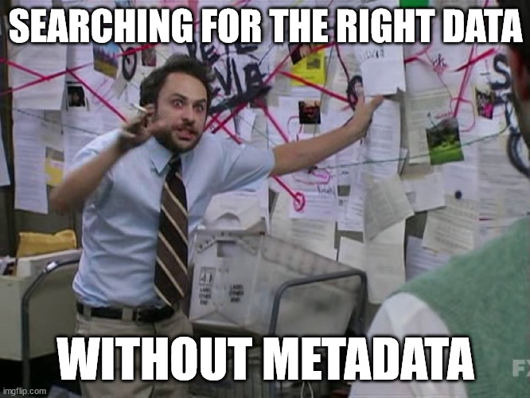

{#fig-data-storage fig-align="center" width=100%}

```{r}
#| echo: false

exercise_number <- 1

```

:::{.callout-note}
### Overview

This week focuses on the data storage stage of the data lifecycle. You will learn how to:

- Describe how data change while in data storage, including the differences between original, cleaned, gold standard, confidential, and public datasets.
- Explain how data cleaning, documentation, and quality assurance practices affect the accuracy, usability, and downstream use of data.
- Evaluate how security, privacy, and ethical considerations influence decisions about storing, sharing, and protecting data.
- Apply the FAIR principles and FAIR-R framework to assess whether data are findable, accessible, interoperable, reusable, and ready for responsible AI applications.

:::

## Quick recap on week 2

### Data types

We learned about the three principal types of qualitative and quantitative data:

::: callout-tip

### Primary data
**Primary** is any data directly collected by an entity. 

:::

::: callout-tip
### Secondary data
**Secondary** is any data collected by another organization that a stakeholder uses for analysis.

:::

::: callout-tip

### Administrative data
**Administrative** is any data collected by governments or other organizations, as part of their management and operation of a program or service, that provide information on registrations, transactions, and other regular tasks.

:::

### Data collections challenges

We've discussed several challenges surrounding security, privacy, and ethics in data collection. Specifically, we learned that data are made, not found, which means...

- defining groups and other variables and how those decisions impacts our communities and downstream uses.
- deciding whether to collect the data or not, and if so, how to collect that data while balancing various things, such as cost, convenience, and incentives.
- recognizing that a lack of data results in a lack of action.

### Week 3 Assignment

#### Read

- Chapter 3: How Do Data Privacy Methods Expand Access to Data?

#### Optional additional read

- [The Future of Public Data Lies in the States, But It’s Complicated](https://issues.org/public-data-states-bowen/).

#### Write (600 to 1200 words)

Choose a community you belong to (e.g., your hometown, workplace, religious organization, college community, or another community that is meaningful to you). Identify a public dataset or data collection effort that is used to inform decisions affecting that community. Examples may include data collected by the U.S. Census Bureau, Bureau of Labor Statistics, Centers for Disease Control and Prevention, Department of Transportation, local governments, or other public agencies.

Describe the dataset and explain how it is collected, who collects it, and how it is used to inform decisions, policies, or resource allocation.
In your discussion paper, address the following questions:

1.	Data Collection and Acquisition
    - How are the data acquired (e.g., surveys, administrative records, sensors, web scraping, third-party data, or other methods)?
    - Who is responsible for collecting and maintaining the data?
2.	Representation and Data Quality
    - Who is represented in the data?
    - Are there populations that may be underrepresented, excluded, or difficult to measure? (e.g., children, veterans, persons with disabilities)
    - How might missing or inaccurate data affect decisions made using the dataset?
3.	Privacy, Security, and Ethics
    - What privacy, security, and/or ethical concerns arise from collecting this information?
    - How would limiting or expanding access to this dataset affect your community in making decisions?
    - What might be the privacy, security, and/or ethical risks could result from collecting or linking additional information?

Example (that you can’t use): [School district lines](https://apps.urban.org/features/dividing-lines-school-segregation/).

Cite all references using APA format, including the real-world example you picked.

**AI Reflection (Prepare to discuss in class):** What risks might arise if AI systems are trained on incomplete, biased, or unrepresentative data? How might that impact your community?

::: callout
#### [`r paste("Class Activity", exercise_number)`]{style="color:#1696d2;"}

```{r}
#| echo: false

exercise_number <- exercise_number + 1
```

1. What dataset did you choose, and what community does it represent?

2. If an AI system were trained using your dataset, what is the biggest risk you identified? Why?

3. What populations or perspectives might be missing or underrepresented in the data? How could that affect the AI system's outputs or decisions?
 
:::

## Why is data storage so important?

> Archives and domain repositories that preserve and disseminate social and behavioral data perform a critical service to the scholarly community and to society at large by ensuring that these culturally significant materials are accessible in perpetuity. The success of the archiving endeavor, however, ultimately depends on researchers’ willingness to deposit their data and documentation for others to use.

From Inter-university Consortium for Political and Social Research [@icpsr], one of the world's largest data archives of social science data for research and education.

### More definitions

As data move through their lifecycle, they often exist in multiple versions. The following terms distinguish common stages in that process.

::: {.callout-tip}
## Original dataset:

**Original dataset** is the raw, unedited, and unprotected version of the data as originally collected.

For example, raw 2020 Decennial Census microdata, which are never publicly released.
::: 

::: {.callout-tip}
## Cleaned dataset

**Cleaned dataset** is a version of the original data that has been reviewed and corrected for errors, inconsistencies, missing values, or other quality issues.

For example, the Census Edited File is a cleaned version of the 2020 Census data used to produce official statistics and data products.

::: 

::: {.callout-tip}
## Gold standard dataset

**Gold standard dataset** is a curated version of the cleaned data that has been prepared for a specific analytical or operational purpose.

For example, the Census Edited File is further transformed to produce datasets such as the Redistricting Data File, which states use to redraw legislative and congressional districts.
::: 

::: {.callout-tip}
## Confidential data

**Confidential dataset** is a dataset that contains information that could directly or indirectly identify individuals, households, businesses, or other protected entities and therefore cannot be publicly released.

For example, the Census Edited File is confidential. The file is only accessible to individuals sworn to protect confidentiality (e.g., those with Special Sworn Status) and only within secure environments such as a Federal Statistical Research Data Center.

::: 

::: {.callout-tip}
## Public dataset or statistics

**Public dataset** is a version of the data that has been reviewed and modified, when necessary, to protect confidentiality before public release.

For example, the U.S. Census Bureau's public-use datasets and statistical tables or the Bureau of Labor Statistics' published unemployment statistics.

::: 

![Diagram illustrating the medallion architecture for data processing. On the left, multiple Data Sources feed into a Bronze layer labeled "Raw Data Ingestion." Data then moves to the Silver layer, labeled "Filtered. Cleaned. Augmented." Next, it progresses to the Gold layer, labeled "Business Level Data." Finally, the curated data are used to create Products, including Analytics, Reporting, and Statistics/Data Science. A large arrow labeled Data Quality runs beneath the Bronze, Silver, and Gold layers, indicating that data quality improves as data move through each stage.](www/images/03_medallion-arrchitecture.png){#fig-data-storage fig-align="center" width=100%}

::: {.callout-important}
## No set taxonomony in the field!

All definitions used (including the data life cycle) are my opinionated definitions. Since many different fields work in data security, privacy, and ethics, there is no standard taxonomy, which causes a lot of confusion. I set a standard definition in all my work, including this course, to ensure we are using the same common language. However, note that when reading other materials or literature, you might encounter conflicting terminology.

::: 

Different levels of security and privacy are needed for different versions of the data.

::: callout
#### [`r paste("Class Activity", exercise_number)`]{style="color:#1696d2;"}

```{r}
#| echo: false

exercise_number <- exercise_number + 1
```

You are given a dataset from an online wine retailer containing customers' date of birth, age, gender, and purchase history. Your task is to estimate the average age, by gender, of customers who purchased a particular product.

Before writing any code or calculating summary statistics, what is the first thing you should do with the data? Why?

Hint: Pay particular attention to the date of birth variable.
 
:::

### Data cleaning

After data collection, data curators typically need to clean the raw data, which are often messy, inconsistent, incomplete, or contain errors. In most data projects, data cleaning is the most time-consuming stage, often requiring more effort than data collection or analysis. This critical step transforms raw data into a consistent, usable format for analysis, reporting, and other downstream uses.

One widely used framework for organizing data is tidy data, which has three defining characteristics:

1. Each variable forms a column.
2. Each observation forms a row.
3. Each type of observational unit forms a dataframe.

{#fig-tidydata fig-align="center"}

Given the conceptual focus of this course, we will not complete coding exercises on data cleaning. Instead, we will focus on the key principles and decisions involved in preparing data for analysis.

There is no single "correct" workflow for cleaning data, and you will find many different recommendations in textbooks and online resources. Despite these differences, most approaches emphasize the same core tasks, which we discuss below.

::: {.callout-important}

## Create backups!

Always create a backup copy of the original data before making any changes. If something goes wrong during the cleaning process, you can always return to the original dataset.

::: 

#### Check for data quality issues

Common data quality issues include duplicate records, spelling errors, incorrect values or signs (e.g., entering a negative value instead of a positive one), inconsistent coding, and totals that do not match the sum of their components (e.g., the populations of all counties in Massachusetts should add up to the state's total population).

::: {.callout-caution}
## Be careful about outliers

Some data cleaning guides recommend removing outliers. However, you should proceed with caution. An outlier may represent a data entry error, but it may also reflect a real and important phenomenon. Before removing any observations, investigate why they are unusual and document your decision.

::: 

#### Standardize the data

Standardization includes tasks such as making text case consistent, removing extra spaces and non-printing characters, standardizing date and time formats (a very common source of problems), and ensuring that variables use consistent units of measurement.

#### Decide how to handle missing data

Missing data can substantially affect downstream analyses and conclusions. Clearly document how missing values were handled. Common approaches include removing incomplete records or imputing missing values using appropriate statistical methods.

#### Validate the data cleaning (Quality assurance)

After cleaning the data, perform quality assurance checks to confirm that the cleaning process produced the intended results and did not introduce new errors.

### Educational attainment example

Suppose a researcher gathers data from various participants who have filled out a form about educational attainment. The raw data might look something like this:

```{r}
#| echo: false

initial_data <- data.frame(
  Name = c("peter hunter", "Beth SMITH", "ryan chadwick", "Silvia Li", "Larry Thomas", "Anne-Marie"),
  Race = c("caucasian", "african-american", "Caucasian", "asian", "asian", "caucasian"),
  Age = c(25, 32, 40, 28, "twenty-three", 35),
  Education = c("bachelors", "Master's", "PHD", "bachelors", "high school diploma", "Bachelor's")
)

knitr::kable(initial_data,
             caption = "Fictitious dataset of educational attainment.")

```

::: callout
#### [`r paste("Class Activity", exercise_number)`]{style="color:#1696d2;"}

```{r}
#| echo: false

exercise_number <- exercise_number + 1
```

Based on the initial data collection of this raw data, answer the following (2 minutes to type or write your answer out):

1. What data quality issues do you notice?
2. Which issues can be corrected confidently?
3. Which issues would require you to go back to the original respondent or data source?

:::

::: {.callout-caution collapse="true"}
## Possible issues

- **Inconsistent Name Formats:** Mixed capitalization and punctuation.
- **Inconsistent Race Descriptions:** Different capitalization and spelling conventions.
- **Inconsistent Age Formats:** One value is written as text instead of a number.
- **Inconsistent Education Levels:** Mixed capitalization, abbreviations, and wording.
- **Potential ambiguity:** We do not know whether categories such as race or education were entered as free text or selected from predefined options.

:::

::: {.callout-caution collapse="true"}
## Possible cleaning steps

- Standardizing Name Formats:
    - Capitalize all names properly.
    - Correct: "John Doe" instead of "john doe".

- Standardizing Race Descriptions:
    - Ensure race descriptions are consistent.
    - Correct: "African-American" instead of "african-american".

- Standardizing Age Formats:
    - Convert all ages to numeric format.
    - Correct: "23" instead of "twenty-three".

- Standardizing Education Levels:
    - Use consistent terms and capitalizations.
    - Correct: "Bachelor's" instead of "bachelors" and "Ph.D." instead of "PHD".

- **Document every change so the cleaning process is reproducible and transparent.**

:::

```{r}
#| echo: false

cleaned_data <- data.frame(
  Name = c("Peter Hunter", "Beth Smith", "Ryan Chadwick", "Silvia Li", "Larry Thomas", "Anne-Marie"),
  Race = c("Caucasian", "African American", "Caucasian", "Asian", "Asian", "Caucasian"),
  Age = c(25, 32, 40, 28, 23, 35),
  Education = c("Bachelor's", "Master's", "Ph.D.", "Bachelor's", "High School Diploma", "Bachelor's")
)

knitr::kable(cleaned_data,
             caption = "Cleaned version of the fictitious dataset.")
```

::: callout
#### [`r paste("Class Activity", exercise_number)`]{style="color:#1696d2;"}

```{r}
#| echo: false

exercise_number <- exercise_number + 1

```

The dataset is now cleaner, but there is still one important concern.

- Which values could still contain errors even though they are formatted consistently?
- How could we verify the accuracy of the data?

:::

::: {.callout-caution collapse="true"}

### Cleaning improves consistency, but it does not guarantee accuracy.

For example:

- Is Larry actually 23 years old, or did someone incorrectly convert "twenty-three" from another value?
- Did respondents use the education categories consistently?
- Did respondents self-identify their race, or did someone assign those categories afterward?
- Were names entered correctly, or were typographical errors introduced during data entry?

Many potential errors cannot be resolved through cleaning alone. They require returning to the original data source or documentation.

:::

::: {.callout-important}
## Cognitive testing and questionnaire evaluation

Prior to launching a survey, most entities should conduct cognitive interviews[^COG] and other survey evaulations to ensure the surveys are easy to understand (avoiding misinterpretations of the questions), can be completed within the suggested time frame, and capture the correct information, among other things.
::: 

[^COG]: "Cognitive tests, pilot tests, focus groups, and other tools can be used to understand how respondents interpret your questions and instructions, understand the meaning of survey questions, and to write better questions. This type of testing can also evaluate different survey techniques used in the field to increase response or cooperation, and can help you sort out the meaning of survey responses." [Overview of Cognitive Testing and Questionnaire Evaluation ](https://psr.iq.harvard.edu/book/overview-cognitive-testing-and-questionnaire-evaluation).

::: callout
#### [`r paste("Class Activity", exercise_number)`]{style="color:#1696d2;"}

```{r}
#| echo: false

exercise_number <- exercise_number + 1

```

Suppose you are tasked with merging another dataset with this one to include income. However, some other entity collected the data on a separate population and only has race and education as common variables. What are the potential issues for merging the datasets?

**Hint:** Reflect on our discussion on data collection.

:::

### Credit data

Suppose you have credit bureau data that is rich in information but lacks details on race and ethnicity. Including this information could provide valuable insights, as there are documented cases showing how credit scores contribute to racial homeownership gaps [@choi2019explaining] and how credit screening affects hiring decisions [@traub2016bad].

A team member suggests using imputation--a method for estimating missing values--to infer race and ethnicity based on individuals’ names, ages, and ZIP codes.

::: callout
#### [`r paste("Class Activity", exercise_number)`]{style="color:#1696d2;"}

```{r}
#| echo: false

exercise_number <- exercise_number + 1

```

What are your thoughts on this scenario and this approach to creating race and ethnicity variables? (Take 2 minutes to type or write your response.)

:::

::: {.callout-caution collapse="true"}
## Open only after discussion

> The most widely used method for imputing race and ethnicity on administrative data is Bayesian Improved Surname Geocoding, which the RAND Corporation developed for the US Department of Health and Human Services and which is also used by the Equal Opportunity Employment Commission and the Consumer Financial Protection Bureau (CFPB). The latest method involving this tool, Medicare Bayesian Improved Surname Geocoding 2.0, combines name, administrative data, and census data based on address in a calibrated Bayesian framework (a multinomial logistic regression model) to estimate probabilities by race and ethnicity for each record in a dataset.

From @stern2021ethics, where they tested Bayesian Improved Surname Geocoding to learn from a case study in an attempt to incorporate equity in imputing race and ethnicity onto a nationally representative sample of credit bureau data. 

:::

## Data security basics

> The only system which is truly secure is one which is switched off and unplugged locked in a titanium lined safe, buried in a concrete bunker, and is surrounded by nerve gas and very highly paid armed guards. Even then, I wouldn't stake my life on it.

~ Gene Spafford, Director, Computer Operations, Audit, and Security Technology (COAST) Project, Purdue University

For all data, you should document how and where you will store copies of your research files to ensure their safety. You should also specify how many copies you will maintain and how you will synchronize them. (You do **not** want multiple versions of the same data floating around wtih inconsistencies among them!)

After determining how to synchronize your files, one best practice for protecting data is to store multiple copies in multiple locations. How and where you store data depends on the contents of the data, applicable privacy laws, workplace practices, contractual agreements, and other factors. We will discuss some of these issues today and in future classes, but keep in mind that many additional considerations exist. You should always consult with your institution's or workplace's data security officer when handling confidential data.

### Virtual data storage

{#fig-one-simply-unlocked fig-align="center" width=80%}

Most universities, privacy companies, government agencies, and other organizations maintain confidential storage systems that are separate from nonconfidential storage systems. Any confidential data stored on disks should use some form of encryption, such as Pretty Good Privacy (PGP)[^PGP], at the folder level.

[^PGP]: "Pretty Good Privacy is an encryption program that provides cryptographic privacy and authentication for data communication." from https://en.wikipedia.org/wiki/Pretty_Good_Privacy

Anyone using an account or computer with access to confidential data must not leave the session unattended, must log out at the end of the session, and must secure any storage media containing confidential data.

Other good data security practices include:

- limiting access to confidential data to authorized users, such as through secure login credentials
- using multiple levels of encryption
- preventing individuals from making copies of confidential data to nonconfidential disks (or copying the data without authorization)
- maintaining virus protection and intrusion detection systems

### Physical data storage

{#fig-hiding-plants fig-align="center" width=80%}

If confidential data are stored on a PC, the data should be encrypted or stored on removable storage media that are secured in a locked cabinet when not in use.

All storage media (e.g., CDs, internal and external hard drives, flash drives) that contain confidential data must be explicitly labeled "confidential." The project security officer or project manager (depending on your workplace) should maintain a log for each piece of confidential storage media and record the dates of the following events:

- receipt of the item from an external source
- creation of the item at the institution
- destruction of the item
- transfer of responsibility for the item to another person (even within the institution)

::: {.callout-important}
## Security and privacy trainings and audits
Frequently, workplaces and/or entities that allow data use require annual training sessions on the appropriate handling of confidential data.

Additionally, they may conduct semiannual reviews of confidential data logs to ensure that all confidential media are properly accounted for.
::: 

## Importance of meta data

> Metadata are essential for maximizing the usefulness of data. Because it is often impossible for secondary researchers to ask questions of the original data producers, metadata are the de facto form of communication between them. Comprehensive metadata standardizes how the data are described, enables a deeper comprehension of a dataset, facilitates data searches by variables, and offers a variety of display options on the Web.

::: callout-tip

## Meta data

**Metadata** is "information about the data collections that help others discover, understand, and use them."

From ICPSR's webpage on [Metadata](https://www.icpsr.umich.edu/web/pages/datamanagement/lifecycle/metadata.html).

:::

The lack of metadata across public datasets from local, state, territory, tribal, and federal government agencies is one reason why the Open, Public, Electronic and Necessary (OPEN) Government Data Act was included as a section of the [2018 Foundations for Evidence-Based Policymaking Act](https://www.datacoalition.org/resources/Documents/BILLS-115HR4174ih-FEBP.pdf). This bipartisan U.S. law encouraged the federal government to modernize its data infrastructure, including data management practices, statistical efficiency, and data accessibility.

To conceptually understand what information should be included in metadata, we will follow the FAIR guiding principles. FAIR aims to make data findable, accessible, interoperable, and reusable [@wilkinson2016fair].

As AI becomes increasingly integrated into research, policy, and decision-making, data must also be prepared for machine learning and AI applications. This requires going beyond simply making data available. Data must be sufficiently documented, structured, contextualized, and governed so that AI systems can interpret and use the data appropriately.

One emerging framework for thinking about this additional requirement is FAIR-R, where the additional "R" represents AI Ready. FAIR-R extends the FAIR principles by emphasizing that data should not only be available for reuse but also prepared for responsible use by AI systems. AI-ready data should include clear documentation of data provenance, collection methods, limitations, quality considerations, context, and appropriate use.

In practice, FAIR-R reinforces many ideas already embedded within FAIR, but places greater emphasis on whether data can be understood and responsibly used by automated systems. For example, an AI system may be able to access a dataset, but without information about how the data were collected, who was included or excluded, how variables were defined, and what limitations exist, the resulting analysis may be misleading or harmful.

We will first examine the FAIR principles and then discuss how FAIR-R extends these concepts for an AI-enabled world.

Also, check out [GO FAIR](https://www.go-fair.org/fair-principles/), "a bottom-up, stakeholder-driven and self-governed initiative that aims to implement the FAIR data principles." I borrow examples from this site.

::: {.callout-tip}
## Document, Discover, and Interoperate
[Document, Discover, and Interoperate](https://ddialliance.org/) (DDI) is a standard that follows the FAIR principles and many major data repositories like ICPSR uses DDI!

:::

{#fig-charlie-metadata fig-align="center"}

### Findable

**1. Data and metadata are assigned a globally unique, eternally persistent identifier.**

Two common examples are [ORCID](https://orcid.org/) (Open Researcher and Contributor ID) and [DOI](https://www.doi.org/) (Digital Object Identifier). Both are used in a paper I recently published [here](https://www.tandfonline.com/doi/full/10.1080/01621459.2023.2270795).

**2. Data are described with rich metadata.**

More details the better! Imagine what information you would like to know. Some potential information could be descriptive about the context, quality and condition, how the data were collected and cleaned, or characteristics of the data.

**3. Metadata clearly and explicitly include the identifier of the data they describe.**

> The metadata and the dataset they describe are usually separate files. The association between a metadata file and the dataset should be made explicit by mentioning a dataset’s globally unique and persistent identifier in the metadata

**4. (Meta)data are registered or indexed in a searchable resource.**

Even if the data have identifies and rich metadata, that doesn't guarantee that the data is findable. This is why data curators will often use well-known data repositories to house their data, such as [ICPSR](https://www.icpsr.umich.edu/web/pages/ICPSR/index.html) and [Harvard Dataverse](https://dataverse.harvard.edu/) (Urban has one too called the [Urban Data Catalog](https://datacatalog.urban.org/)!).

### Accessible

**1. (Meta)data are retrievable by their identifier using a standardized communication protocol.**

  - **The protocol is open, free, and universally implementable.**
  - **The protocol allows for an authentication and authorization procedure, where necessary.**

Hypertext Transfer Protocol Secure (HTTPS), File Transfer Protocol Secure (FTPS), and Phone numbers (arguably not universally-implementable, but close enough) are all examples of such identifiers.

**2. Metadata are accessible, even when data are no longer available.**

> Datasets tend to degrade or disappear over time because there is a cost to maintaining an online presence for data resources. When this happens, links become invalid and users waste time hunting for data that might no longer be there. Storing the metadata generally is much easier and cheaper. Hence, principle Accessible 2 states that metadata should persist even when the data are no longer sustained. Accessible 2 is related to the registration and indexing issues described in F4.

### Interoperable

**1. (Meta)data use a formal, accessible, shared, and broadly applicable language for knowledge representation.**

Data should be readable and interpretable by both humans and computers without needing specialized tools. The goal is a common understanding of digital objects using a standard knowledge representation language. This language should have a precise formal specification, be accessible for learning, and support interoperability across multiple scenarios.

**2. (Meta)data use vocabularies that follow the FAIR principles.**

When describing data or metadata, we use vocabularies that must be FAIR so they can be found, accessed, interoperated, and reused by humans and machines. These vocabularies should have globally unique and persistent identifiers, be well-documented, and easily accessible. Communities should set FAIRness standards, ensuring vocabularies meet criteria such as unique identifiers (Findable 1), resolvable via standard protocols (Accessible 1), and described in a formal, accessible language (Identifiable 1).

**3. (Meta)data include qualified references to other (meta)data.**

A qualified reference is a cross-reference that specifies its intent, such as "X is regulator of Y" rather than just "X is associated with Y." The goal is to create meaningful links between (meta)data resources to enrich contextual knowledge, while balancing the effort required to develop a good data model. Specify relationships such as one dataset building on another or needing complementary data, and describe scientific links between datasets. Additionally, all datasets should be properly cited with globally unique and persistent identifiers.

### Reusable

**1. (Meta)data are richly described with a plurality of accurate and relevant attributes**

Others can more easily reuse the data if there are many labels/information attached to the data. Some examples are what was the purpose of the data collection, what are the limitations, what were the conditions for the data collection, has the data been cleaned, are the variables explained or self-explanatory, etc.

  - **(Meta)data are released with a clear and accessible data usage license.**

Here is a [page](https://choosealicense.com/licenses/) to help choose a license.

  - **(Meta)data are associated with detailed provenance.**
  
> For others to reuse your data, they should know where the data came from (i.e., clear story of origin/history, see Readability 1), who to cite and/or how you wish to be acknowledged. Include a description of the workflow that led to your data: Who generated or collected it? How has it been processed? Has it been published before? Does it contain data from someone else that you may have transformed or completed? Ideally, this workflow is described in a machine-readable format.

  - **(Meta)data meet domain-relevant community standards.**
  
Data reuse is easier when datasets are similar: same type, standardized organization, sustainable formats, and common documentation templates. FAIR data should meet these standards to enhance usability. If deviations from standard practices are necessary, reasons should be specified in the metadata. Note that FAIR principles do not address data quality, which depends on the intended application.

### FAIR-R: Preparing data for artificial intelligence

The FAIR principles provide an important foundation for responsible data stewardship by emphasizing that data should be **Findable, Accessible, Interoperable, and Reusable**. However, as AI becomes increasingly integrated into research, government, and decision-making, an additional question emerges:

**Are data prepared for responsible use by AI systems?**

The FAIR-R framework extends the FAIR principles by adding an additional "R" for **AI Readiness** [@verhulst2025moving]. FAIR-R recognizes that data suitable for human reuse may not necessarily be suitable for AI applications. AI systems require data that are not only available but also sufficiently documented, structured, contextualized, and governed.

AI-ready data should support applications such as AI training, fine-tuning, and augmentation while maintaining appropriate safeguards around quality, transparency, and responsible use [@verhulst2025moving].

FAIR-R builds on many concepts already included in FAIR but places additional emphasis on:

- **Data quality and documentation:** AI systems depend on accurate and well-documented data. Users should understand how data were collected, processed, cleaned, and transformed, as well as the limitations of the data.
- **Data labeling and structure:** AI systems often require additional information about variables, categories, relationships, and annotations to interpret data correctly.
- **Provenance and transparency:** AI users need to understand the origin of data, how they were created, and what changes were made throughout the data lifecycle.
- **Ethical and responsible use:** AI-ready data should include information about appropriate uses, privacy protections, legal requirements, and potential biases or limitations.
- **Standards and interoperability:** Data should be structured using common standards that allow both humans and machines to understand and work with the data.

FAIR-R is not a replacement for FAIR. Instead, it extends FAIR by recognizing that the growth of AI creates new requirements for data stewardship. A dataset can be technically reusable but still not be ready for AI applications if users cannot determine whether the data are appropriate, representative, sufficiently documented, or ethically suitable for the intended purpose.

For example, a government dataset may be publicly available and downloadable, but without information about the population covered, missing data, collection methods, definitions of key variables, and known limitations, an AI system may produce inaccurate or biased results. Making data AI-ready requires investing in the documentation and governance practices that allow both humans and machines to use data responsibly.

FAIR-R highlights an important shift in data stewardship: the goal is not simply to make more data available, but to make data available **with the context, quality, and governance needed to create trustworthy insights.**

## References