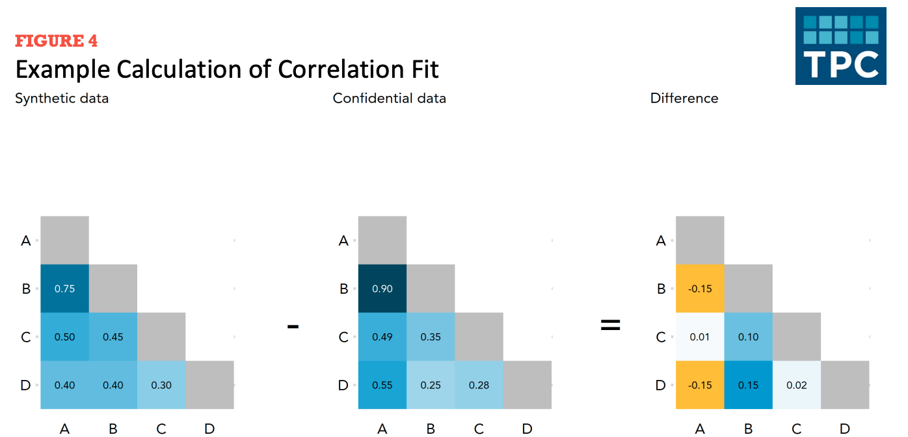
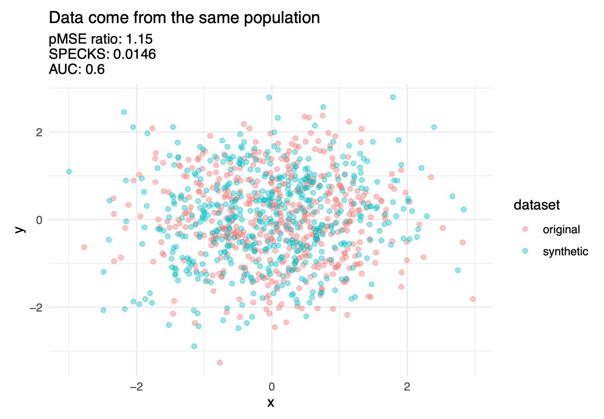
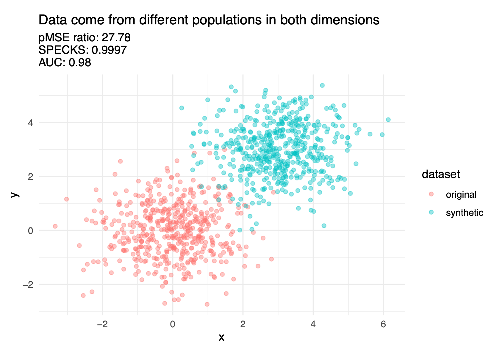
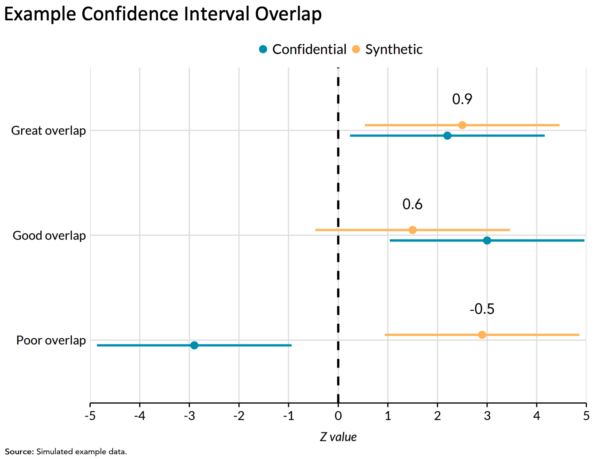
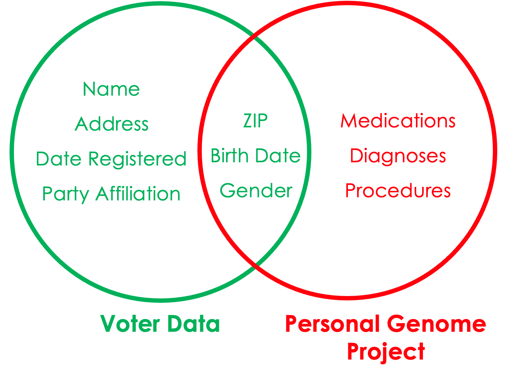

```{r}
#| echo: false
#| message: false

exercise_number <- 1

```

{#fig-data-analysise fig-align="center" width=100%}

:::{.callout-note}
### Overview

This week focuses on the data analysis stage of the data lifecycle. You will learn how to:

- Describe the privacy-utility tradeoff and how privacy-enhancing technologies (PETs) balance data protection with data usefulness with the intent for downstream uses/analyses.
- Evaluate data utility and disclosure risks using different metrics and approaches.
- Critically assess how data-driven findings are produced, interpreted, and communicated.

:::

For this week, we will learn about how to evaluate and analyze data while considering security, privacy, and ethics.

## Quick recap on week 3

### Data storage 

Even more definitions...

::: {.callout-tip}
## Original dataset:

**Original dataset** is the raw, unedited, and unprotected version of the data as originally collected.

For example, raw 2020 Decennial Census microdata, which are never publicly released.
::: 

::: {.callout-tip}
## Cleaned dataset

**Cleaned dataset** is a version of the original data that has been reviewed and corrected for errors, inconsistencies, missing values, or other quality issues.

For example, the Census Edited File is a cleaned version of the 2020 Census data used to produce official statistics and data products.

::: 

::: {.callout-tip}
## Gold standard dataset

**Gold standard dataset** is a curated version of the cleaned data that has been prepared for a specific analytical or operational purpose.

For example, the Census Edited File is further transformed to produce datasets such as the Redistricting Data File, which states use to redraw legislative and congressional districts.
::: 

::: {.callout-tip}
## Confidential data

**Confidential dataset** is a dataset that contains information that could directly or indirectly identify individuals, households, businesses, or other protected entities and therefore cannot be publicly released.

For example, the Census Edited File is confidential. The file is only accessible to individuals sworn to protect confidentiality (e.g., those with Special Sworn Status) and only within secure environments such as a Federal Statistical Research Data Center.

::: 

::: {.callout-tip}

## Public dataset or statistics

**Public dataset** is a version of the data that has been reviewed and modified, when necessary, to protect confidentiality before public release.

For example, the U.S. Census Bureau's public-use datasets and statistical tables or the Bureau of Labor Statistics' published unemployment statistics.

::: 

![Diagram illustrating the medallion architecture for data processing. On the left, multiple Data Sources feed into a Bronze layer labeled "Raw Data Ingestion." Data then moves to the Silver layer, labeled "Filtered. Cleaned. Augmented." Next, it progresses to the Gold layer, labeled "Business Level Data." Finally, the curated data are used to create Products, including Analytics, Reporting, and Statistics/Data Science. A large arrow labeled Data Quality runs beneath the Bronze, Silver, and Gold layers, indicating that data quality improves as data move through each stage.](www/images/03_medallion-arrchitecture.png){#fig-data-storage fig-align="center" width=100%}

### Data sharing and transfer

We also learned about the two general ways people access data:

1. Secure Data Access
    - Pros: Very secure, provides access to confidential data.
    - Cons: Inaccessible to most people.
2. Public Data Files and Statistics
    - Pros: Accessible to anyone.
    - Cons: Altered for privacy, which may reduce accuracy for specific applications and may not always be properly protected.
    
### Week 4 Assignment

#### Read

- Chapter 5: What Makes Datasets Difficult for Data Privacy?

#### Read Optional
-	Chapter 4: How Do Data Privacy Methods Avoid Invalidating Results?
-	[Do No Harm Guide: Applying Equity Awareness in Data Privacy Methods](https://www.urban.org/research/publication/do-no-harm-guide-applying-equity-awareness-data-privacy-methods)


#### Watch

- [Scientific Studies: Last Week Tonight with John Oliver (HBO)](https://www.youtube.com/watch?v=0Rnq1NpHdmw)

#### Write (600 to 1200 words)

**Topic assignments:**

Student Last Name | Topic
-----|-----
Bennett | Financial trade
DiSandro | Domestic education
Gentile | Medical images
Hayes | Classical music
Imperati | Digital advertising
Possamai | Automobiles
Ricket | Internet searches
Rious | Journalism
Rossi | Phone calls or text messages
Santosh | Domestic politics
Spadea | Genetics
Sudoval | Mental health
Trotta | Clothing retail
Wadsworth | Forgeries 


##### 1. Find a digital object and identify its metadata

Based on your assigned topic, find an article, dataset, image, or other digital object that matches or is highly related to that topic. Select an object from a digital repository or platform that provides enough metadata to answer *at least half* of the following questions:

  - What is the title of the digital object?
  - Who is the author, creator, or organization responsible for the object?
  - When was the digital object created or published?
  - What keywords, topics, or subject categories are associated with the object?
  - What is the abstract, summary, or description of the object?
  - What file formats are available?
  - What information is provided about how the data or object were created or collected?
  - What information is provided about licensing, permissions, or appropriate use?

Below are a few repositories you could use as a starting point, but feel free to use any search tools at your disposal (e.g., use your Google-Fu) to find a digital object with a reasonable amount of metadata.

  - [Data.Gov](https://data.gov/)
  - [FiveThirtyEight](https://data.fivethirtyeight.com/)
  - [figshare](https://figshare.com/)
  - [Financial Times](https://markets.ft.com/data/)
  - [Harvard Dataverse](https://dataverse.harvard.edu/)
  - [ICPSR](https://www.icpsr.umich.edu/web/pages/ICPSR/index.html)
  - [IMDb Non-Commercial Datasets](https://developer.imdb.com/non-commercial-datasets/)
  - [Mendeley Data](https://data.mendeley.com/)
  - [Natural History Museum Data Portal](https://data.nhm.ac.uk/)
  - [Zenodo](https://zenodo.org/)

##### 2. Assess the metadata using FAIR principles
Based on the metadata you found, evaluate the quality of the digital object.

  - **Findable:** Could another person easily discover this object? Does it have a persistent identifier, searchable metadata, or useful keywords?
  - **Accessible:** Can users access the object and its metadata through a clear and understandable process?
  - **Interoperable:** Are the metadata and data described using common standards, formats, or terminology that allow others (including computers) to understand them?
  - **Reusable:** Does the documentation provide enough context for others to understand and appropriately use the object?
  
##### 3. Assess AI readiness using FAIR-R
Consider whether this digital object is ready for use in AI applications.

  - Does the metadata provide enough context for an AI system to understand the data?
  - Are the data sources, collection methods, processing steps, and limitations documented?
  - Are variables, labels, and potential biases clearly described?
  - Would someone know whether this data is appropriate for training or evaluating an AI system?

::: callout
#### [`r paste("Class Activity", exercise_number)`]{style="color:#1696d2;"}

```{r}
#| echo: false

exercise_number <- exercise_number + 1
```

1. What digital object did you choose, and what was one thing you learned from examining its metadata that you had never considered before?

2. Looking at your object through the FAIR-R lens, what information was missing (or difficult to find) that would make it harder for an AI system to use the data responsibly?

3. Based on what you found, would you trust your digital object to train or evaluate an AI system? Why or why not?
 
:::

## PETs Process Overview

Note that this overview is opinionated and simplified in order to provide a reasonable summary.

{#fig-process-actors}

{#fig-process-iterative}

### Iteration is key

As mentioned in the textbook, data curators and privacy experts must fine-tune their PETs methods by repeatedly evaluating if the altered data are at acceptable levels of disclosure risk and quality. Often, the process of adjusting the PETs methods and earlier steps in the process becomes analogous to “holding sand.” Shifting or changing one part of the workflow, such as trying to improve the data quality for one variable, can result in the privacy “spilling out” in unexpected ways. Or a model you thought would create high quality data could result in the opposite.

{#fig-process-actors width=75%}

### Privacy-utility tradeoff?

{#fig-seth-meyers-balance fig-align="center"}

One of the most important challenges in statistical disclosure protection is managing the fundamental tradeoff between privacy loss and statistical utility. As we will see throughout this class, this tradeoff plays a central role in determining the technical approaches to data protection and in shaping ethical and equitable decisionmaking.

{#fig-privacy-utility-trade-off fig-align="center"}

The privacy-utility tradeoff describes the relationship between the amount of privacy protection applied to a dataset and the utility (or usefulness) of that data for analysis.

- Privacy loss is often referred to as the risk that confidential or sensitive information about individuals, records, or entities being directly observed or inferred from the release of public data and statistics.

- Utility can be defined as the quality, qunatity, ease of access, permitted use and dissemination, and more (e.g., research, policy analysis, public reporting).

**Example from @bowen2023no:** Suppose someone decided to release unaltered confidential data, say an individual’s official tax records. This scenario would result in the maximum privacy loss to the individual but simultaneously the maximum value to society that could be obtained from the data. Details about the person’s income, investments, donations, and Social Security number would be available to the public, but researchers could use that information to better understand issues such as income inequality and financial investment decisions. Conversely, if no data were released, the resulting analysis (or lack thereof) would simultaneously constitute the minimal privacy loss and the minimal value to society that could be derived from this dataset.

## Assessing utility

::: {.callout-tip}

## Data utility, Quality, Accuracy, or Usefulness

**Data utility, quality, accuracy, or usefulness** is how useful or accurate the data are for research and analysis purposes.

::: 

::: {.callout-tip}

## Utility Metrics

**Utility metrics** are metrics that measure a public use dataset's degree of usefulness for downstream data processing.

:::

Why produce utility metrics? 

1. Assess how public use data can or cannot be used.
   - e.g., can I use public use data to estimate the effect of degree type on migration in and out of the state? 
   - e.g., can I use public use data to estimate the number of students with subsidized healthcare coverage? 
2. Motivate moving the needle on the privacy-utility trade-off.
   - e.g., does the relationship between degree type and migration need to be more accurate so public use data can be useful to practitioners? 
   - e.g., is the estimate of the number of students with subsidized healthcare coverage accurate enough that I could include more noise in that variable? 

Generally there are three ways to measure utility of the public use data:

-   General (or global) utility metrics;
-   Specific utility metrics; and
-   Fit-for-purpose

### General utility metrics

::: callout-tip
### General utility

**General utility** metrics measure differences between public data and confidential data independent of pre-specified use cases.

:::

General utility metrics are useful because they provide a sense of how "fit for use" public data is for analysis without making assumptions about the uses of the public data.

#### Univariate general utility

Some univariate general utility measures could include comparisons of:

-   **Categorical variables:** frequencies, relative frequencies.

-   **Numeric variables** means, standard deviations, skewness, kurtosis (i.e., first four moments), percentiles, and number of zero/non-zero values.

#### Bivariate general utility

::: callout-tip
##### Correlation fit

**Correlation fit** measures how well the public use data recreates the linear relationships between variables in the confidential dataset.

:::

To calculate correlation fit:

-   Create correlation matrices for the public data and confidential data. Then measure differences across public and confidential data. 

{#fig-corrdiff width=90%}

@fig-corrdiff shows the creation of a difference matrix. Let's summarize the difference matrix using mean absolute error.

#### Multivariate general utility (discriminant-based metrics)

::: callout-tip
##### Discriminant based methods

**Discriminant based methods** measure how well a predictive model can distinguish (i.e., discriminate) between records from the confidential and synthetic data.

Simply put, the harder it is for the predictive model to distinguish records from one another, the *higher the general utility* of the public data.

:::

-   The confidential data and public data should theoretically be drawn from the same super population.

-   The basic idea is to combine (stack) the confidential data and public data and see how well a predictive model distinguish (i.e., discriminate) between public observations and confidential observations.

-   An inability to distinguish between the records suggests a good synthesis.

-   It is possible to use logistic regression for the predictive modeling, but decision trees, random forests, and boosted trees are more common. (We recommend, to the degree possible, using more using more sophisticated models as well as machine learning best-practices like feature engineering and hyperparameter tuning because these practices will more effectively discriminate between classes.)

-   @fig-discriminant shows three discriminant based metrics calculated on a good synthesis and a poor synthesis.

::: {#fig-discriminant layout-nrow="2"}
{width=75%}

{width=75%}

A comparison of discriminant metrics on a good synthesis and a poor synthesis
:::

There are several different discriminant-based metrics, but it is beyond this course to cover them in depth. @hu2024advancing covers these metrics in further detail.

### Specific utility metrics

::: callout-tip
### Specific utility

**Specific utility** or analysis-specific utility metrics measure differences between public data and confidential data *for pre-specified use cases.*

:::

Specific utility metrics measure how suitable a public dataset is for specific analyses.

-   These specific utility metrics will change from application to application, depending on common uses of the data.
-   A helpful rule of thumb: general utility metrics are useful for the data synthesizers to be convinced that they're doing a good job. Specific utility metrics are useful to convince downstream data users that the data synthesizers are doing a good job.

#### Recreating inferences

-   It can be useful to compare statistical analyses on the confidential data and public data:
    -   Do the estimates have the same sign?
    -   Do the estimates have the same statistical inference at a common significance level?
    -   Do the confidence intervals for the estimates overlap?
-   Each of these questions is useful. @barrientos2024feasibility combine all three questions into sign, significance, and overlap (SSO) match. SSO is the proportion of times that intervals overlap and have the same sign and significance.

#### Regression confidence interval overlap

::: callout-tip
##### Confidence Interval Overlap (CIO)

**Confidence interval overlap (CIO)** quantifies how well confidence intervals from estimates on the synthetic data recreate confidence intervals from the confidential data. 

1 indicates perfect overlap. 0 indicates intervals that are adjacent but not overlapping. Negative values indicate gaps between the intervals.

A common example is comparing intervals from linear regression models and logistic regression models. 

:::

{width=75%}

### Fit-for-purpose

The final group of utility metrics are called fit-for-purpose and are not discussed as often in the literature. @drechsler2022challenges states how fit-for-purpose measures could be considered something in between the previous two utility metric types. In other words, fit-for-purpose metrics are not global measures, because they focus on certain features of the data, but may not be specific to an analysis that data users and stakeholders are interested in like analysis-specific utility metrics.

@drechsler2022challenges highlights how global utility metrics can be too broad and miss aspects of the synthetic dataset that do not align with the confidential dataset. On the other hand, analysis-specific metrics may perform well for the selected analyses on the synthetic data but not for others. This is why it is critical to determine the proper analysis, but it is difficult to anticipate all downstream data uses. For example, decennial census data products in the United States are utilized in thousands of different ways, making it impossible to predict all potential use cases. Therefore, fit-for-purpose metrics help privacy experts and researchers assess if their synthesis makes sense before implementing other utility metrics. Some examples include ensuring population totals or ages are positive.

::: callout-tip
### Fit-for-purpose

**Fit-for-purpose**, are something in between the previous two utility metric types to quickly assess the quality of the public data compared to the confidential data. They are not global measures, because they focus on certain features of the data, but may not be specific to an analysis that data users and stakeholders are interested in like analysis-specific utility metrics.

:::

## Assessing disclosure risk

We now pivot to evaluating the disclosure risks of public data. Note that most thresholds for acceptable disclosure risk are often determined by law.

There are generally three kinds of disclosure risk:

-   Identity disclosure risk
-   Attribute disclosure risk
-   Inferential disclosure risk

### Identity disclosure metrics

@sweeney2013identifying used voter data to re-identify individuals in the Personal Genome Project.

{#fig-identity-disclosure-risk width=60%}

::: callout-tip
#### Identity disclosure metrics

**Identity disclosure metrics** evaluate how often we correctly re-identify confidential records in the public data.

**Note:** These metrics require major assumptions about attacker information.
:::

#### Basic matching approaches

-   We start by making assumptions about the knowledge an attacker has (i.e., external publicly accessible data they have access to).

-   For each confidential record, the data attacker identifies a set of public records which they believe contain the target record (i.e., potential matches) using the external variables as matching criteria.

-   There are distance-based and probability-based algorithms that can perform this matching. This matching process could be based on exact matches between variables or some relaxations (i.e., matching continuous variables within a certain radius of the target record, or matching adjacent categorical variables).

-   We then evaluate how accurate our re-identification process was using a variety of metrics.

::: panel-tabset
##### Expected Match Rate

-   **Expected Match Rate**: On average, how likely is it to find a "correct" match among all potential matches? Essentially, the expected number of observations in the confidential data expected to be correctly matched by an intruder.

    -   Higher expected match rate = higher identification disclosure risk.

    -   The two other risk metrics below focus on the subset of confidential records for which the intruder identifies a single match.

##### True Match Rate

-   **True Match Rate**: The proportion of true unique matches among all confidential records. Higher true match rate = higher identification disclosure risk.

##### False Match Rate

-   **False Match Rate**: The proportion of false matches among the set of unique matches. Lower false match rate = higher identification disclosure risk.
:::


### Attribute disclosure metrics

It is possible to learn confidential attributes without perfectly re-identifying observations in the data.

::: callout-tip
### Attribute disclosure

**Attribute disclosure** occurs if the data intruder determines new characteristics (or attributes) of an individual based on the information available through public data or statistics (e.g., if a dataset shows that all people age 50 or older in a city are on Medicaid, then the data adversary knows that any person in that city above age 50 is on Medicaid). This information is learned without idenfying a specific individual in the data!
:::

::: callout-tip
#### Predictive Accuracy

**Predictive accuracy** measures how well an attacker can learn about attributes in the confidential data using the public data (and possibly external data).
:::

-   Similar to above, you start by matching public records to confidential records. Alternatively, you can build a predictive model using the public data to make predictions on the confidential data.

-   **key variables**: Variables that an attacker already knows about a record and can use to match.

-   **target variables**: Variables that an attacker wishes to know more or infer about using the public data.

-   Pick a sensitive variable in the confidential data and use the public data to make predictions. Evaluate the accuracy of the predictions.

### Inferential disclosure

::: callout-tip
### Inferential disclosure

**Inferential disclosure** occurs if the data intruder predicts the value of some characteristic from an individual more accurately with the public data or statistic than would otherwise have been possible (e.g., if a public homeownership dataset reports a high correlation between the purchase price of a home and family income, a data adversary could infer another person's income based on purchase price listed on Redfin or Zillow).
:::

Inferential disclosure is a specialized type of attribute disclosure, so the metrics discussed above apply here as well. Inference disclosure risk is very hard to predict, so many federal agencies tend to disregard this type of risk.

## There are lies, damned lies, and statistics...

{#fig-liar fig-align="center"}

There are often two sides to every story, especially when it comes to how people collect, store, transfer, and analyze data. In this in-class activity, we will apply the ideas and concepts we've learned so far to answer a question in multiple ways that are technically correct, even if the different answers contradict one another.

::: callout
#### [`r paste("Class Activity", exercise_number)`]{style="color:#1696d2;"}

```{r}
#| echo: false

exercise_number <- exercise_number + 1
```

Each of you will work in pairs or groups of three. You will have 30 minutes to complete this activity, with a check-in after 15 minutes to assess your progress.

Each pair (or trio) will choose one question from the list below.

**Step 1 (individually): Answer the question without AI**

Without using a generative AI tool, answer your assigned question using U.S. data and statistics.

As you work, consider the following:

- What information did you use to answer the question?
- How did you access the information?
- Did the storage and transfer of that information appear to take security and privacy into account?
- How did you use the information to answer the question?
- Do you have any ethical concerns about the information or how it was collected, stored, or used?

**Step 2 (within your partner or group): Ask AI the same question**

Working together, ask a generative AI system the same question.

Compare the AI's response with your own research and with the answers each member of your group found.

Discuss the following:

- Did the AI produce the same statistic(s) that you found? If not, why might the answers differ?
- Did the AI present its answer with appropriate uncertainty or caveats, or did it sound more certain than the evidence supports?
- Based on your own research, would you trust the AI's answer? Why or why not?

:::

**Assigned Pairs/Groups:**

```{r}
#| warning: false

set.seed(42)

library(tidyverse)
library(dplyr)

students <- c("Bennett", 
              "DiSandro", 
              "Gentile", 
              "Hayes", 
              "Imperati", 
              "Possamai", 
              "Ricket", 
              "Rious", 
              "Rossi", 
              "Santosh", 
              "Spadea", 
              "Sudoval",
              "Trotta", 
              "Wadsworth")

n <- length(students)

students |>
  sample(n, replace = FALSE)

```

**Topic assignments:**

- What percent of marriages end in divorce?
- What is the average student loan debt?
- What is the primary factor that causes homelessness?
- At what age do mental health disorders develop in people?
- At what age are women less likely to get pregnant?
- At what year after being founded do most startup companies fail?
- What percentage of immigrants are taking jobs from Americans?
- What is the average cost of raising a child?
- What percentage of crimes are committed by someone known to the victim?
- What percentage of welfare recipients are able-bodied adults who don't work?
- Does the unemployment rate accurately reflect joblessness?
- What percentage of energy consumption comes from renewable sources?

<!-- Boyar | What is the percentage of African American men incarcerated compared to those in college? -->
<!-- Choate | What is the carbon footprint of raising a child? -->
<!-- Clayman | What is the gender pay gap? -->
<!-- Dowdy | What is the rate of illegal immigration? -->
<!-- Espinal-Guzman | What is the rate of sexual assault? -->
<!-- Garratt | What is the teenage pregnancy rate? -->
<!-- Pacheoco | What is the fraud rate of using food stamps? -->
<!-- Scott | What percentage of immigrants are undocumented? -->
<!-- Thadeio | What is the percentage of abortions performed on teenagers? -->
<!-- Thorbahn | What is the percentage of gun violence? -->
 <!-- | What is the percentage of voter fraud? -->

## Week 5 Assignment

::: {.callout-important}
## DEADLINE
Due July 27, at 11:59 PM EDT on Canvas
::: 

### Read

- Chapter 6: What Data Privacy Laws Exist?
- [A Day in the Life with Federal Government Data](https://apdu.org/2025/11/a-day-in-the-life-with-federal-government-data/)

### Watch

- [Data Brokers: Last Week Tonight with John Oliver (HBO)](https://www.youtube.com/watch?v=wqn3gR1WTcA)

### Optional read

- [Part 1: Is Data Privacy Dead? The Answer Must be No](https://apdu.org/2026/07/part-1-is-data-privacy-dead-the-answer-must-be-no/)
- [Part 2: Is Data Privacy Dead? The Answer Must be No](https://apdu.org/2026/07/part-2-is-data-privacy-dead-the-answer-must-be-no/)

### Write (600 to 1200 words)

Find a news analysis story* published within the last year (2025-2026) that relies on data, research findings, surveys, administrative records, or statistical analysis. Evaluate how data were analyzed and used to support the story's conclusions.

- What are the main findings or claims of the article?
- What data sources were used to support those claims?
- How were the data analyzed or interpreted?
- What assumptions, limitations, biases, or uncertainties might affect the conclusions?
- How do the privacy, security, and ethical considerations surrounding the data affect the analysis?
- Would the story's conclusions change if more data, less data, or different data were available? Why or why not? (Reflect on your week 3 assignment.)
- Do you agree with the article's claims?

Cite all references using APA format, including the article you picked.

*"An article written to inform readers about recent events. The author reports and attempts to deepen understanding of recent events—for example, by providing background information and other kinds of additional context." – [CSUSM Library](https://libguides.csusm.edu/news/different_news_types)

**AI Reflection (Prepare to discuss in class):** Use any generative AI tool to identify:

- The article's main claims
- The evidence supporting those claims
- Potential limitations, biases, or weaknesses in the analysis
- Whether the conclusions appear justified
Compare the AI's response to your own assessment.

## References