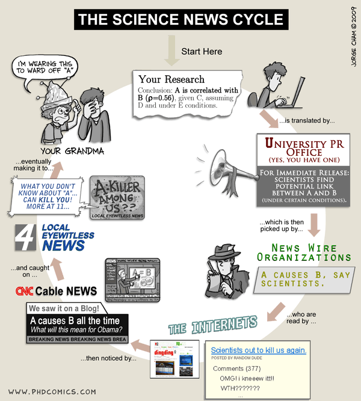
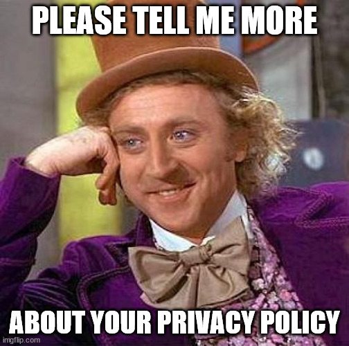
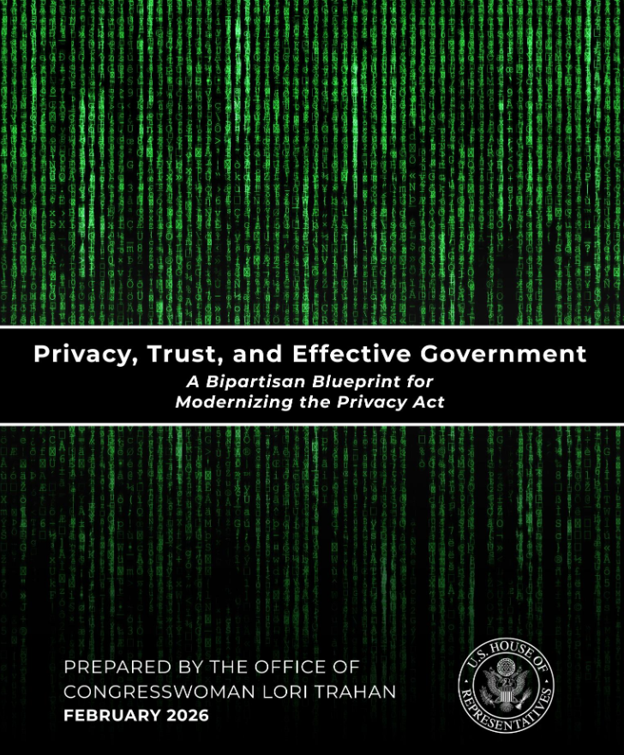
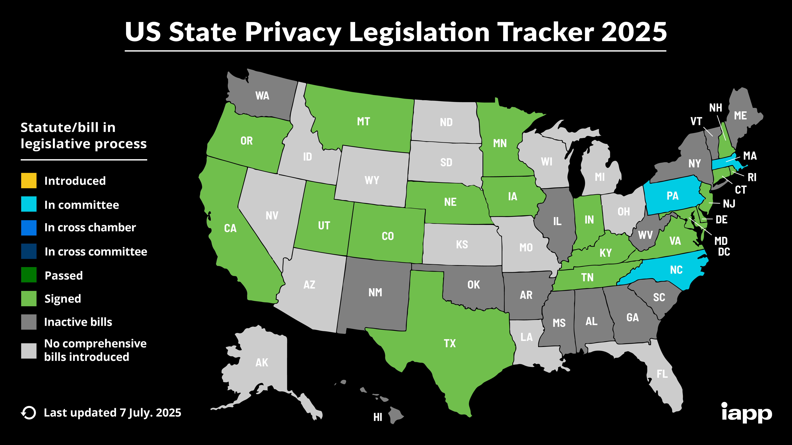
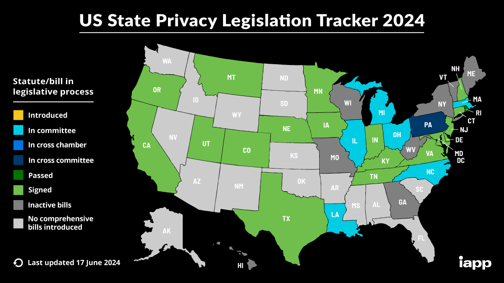

```{r}
#| echo: false

exercise_number <- 1

```

{#fig-data-analysise fig-align="center" width=100%}

:::{.callout-note}
### Overview

This week focuses on the data dissemination stage of the data lifecycle. You will learn how to:

- Explain the major U.S. data privacy laws and regulations governing the collection, sharing, dissemination, and protection of confidential information, including CIPSEA, Title 13, Title 26, the Privacy Act, FERPA, HIPAA, CCPA, and emerging state privacy laws.
- Assess the strengths and limitations of the United States' patchwork approach to data privacy and discuss how it affects research, evidence-based policymaking, and the responsible use of administrative and survey data.

:::

## Quick recap on week 4

### Privacy-utility tradeoff

The privacy-utility tradeoff describes the relationship between the amount of privacy protection applied to a dataset and the utility (or usefulness) of that data for analysis.

- Privacy loss is often referred to as the risk that confidential or sensitive information about individuals, records, or entities being directly observed or inferred from the release of public data and statistics.

- Utility can be defined as the quality, qunatity, ease of access, permitted use and dissemination, and more (e.g., research, policy analysis, public reporting).

::: {.callout-tip}

## Data utility, Quality, Accuracy, or Usefulness

**Data utility, quality, accuracy, or usefulness** is how useful or accurate the data are for research and analysis purposes.

::: 

{#fig-tradeoff fig-align="center"}

### Assessing utility

Generally there are three ways to measure utility of the data:

::: callout-tip
### General utility

**General utility**, sometimes called global utility, measures the univariate and multivariate distributional similarity between the confidential data and the public data (e.g., sample means, sample variances, and the variance-covariance matrix).
:::

::: callout-tip
### Specific utility

**Specific utility** or analysis-specific utility metrics measure differences between public data and confidential data *for pre-specified use cases.*

:::

::: callout-tip
### Fit-for-purpose

**Fit-for-purpose**, are something in between the previous two utility metric types to quickly assess the quality of the public data compared to the confidential data. They are not global measures, because they focus on certain features of the data, but may not be specific to an analysis that data users and stakeholders are interested in like analysis-specific utility metrics.
:::

### Assessing disclosure risk

Note that most thresholds for acceptable disclosure risk are often determined by law.

There are generally three kinds of disclosure risk:

::: callout-tip
#### Identity disclosure metrics

**Identity disclosure metrics** evaluate how often we correctly re-identify confidential records in the public data.

**Note:** These metrics require major assumptions about attacker information.
:::

::: callout-tip
### Attribute disclosure

**Attribute disclosure** occurs if the data intruder determines new characteristics (or attributes) of an individual based on the information available through public data or statistics (e.g., if a dataset shows that all people age 50 or older in a city are on Medicaid, then the data adversary knows that any person in that city above age 50 is on Medicaid). This information is learned without idenfying a specific individual in the data!
:::

::: callout-tip
### Inferential disclosure

**Inferential disclosure** occurs if the data intruder predicts the value of some characteristic from an individual more accurately with the public data or statistic than would otherwise have been possible (e.g., if a public homeownership dataset reports a high correlation between the purchase price of a home and family income, a data adversary could infer another person's income based on purchase price listed on Redfin or Zillow).
:::

### Hidden stories in news reports

{#fig-science-news-cycle fig-align="center"}

There are often two sides to every story, especially when it comes to how people collect, store, transfer, and analyze data. In this in-class activity, we will apply the ideas and concepts we've learned so far to answer a question in multiple ways that are technically correct, even if the different answers contradict one another.

### Week 5 Assignment

#### Read

- Chapter 6: What Data Privacy Laws Exist?
- [A Day in the Life with Federal Government Data](https://apdu.org/2025/11/a-day-in-the-life-with-federal-government-data/)

#### Watch

- [Data Brokers: Last Week Tonight with John Oliver (HBO)](https://www.youtube.com/watch?v=wqn3gR1WTcA)

#### Optional read

- [Part 1: Is Data Privacy Dead? The Answer Must be No](https://apdu.org/2026/07/part-1-is-data-privacy-dead-the-answer-must-be-no/)
- [Part 2: Is Data Privacy Dead? The Answer Must be No](https://apdu.org/2026/07/part-2-is-data-privacy-dead-the-answer-must-be-no/)

#### Write (600 to 1200 words)

Find a news analysis story* published within the last year (2025-2026) that relies on data, research findings, surveys, administrative records, or statistical analysis. Evaluate how data were analyzed and used to support the story's conclusions.

- What are the main findings or claims of the article?
- What data sources were used to support those claims?
- How were the data analyzed or interpreted?
- What assumptions, limitations, biases, or uncertainties might affect the conclusions?
- How do the privacy, security, and ethical considerations surrounding the data affect the analysis?
- Would the story's conclusions change if more data, less data, or different data were available? Why or why not? (Reflect on your week 3 assignment.)
- Do you agree with the article's claims?

Cite all references using APA format, including the article you picked.

*"An article written to inform readers about recent events. The author reports and attempts to deepen understanding of recent events—for example, by providing background information and other kinds of additional context." – [CSUSM Library](https://libguides.csusm.edu/news/different_news_types)

**AI Reflection (Prepare to discuss in class):** Use any generative AI tool to identify:

- The article's main claims
- The evidence supporting those claims
- Potential limitations, biases, or weaknesses in the analysis
- Whether the conclusions appear justified
Compare the AI's response to your own assessment.

::: callout
#### [`r paste("Class Activity", exercise_number)`]{style="color:#1696d2;"}

```{r}
#| echo: false

exercise_number <- exercise_number + 1
```

1. How closely did the AI's analysis align with your own? Where did the AI identify strengths, weaknesses, assumptions, or biases that you overlooked (if at all), and where did it miss important context or make claims that you disagreed with (if at all)? Why do you think those differences occurred?

2. If you were an editor deciding whether to publish this news story, would you trust the AI's assessment alone to evaluate the quality of the article? What additional information, expertise, or verification would still be necessary before deciding whether the article's conclusions are well supported?
 
:::

## U.S. Data Privacy Laws

{#fig-wonka-privacy-policy width=50%}

Prior to releasing any information (e.g., data and statistics), you must review the legal requirements. As you learned from the book and the questionnaire in the first week of class, the United States has no federal law regulating how personal data can be collected, stored, and used. A privacy policy does not equate to data privacy protections.

The laws governing data collection and dissemination are limited to specific federal agencies (e.g., U.S. Census Bureau) or specific data types (e.g., education).

### CIPSEA

#### What is CIPSEA?
::: callout-note
### Confidential Information Protection and Statistical Efficiency Act (CIPSEA)

> CIPSEA establishes uniform confidentiality protections for information collected for statistical purposes by U.S. statistical agencies, and it allows some data sharing between the Bureau of Labor Statistics, Bureau of Economic Analysis, and Census Bureau. The agencies report to Office of Management and Budget on particular actions related to confidentiality and data sharing.
>
> The law gives the agencies standardized approaches to protecting information from respondents so that it will not be exposed in ways that lead to inappropriate or surprising identification of the respondent. By default the respondent's data is used for statistical purposes only. If the respondent gives informed consent, the data can be put to some other use.

From [Wiki](https://en.wikipedia.org/wiki/Confidential_Information_Protection_and_Statistical_Efficiency_Act).

> A reauthorization of CIPSEA in 2018-19 gave the statistical agencies more opportunities to use administrative data for statistical purposes, and required them to more deeply analyze risks to privacy and confidentiality of respondents.

Foundations for Evidence-Based Policymaking Act of 2018 is often referred to as the Evidence Act and updated CIPSEA.

::: 

#### What data falls under CIPSEA?

- Information collected under a pledge of confidentiality
- Business, household, and individual data collected solely for statistical purposes
- Administrative records used within approved statistical programs

#### What does "statistical purpose" mean?

- Producing aggregate statistics (e.g., estimating or analyzing a group); not about specific individuals or entities
- Research and analysis intended to describe populations or trends

#### What are the restrictions?

- Cannot use protected data for administrative, enforcement, tax, benefits, or regulatory actions
- Cannot disclose respondent identities
- Cannot use data in a manner inconsistent with the confidentiality pledge

#### What are the penalties?

- Fines up to \$250,000 and up to 5 years imprisonment

### Title 13, U.S. Code of 1953

#### What is Title 13?

::: callout-note
### Title 13, U.S. Code of 1953

> The Census Bureau is bound by Title 13 of the United States Code. These laws not only provide authority for the work we do, but also provide strong protection for the information we collect from individuals and businesses.
>
> Title 13 provides the following protections to individuals and businesses:
>
> - Private information is never published. It is against the law to disclose or publish any private information that identifies an individual or business such, including names, addresses (including GPS coordinates), Social Security Numbers, and telephone numbers.
> - The Census Bureau collects information to produce statistics. Personal information cannot be used against respondents by any government agency or court.
> - Census Bureau employees are sworn to protect confidentiality. People sworn to uphold Title 13 are legally required to maintain the confidentiality of your data. Every person with access to your data is sworn for life to protect your information and understands that the penalties for violating this law are applicable for a lifetime.
> - Violating the law is a serious federal crime. Anyone who violates this law will face severe penalties, including a federal prison sentence of up to five years, a fine of up to $250,000, or both.

From the [U.S. Census Bureau](https://www.census.gov/about/history/bureau-history/agency-history-timeline/title-13.html)
::: 

- The law authorizing Census Bureau operations
- Establishes confidentiality protections for Census-collected information

#### What data falls under Title 13?

- All Census Bureau data, such as decennial census and survey responses for the Census Bureau

#### What are the restrictions?

- "Disclose or publish any private information that identifies an individual or business such, including names, addresses (including GPS coordinates), Social Security Numbers, and telephone numbers."
- Limits use to authorized statistical purposes

#### What are the penalties?

- Fines up to \$250,000 and up to 5 years imprisonment

### Title 26, U.S. Code of 1939

#### What is Title 26?

::: callout-note
### Title 26, U.S. Code of 1939

> The Internal Revenue Code (IRC) is the body of law that codifies all federal tax laws, including income, estate, gift, excise, alcohol, tobacco, and employment taxes. U.S. tax laws began to be codified in 1874, but there was no central, comprehensive source for them at that time. The IRC was originally compiled in 1939 and overhauled in 1954 and 1986. This code is the definitive source of all tax laws in the United States and has the force of law in and of itself.
> 
> These laws constitute Title 26 of the U.S. Code (26 U.S.C.A. § 1 et seq. [1986]) and are implemented by the Internal Revenue Service (IRS) through its Treasury Regulations and Revenue Rulings.
>
> Congress made major statutory changes to Title 26 in 1939, 1954, and 1986. Because of the extensive revisions made in the Tax Reform Act of 1986, Title 26 is now known as the Internal Revenue Code of 1986 (Pub. L. No. 99-514, § 2, 100 Stat. 2095 [Oct. 22, 1986]).

From the [U.S. Census Bureau](https://www.census.gov/about/history/bureau-history/agency-history-timeline/title-26.html)

:::

- Federal tax code that enforces strict confidentiality requirements governing tax-return information

#### What data falls under Title 26?

- All administrative tax data, such as individual tax returns, business tax returns, and other tax return information

#### What are the restrictions?

- No disclosure of any tax records

#### What are the penalties?

- Depends on the type of tax record disclosure, but all penalties include some form of criminal, civil, and administrative penalties, such as jail time and fines of up to \$500,000

### Privacy Act of 1974

#### What is the Privacy Act?

::: callout-note
### Privacy Act of 1974

> The Privacy Act of 1974 a United States federal law, establishes a Code of Fair Information Practice that governs the collection, maintenance, use, and dissemination of personally identifiable information about individuals that is maintained in systems of records by federal agencies.

From [Wiki](https://en.wikipedia.org/wiki/Privacy_Act_of_1974).

::: 

- The Privacy Act of 1974 is a "...foundational federal privacy law, providing guardrails for when and how personal data is handled and shared by the federal government." - [APDU's Data Privacy Resources](https://apdu.org/apdu-in-action/data-privacy-resources/).

#### What data falls under the Privacy Act?

- Protects natural, living individuals, which are defined as "a citizen of the United States or an alien lawfully admitted for permanent residence"
- U.S. persons definition excludes deceased persons, non-US persons (e.g., vistors), and organizations (i.e., both for-profit and non-profit entities)

#### What are SORNs?

- SORNs (system of records notices) are how federal agencies tell the public when they collect personal information that meets certain conditions.
- "Think of a SORN as a public rulebook. Once an agency publishes a SORN in the Federal Register, they must follow it." - [How to Review a Privacy Act System of Records Notice](https://apdu.org/apdu-in-action/Data-Privacy-Resources/How-to-Review-a-SORN/)

#### What are the penalties?

- "If any officer or employee of a government agency knowingly and willfully discloses personally identifiable information will be found guilty of a misdemeanor and fined a maximum of \$5,000. Also, if any agency employee or official willfully maintains a system of records without disclosing its existence and relevant details as specified above can be fined a maximum of \$5,000. The same misdemeanor penalty (and $5,000 maximum fine) can be applied to anyone who knowingly and willfully requests an individual’s record from an agency under false pretenses." - [EPIC](https://epic.org/the-privacy-act-of-1974/)

#### Any recent developments?
{#fig-2026-privacy-report fig-align="center" width=60%}


- [Trahan Announces Effort to Reform Privacy Act of 1974, Protect Americans’ Data from Government Abuse](https://trahan.house.gov/news/documentsingle.aspx?DocumentID=3491)
- [Privacy, Trust, and Effective Government: A Bipartisan Blueprint for Modernizing the Privacy Act](https://trahan.house.gov/uploadedfiles/2026.02_trahan_privacy_act_report.pdf)

### The Family Educational Rights and Privacy Act (FERPA) of 1974

#### What is FERPA?

::: callout-note
### The Family Educational Rights and Privacy Act (FERPA) of 1974

> The FERPA is a federal law that affords parents the right to have access to their children’s education records, the right to seek to have the records amended, and the right to have some control over the disclosure of personally identifiable information from the education records. When a student turns 18 years old, or enters a postsecondary institution at any age, the rights under FERPA transfer from the parents to the student (“eligible student”). The FERPA statute is found at 20 U.S.C. § 1232g and the FERPA regulations are found at 34 CFR Part 99.

From the [U.S. Department of Education](https://studentprivacy.ed.gov/faq/what-ferpa)
::: 

- Federal law protecting the privacy of student education records and applies to all educational institutions that receive funding from the U.S. government 

#### What data falls under FERPA?

Protects parents and students and related to any information associated with a student record, such as...

- academic transcripts
- disciplinary record
- enrollment information
- other PII associated with the student record

#### What are the restrictions?

- Generally prohibits disclosure of PII education records without consent unless an exception applies
- Limits who may access student records

#### What are the penalties?

- Withdrawal of U.S. Department of Education funds from the institution or agency that has violated the law (e.g., schools, school districts, and state education agencies)
- "A third party who improperly discloses personally identifiable information from student records can be prohibited from receiving access to records at the education agency or institution for at least 5 years. State laws on privacy may also apply penalties." - [NCES](https://nces.ed.gov/pubs2004/privacy/section_6faq.asp)

### The Health Insurance Portability and Accountability Act (HIPAA) of 1996 

#### What is HIPAA?

{#fig-pussy-hat}

::: callout-note
### The Health Insurance Portability and Accountability Act (HIPAA) of 1996 

> The HIPAA Privacy Rule establishes national standards to protect individuals' medical records and other individually identifiable health information (collectively defined as “protected health information”) and applies to health plans, health care clearinghouses, and those health care providers that conduct certain health care transactions electronically. The Rule requires appropriate safeguards to protect the privacy of protected health information and sets limits and conditions on the uses and disclosures that may be made of such information without an individual’s authorization. The Rule also gives individuals rights over their protected health information, including rights to examine and obtain a copy of their health records, to direct a covered entity to transmit to a third party an electronic copy of their protected health information in an electronic health record, and to request corrections.

From the [The HIPAA Privacy Rule from U.S. Department of Human and Health Services](https://www.hhs.gov/hipaa/for-professionals/privacy/index.html).

On June 25, 2024: [HIPAA Privacy Rule To Support Reproductive Health Care Privacy](https://www.federalregister.gov/documents/2024/04/26/2024-08503/hipaa-privacy-rule-to-support-reproductive-health-care-privacy) will "...strengthen privacy protections for medical records and health information for women."

Effective as of June 18, 2025: [HIPAA Privacy Rule Final Rule to Support Reproductive Health Care Privacy: Fact Sheet](https://www.hhs.gov/hipaa/for-professionals/special-topics/reproductive-health/final-rule-fact-sheet/index.html) states that "...the U.S. District Court for the Northern District of Texas issued an order declaring unlawful and vacating most of the HIPAA Privacy Rule to Support Reproductive Health Care Privacy at 89 Federal Register 32976 (April 26, 2024)."

::: 

- Federal law establishing privacy and security protections for health information as it relates to certain health records

#### What data falls under HIPAA?

Protected health information (PHI), from [HIPAA Journal](https://www.hipaajournal.com/what-is-considered-protected-health-information-under-hipaa/):

- Is created or received by a health care provider, health plan, public health authority, employer, life insurer, school or university, or health care clearinghouse; and
- Relates to the past, present, or future physical or mental health or condition of an individual; the provision of health care to an individual; or the past, present, or future payment for the provision of health care to an individual.

HIPAA does not protect health data from apps like fitness trackers or businesses/schools (e.g., student health data from a nurse's office is protected under FERPA and not HIPAA).

#### What are the restrictions?

- Generally prohibits disclosure of PHI
- Limits who may access PHI records

#### What are the penalties?

- "The penalties for HIPAA violations include civil monetary penalties ranging from \$145 to \$2,190,294 per violation, depending on the level of culpability. Criminal penalties can also be imposed for intentional HIPAA violations, leading to fines and potential imprisonment." - [HIPAA Journal](https://www.hipaajournal.com/what-are-the-penalties-for-hipaa-violations-7096/)

### State privacy laws

::: panel-tabset
### <font color="#1696d2">**June 29, 2026**</font>

{#fig-iapp-state fig-align="center" width=100%}

### <font color="#fdbf11">**July 7, 2025**</font>

{#fig-iapp-state fig-align="center" width=100%}


### <font color="#ec008b">**June 17, 2024**</font>

{#fig-iapp-state fig-align="center" width=100%}

:::

The International Association of Privacy Professionals (IAPP)[^IAPP] has a great
[U.S. State Privacy Legislation Tracker](https://iapp.org/resources/article/us-state-privacy-legislation-tracker/).

>State-level momentum for comprehensive privacy bills is at an all-time high. The IAPP Westin Research Center actively tracks the proposed and enacted comprehensive privacy bills from across the U.S. to help our members stay informed of the changing state privacy landscape. This information is compiled into a chart, map , and a directory with information specific to states with enacted laws.
>
>This tracker only includes bills intended to be comprehensive approaches to governing the use of personal information. If a bill does not appear, it does not qualify due to its scope, coverage or rights. Industry-specific, information-specific and narrowly scoped bills, e.g., data security bills, are not included. The IAPP published an article outlining its current stance concerning which state privacy laws are considered comprehensive. The IAPP may adjust this position in the future in light of new information, bills, stakeholders or member feedback.
>
>If you are aware of a comprehensive bill absent from the tracker, please share it with us at research@iapp.org. The IAPP additionally hosts a US State AI Governance Legislation Tracker, which focuses on cross-sectoral state AI governance bills that apply to private sector organizations, and a US Federal Privacy Legislation Tracker, which informs of developments within the federal privacy landscape.
>
>The state privacy law chart tracks U.S. state comprehensive consumer privacy bills across the legislative process, identifying and mapping out fourteen provisions that commonly appear in comprehensive privacy laws. If a bill includes a provision, an "X" is placed in the corresponding column. The provisions are broken into two categories — consumer rights and business obligations — and are described more fully in the chart. Although many of the proposed bills will fail to become law, comparing the key provisions helps break down how privacy is developing in the U.S.
>
>The map tracks the status of statutes and bills that are enacted or in the legislative process.

[^IAPP]: The International Association of Privacy Professionals is a nonprofit, non-advocacy membership association founded in 2000.

### California Consumer Privacy Act of 2018

#### What is CCPA?
From the [State of California Department of Justice](https://oag.ca.gov/privacy/ccpa):

The California Consumer Privacy Act (CCPA) gives consumers more control over the personal information that businesses collect about them, with accompanying regulations that provide guidance on how to implement the law, which includes:

- The right to know about the personal information a business collects about them and how it is used and shared;
- The right to delete personal information collected from them (with some exceptions);
- The right to opt-out of the sale or sharing of their personal information; and
- The right to non-discrimination for exercising their CCPA rights.

In November 2020, California voters approved Proposition 24, the California Privacy Rights Act, which amended the CCPA and added additional privacy protections that took effect on January 1, 2023. As of this date, consumers have new rights in addition to those above, such as:

- The right to correct inaccurate personal information that a business has about them; and
- The right to limit the use and disclosure of sensitive personal information collected about them.

Businesses subject to the CCPA have several responsibilities, including responding to consumer requests to exercise these rights and providing consumers with certain notices explaining their privacy practices. The CCPA applies to many businesses, including data brokers.

## Patchwork of Data Privacy Laws

::: {.callout-important}
## Always consult your organization's legal consel or general counsel!

Always consult your organization's legal counsel before collecting, storing, sharing, analyzing, disseminating, archiving, or destroying confidential, restricted, protected health information (PHI), personally identifiable information (PII), or other sensitive data. The United States has a patchwork of federal, state, local, tribal, and sector-specific privacy laws and regulations that may overlap, supersede, or impose additional requirements depending on the type of data, who collected it, how it is used, and where it is stored, shared, or transferred.

This is especially important when data are shared or transferred between organizations. Each organization is responsible for complying with its own legal and regulatory obligations, and legal counsel for different organizations may interpret applicable laws, regulations, contracts, or data-sharing agreements differently (e.g., MOU, MOA, DUA, NDA). As a result, negotiating a data-sharing agreement can be as much a legal and policy exercise as it is a technical one.

:::

### Data Sharing Legal Challenges

This patchwork of laws and interpretations is one reason why data sharing is often more difficult than many people expect. Even when linking datasets could substantially improve research, program administration, or evidence-based policymaking, organizations may be unable (or unwilling) to share data because of legal restrictions, differing interpretations of those restrictions, or concerns about privacy, confidentiality, and liability.

For example, a state education agency may wish to link student records with health and human services data, such as SNAP or TANF participation, to evaluate program effectiveness or better understand student outcomes. However, differences in governing privacy laws (e.g., FERPA, HIPAA, state privacy laws), agency authorities, and legal interpretations may make such data sharing difficult or, in some cases, impossible.

### Gaps in the Patchwork of Data Privacy Laws

The following from [Part 2: Is Data Privacy Dead? The Answer Must be No](https://apdu.org/2026/07/part-2-is-data-privacy-dead-the-answer-must-be-no/):

Although new technologies and associated risks are rapidly evolving, such as the widespread use of AI, there is no single federal law that comprehensively covers data privacy and confidentiality. While the Privacy Act of 1974 serves as a backbone, there is a patchwork of laws in the United States that each attempt to address an aspect of privacy, confidentiality, and security of personal data. The laws we have are often limited to specific federal agencies (e.g., [Title 13 confidentiality protections for data at the U.S. Census Bureau](https://www.census.gov/about/policies/privacy/data_stewardship/title_13_-_protection_of_confidential_information.html)) or specific data types (e.g., [Family Educational Rights and Privacy Act privacy and confidentiality protections for education records](https://studentprivacy.ed.gov/ferpa)).

Gaps in the patchwork, including the [lack of a federal-level consumer data privacy law](https://www.theguardian.com/tv-and-radio/2022/apr/11/john-oliver-last-week-tonight-data-brokers), have allowed the multibillion-dollar data broker industry to flourish with [little to no regulation](https://epic.org/issues/consumer-privacy/data-brokers/). Furthermore, our foundational laws, like the Privacy Act of 1974, were created long before personal computers, the internet, smartphones, and social media. In fact, more than a decade ago the Government Accountability Office noted that advances in technology had "rendered some of the provisions of the Privacy Act and the E-Government Act of 2002 inadequate to fully protect all personally identifiable information collected, used, and maintained by the federal government." [@gao2012privacy] And yet, despite some amendments, the Privacy Act of 1974 has remained substantially the same for more than 50 years. Some states have worked to bolster their [state data privacy laws](https://cdt.org/area-of-focus/privacy-data/state-privacy-resources/), but those laws don’t cover every state and may be preempted by federal law.


### To Share or Not to Share Share Data?

::: callout
#### [`r paste("Class Activity", exercise_number)`]{style="color:#1696d2;"}
```{r}
#| echo: false

exercise_number <- exercise_number + 1
```

Working in groups of 3–4 students, review the assigned scenario. For your scenario, discuss the following questions:

1. What laws or regulations may apply?

- CIPSEA
- Title 13
- Title 26
- Privacy Act
- FERPA
- HIPAA
- CCPA or state privacy laws
- Other (specify)

2.What types of data or information are involved?

- PII
- PHI
- Student records
- Tax information
- Administrative records
- Publicly available information
- Other confidential or sensitive information

3. What are the key governance, legal, technical, or ethical challenges?

4. What approaches or safeguards could enable responsible data use?
- Data Use Agreement (DUA) / Memorandum of Understanding (MOU) / Non-Disclosure Agreement (NDA)
- Secure computing environment
- Privacy-enhancing technologies (PETs)
- Human review
- Disclosure review
- Data governance processes
- Other

5. What would be your recommendation?

:::

#### Scenario 1: Linking Education Data Across State Lines

A group of states wants to better understand why some students successfully transition from high school into college and the workforce while others face challenges and why some leave the state for college and not return to their home state.

Researchers propose creating a multi-state data system that links education records from each state's Statewide Longitudinal Data System with other administrative records, including workforce, health, and social service data. The goal is to study how student experiences, access to services, and state policies influence long-term outcomes.

Although each state supports improving services for youth, they face challenges sharing data across state boundaries. Each state has different privacy laws, data governance policies, agency approval processes, and technical systems. Some states are concerned about whether they have the legal authority to share student-level records with another state, while others are concerned about maintaining public trust when sensitive information is combined across jurisdictions.

The states ask your team to recommend whether this multi-state data sharing effort should move forward and what governance structure and privacy protections would be needed.

#### Scenario 2: Expediting Access to Administrative Data for Program Improvement

A county Department of Human Services wants to use its administrative data to improve benefit programs and make faster operational decisions. Agency leaders want to answer questions such as:

- Are eligible residents enrolling in available programs?
- Where are application delays occurring?
- Are outreach efforts reaching the intended populations?
- How are policy changes affecting program participation?

The agency has extensive administrative records from programs such as Medicaid, SNAP, TANF, unemployment insurance, and workforce services. However, accessing these data currently requires lengthy legal reviews, manual disclosure assessments, and approval from multiple program administrators. A typical request can take six to nine months before analysts can begin their work.

Agency leaders want to create a process that allows authorized users to access data more quickly while protecting confidential information. Options under consideration include:

- Pre-approved data access processes
- Standardized data use agreements
- Data access tiers based on user needs
- Secure computing environments
- Public-use datasets or aggregate dashboards
- Other approaches

The agency asks your team to recommend how it can streamline access to administrative data while maintaining privacy, security, and public trust.

#### Scenario 3: Governing an AI-Powered Data Discovery Tool

A federal agency wants to make it easier for researchers and policymakers to discover relevant government data. The agency proposes creating an AI-powered data concierge that can answer questions about available datasets, explain documentation, identify related sources, and help users navigate data access processes.

The AI system would use information from many federal and state sources, including publicly available dataset descriptions, metadata, reports, documentation, and statistical summaries. For example, a researcher could ask: "What datasets are available to study workforce outcomes for adults receiving public assistance?" or "What are the primary factors that lead to homelessness in the US?" The chatbot would identify relevant datasets and explain how they can be accessed or provide an answer with citations and links to the appropriate data used for the analysis.

Although the information used by the chatbot is publicly available, agency leaders are concerned about new risks created when AI combines information across many sources. The chatbot could provide inaccurate answers, misinterpret documentation, reveal sensitive insights through combining datasets, or create false impressions about what data are available.

The agency asks your team to recommend how to design and govern an AI-powered data discovery tool that improves access to information while ensuring accuracy, transparency, privacy, and responsible use.

**Assigned Groups:**

```{r}
#| warning: false

set.seed(20260728)

library(tidyverse)
library(dplyr)

students <- c("Bennett", 
              "DiSandro", 
              "Gentile", 
              "Hayes", 
              "Imperati", 
              "Possamai", 
              "Ricket", 
              "Rious", 
              "Rossi", 
              "Santosh", 
              "Spadea", 
              "Sudoval",
              "Trotta", 
              "Wadsworth")

n <- length(students)

students |>
  sample(n, replace = FALSE)

```

## References
