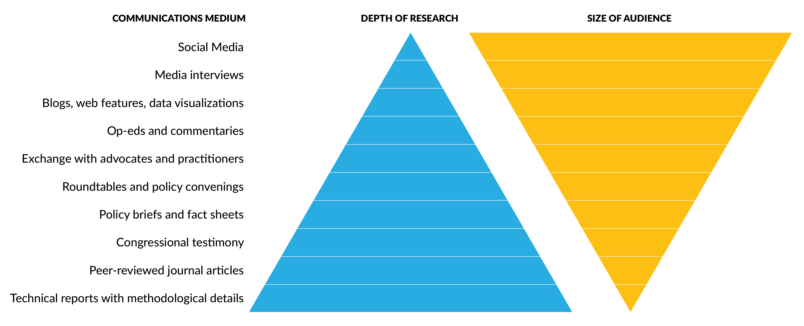

{#fig-data-termination fig-align="center" width=100%}

```{r}
#| echo: false

exercise_number <- 1

```

For this week, we will learn the importance of destroying or terminating data along with future challenges.

## Quick recap on week 5

### Data privacy laws in the United States of America

The laws governing data collection and dissemination are limited to specific federal agencies (e.g., U.S. Census Bureau) or specific data types (e.g., education).

The California Consumer Privacy Act (CCPA) gives consumers more control over the personal information that businesses collect about them, with accompanying regulations that provide guidance on how to implement the law. In November 2020, California voters approved Proposition 24, the California Privacy Rights Act, which amended the CCPA and added additional privacy protections that took effect on January 1, 2023.

### Types of dissemination

{#fig-aspirational fig-align="center" width=100%}

### Data visualizations

Similar to outlining a presentation, don't race to the computer. Start with paper and pen (or color pencils/markers!), chalkboard and chalk, etc. to sketch out your data visualization.

- Show the data
- Reduce the clutter
- Integrate the graphics and text
- Avoid Speghetti chart
- Start with gray

### Week 6 Assignment

#### Read

- Chapter 7: What Is the Future of Data Privacy?

#### Optional additional read

- [Government Data of the People, by the People, for the People: Navigating Citizen Privacy Concerns](https://www.aeaweb.org/articles?id=10.1257/jep.38.2.181).

#### Collect Data

- For one day, record how often your data being collected, shared, or used by private companies (e.g., social media, web browsing, streaming services, online shopping, fitness trackers, mobile apps, or loyalty programs).
- For one day (can be the same day or another), record at least five services, products, or decisions you benefit from that rely on public government data (e.g., navigation apps, weather forecasts, public health services, emergency alerts, and school funding).

#### Write (600 to 1200 words)

Based on your data log, answer the following questions:

1.	Data in Your Everyday Life
  - How do private and public data affect your daily activities?
  - Which examples surprised you the most?
  
2.	Privacy Laws and Regulations
  - Are any of the private-sector data uses protected or regulated by state or federal laws?
  - How do the rules governing private-sector data differ from those governing public government data?
  
3.	Benefits and Risks of Data Sharing
  - How can organizations use these data to create public value or improve services?
  - How might these same data be used in ways that harm individuals, communities, or privacy?
  - What ethical concerns arise when data are shared, disseminated, or combined with other data sources (e.g., private with public)?
  
4.	Reflection: Reflecting on your data collection, should more information be publicly available, less information be publicly available, or does it depend on the type of data? Explain your reasoning.

**AI Reflection (Prepare to discuss in class):** Select one private company from your data log and review its privacy policy.

- What types of data does the company collect, share, or sell?
- How might these data be used to train, improve, or evaluate AI systems?
- Were you surprised by anything disclosed in the privacy policy?
- Did the policy clearly explain how AI may use your information? Why or why not?
  
Be prepared to discuss whether current privacy notices provide meaningful transparency about AI and data sharing practices.


::: callout
#### [`r paste("Class Activity", exercise_number)`]{style="color:#1696d2;"}

```{r}
#| echo: false

exercise_number <- exercise_number + 1
```

From your assignment and personal experience, choose and respond to one of the following questions:

1. What types of data does the company collect, share, or sell?
2. How might these data be used to train, improve, or evaluate AI systems?
3. Were you surprised by anything disclosed in the privacy policy?
4. Did the policy clearly explain how AI may use your information? Why or why not?

:::


## Data destruction or termination (or archival)

Upon project or dissemination completion, it is important to consider the appropriate handling of all copies of confidential data. This may involve physical destruction or, where permitted, archival, in accordance with legal requirements (e.g., data use agreements) or agreements with data subjects (e.g., informed consent).

In cases where data archiving is warranted, all direct identifiers should be removed. A name-code index, if necessary, must be stored separately in a secure location to maintain confidentiality.

::: {.callout-important}
## Contract for data destruction

For data analysis projects involving confidential information—such as Personally Identifiable Information (PII), Personal Health Information (PHI), or financial data, there is often a requirement to destroy the data within a specified period after the project concludes. These requirements are typically outlined in data use agreements, contracts, or institutional policies.

Data destruction must follow approved methods, especially for data stored in readily accessible formats (e.g., hard drives, cloud storage). Some agreements may require formal documentation of the destruction process. In such cases, organizations may issue a Certificate of Destruction or a similar verification document.

Additionally, certain contracts may stipulate that the destruction process be witnessed or notarized, requiring a third party to confirm that the data has been securely and irreversibly destroyed.

:::

Most private companies and other entities have their own policies for data disposal. Generally, acceptable methods fall into two categories: logical and physical.

### Logical

Logical destruction involves erasing data with multiple read/write commands, such as those performed by Pretty Good Privacy[^PGP] File Shredder or by emptying the file system’s recycle bin.

[^PGP]: “Pretty Good Privacy is an encryption program that provides cryptographic privacy and authentication for data communication.” from https://en.wikipedia.org/wiki/Pretty_Good_Privacy

### Physical

Physical disposal involves destroying the data media itself, such as shredding paper documents and CDs/DVDs, degaussing magnetic media, or drilling holes through hard drives.

{#fig-smash-hammer fig-align="center"}

### Data destruction types

The [National Institute of Standards and Technology 800-88 standard Guidelines for Media Sanitization](https://csrc.nist.gov/pubs/sp/800/88/r1/final) defines three primary methods for data destruction:

1.	**Clear**– Uses logical techniques to sanitize data in all user-addressable storage locations, protecting against simple, non-invasive data recovery methods. This is typically done using standard read/write commands, such as overwriting data with new values or using a factory reset option (when overwriting is not supported).

2.	**Purge** – Applies physical or logical techniques that make data recovery infeasible, even with advanced laboratory methods.

3.	**Destroy** – Physically renders media unusable and ensures that data recovery is infeasible using state-of-the-art techniques.

The [Department of Defense 5520.22 M standard](https://www.dami.army.pentagon.mil/site/IndustSec/docs/DoD%20522022-m.pdf) specifies a minimum of three overwrite passes to securely erase electronic data:

- Pass 1: Overwrite with all zeroes
- Pass 2: Overwrite with all ones
- Pass 3: Overwrite with random data

This multi-pass method ensures that data cannot be recovered, even with physical access to the storage medium.

### Ethics considerations

In addition to security and privacy considerations, we should think about the ethical reasons for destroying data. Some points to consider are:

- How should researchers who collect data inform participants about data destruction policies without impacting the data collection process?
  - Consider the transparency aspect.
- Are there situations where destroying data could be unethical?
  - Consider scenarios where data could be valuable for future research versus scenarios where its existence might cause harm.
- How might data destruction disproportionately impact marginalized or vulnerable populations?
  - Consider how to engage stakeholders.

## Future Challenges

Data curators, stakeholders, privacy experts, and data users all face ongoing challenges in expanding the use of government data—particularly when linking administrative and survey data. Unless data privacy can be robustly protected, access to such data is likely to remain limited or restricted entirely.

### Educating the data ecosystem 

Little is known about the expectations and needs of various entities within the data ecosystem who do not specialize in privacy, security, and ethics. As an example, @williams2023disclosing conducted a convenience sample survey of economists from the American Economic Association on their baseline knowledge about differential/formal privacy (the concept used on the 2020 Census), attitudes toward differentially/formally private frameworks, types of statistical methods that are most useful to economists, and how the injection of noise under formal privacy would affect the value of the queries to the user. At a high level, the survey found that most economists are unfamiliar with formal privacy and differential privacy (and if they know about it, they are skeptical). Instead, economists rely on simple methods for analyzing cross-sectional administrative data but have a growing need to conduct more sophisticated research designs, and economists have low tolerance for errors, which is incompatible with existing formal privacy definitions and methods.

The results from the @williams2023disclosing survey are not surprising. In general, traditional PETs are more intuitive and easier to explain, such as why data curators should remove unique records. In contrast, formally private methods are more complex and lack an intuitive definition. Although there has been an explosion of new communication materials to explain formal privacy and other data privacy concepts,[^16] such efforts are trying to fill a chasm and we are not even close.

[^16]: One of my favorites is a video created by minutephysics for the US Census Bureau, available at “[Protecting Privacy with MATH (Collab with the Census)](https://www.youtube.com/watch?v=pT19VwBAqKA),” (accessed on June 27, 2024).

One way to address the shortage of educational and communication materials on security, privacy, and ethics throughout the data lifecycle is to teach the next generation and grow the field. However, most higher education institutions lack dedicated courses on the topic. When the topic is taught, it’s typically at the graduate level within computer science departments. Some undergraduate professors may introduce these concepts in seminars, but standalone courses are rare. As a result, individuals from other technical disciplines, such as economics,are often underrepresented.

To bridge this gap, departments beyond computer science should consider offering their own courses on PETs or integrating these topics into existing curricula. In doing so, instructors can encourage students to explore the legal, social, and ethical dimensions of data privacy, including principles of data guardianship, custodianship, and permissions [@williams2023promise].

### Tiered Access

In a [blog post](https://www.slowboring.com/p/the-economic-research-policymakers), former U.S. Under Secretary for Economic Affairs, Jed Kolko, identified three types of research most useful to public policymakers:

- Development of new economic measures
- Broad literature reviews
- Quantitative or simulated policy analyses

The third category often relies on access to high-quality data—either through public-use files or secure/restricted environments. The value of the latter is underscored by [@nagaraj2024does], who found that research using confidential microdata from the Federal Statistical Research Data Centers (FSRDCs) is more likely to be cited in policy documents and results in 24% more publications in top-tier journals annually.

As we learned earlier in the course, people interested in obtaining direct access to confidential data face several barriers:

- Eligibility restrictions (e.g., U.S. citizenship)
- Limited geographic access to FSRDCs
- Lengthy approval processes for certain datasets

These challenges can prevent researchers, analysts, and policymakers from using data that could inform critical decisions.

{#fig-nsds fig-align="center"}

To address this, experts have proposed tiered access models — offering options between fully public-use files and highly restricted secure data. Created under the Foundations for [Evidence-Based Policymaking Act of 2018](https://www.congress.gov/bill/115th-congress/house-bill/4174), the [National Secure Data Service (NSDS)](https://ncses.nsf.gov/initiatives/national-secure-data-service-demo) is designed to improve access to administrative data across all levels of government. Its goals include:

- Providing secure, privacy-preserving data access
- Supporting data linkage across agencies
- Offering shared services like a data concierge and secure tools

To test this vision, the National Center for Science and Engineering Statistics has launched [NSDS Demonstration Projects](https://www.americasdatahub.org/awards/), which explore practical solutions to technical and policy challenges in building a future NSDS.

## References